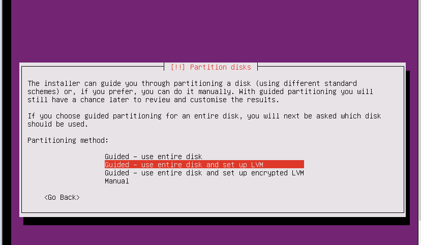

# Ubuntu  安装

安装完后进行管理
1.创建文件夹把创建虚拟机放进来

2.安装光驱

3.语言选英语,国家选亚洲中国,本地化(国际化)默认
4.键盘布局测试no,格式美国

5.主机名

6.创建用户和密码,不进行关闭文件夹
7.分区 linux没有分区只有挂载

LVM技术 磁盘扩容技术  选择yes  写入磁盘 yes
8.开始安装
9. 选择不自动更新

10. 选择ssh服务就ok  按空格进行勾选

11.引导模式 GRUB  通过磁盘0磁道来启动系统,系统启动过程其实是转载驱动过程  windows是MBR 和UEFI

vmware克隆虚拟机之后重新配置ip地址
vi /etc/udev/rules.d/70-persistent-net.rules
可以看到有两条网卡信息一个是eth0，一个是eth1。光标移动到eth0那一行，键盘按dd就能删除这条网卡信息。
然后把第二条中的eth1修改为eth0，并记下这块网卡的物理地址HWADDR=00:0c:29:ae:0a:54
2.在命令行中键入以下命令，来修改eth0这块网卡的信息：
vi /etc/sysconfig/network-scripts/ifcfg-eth0

在第一个位置输入上面你记下的ip地址，第二个位置输入新的静态ip地址。
然后键入命令reboot，重启机器。
输入ifconfig查看eth0这块网卡又可以用了，并设置好了新的静态ip地址。