### Spring Cloud 介绍
Spring Cloud是一系列框架的有序集合。它利用Spring Boot的开发便利性巧妙地简化了分布式系统基础设施的开发，如服务发现注册、配置中心、消息总线、负载均衡、断路器、数据监控等，都可以用Spring Boot的开发风格做到一键启动和部署。Spring Cloud并没有重复制造轮子，它只是将目前各家公司开发的比较成熟、经得起实际考验的服务框架组合起来，通过Spring Boot风格进行再封装屏蔽掉了复杂的配置和实现原理，最终给开发者留出了一套简单易懂、易部署和易维护的分布式系统开发工具包。

### 如何搭建一个Spring Cloud 应用
基础知识：springboot 
开发工具：idea
1.一个分布式的项目相比普通项目区别在于把一个应用拆分为多个模块，每个模块存在一台或者多台服务
2.难点：如何进行服务器之间的数据互通 =====>RPC架构
一、服务发现（也就是注册中心 Eureka ）zookeeper多用于dubbo
1.新建一个maven的web项目
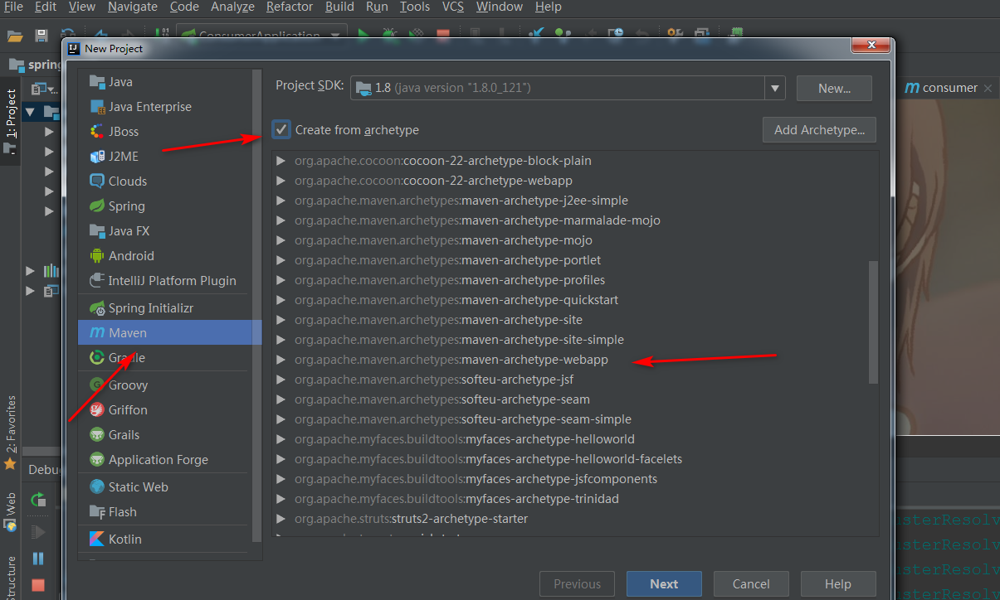
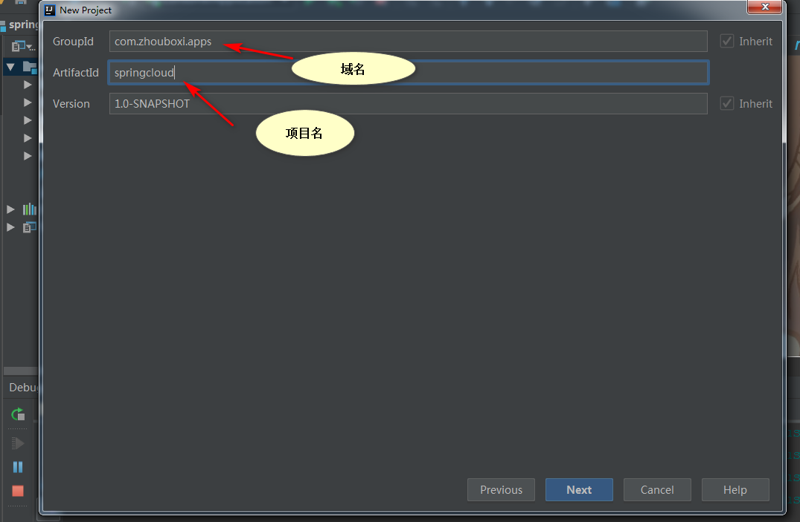
2.配置好maven完成创建
3.创建Module
项目右键-->new --->module
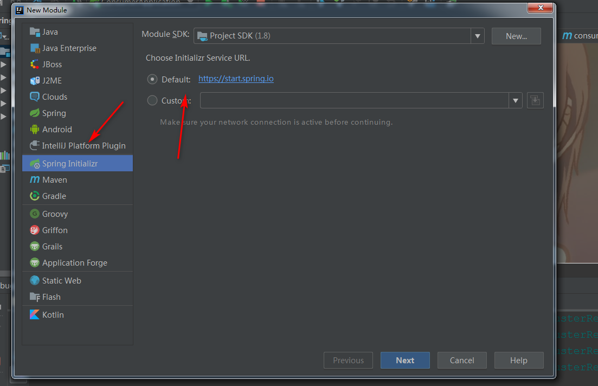
这样是快速创建一个springboot应用
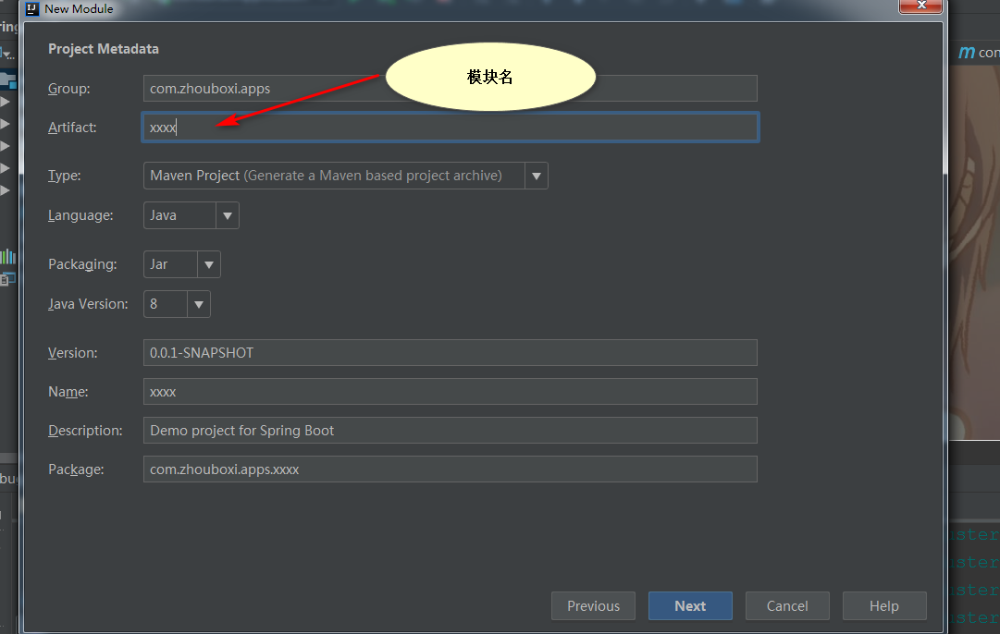
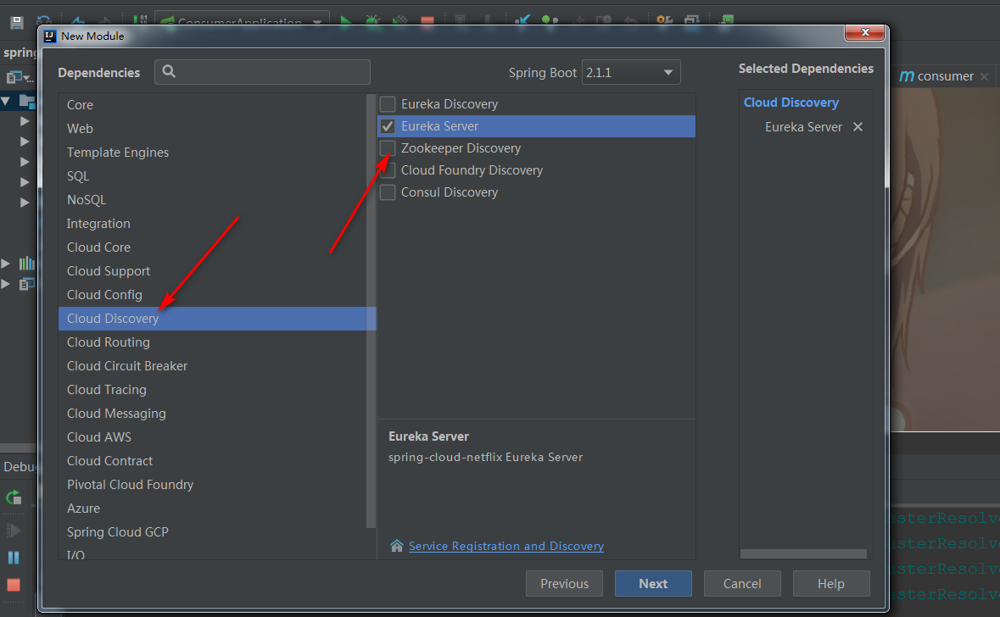
现在就已经创建一个springboot应用了，结构展示
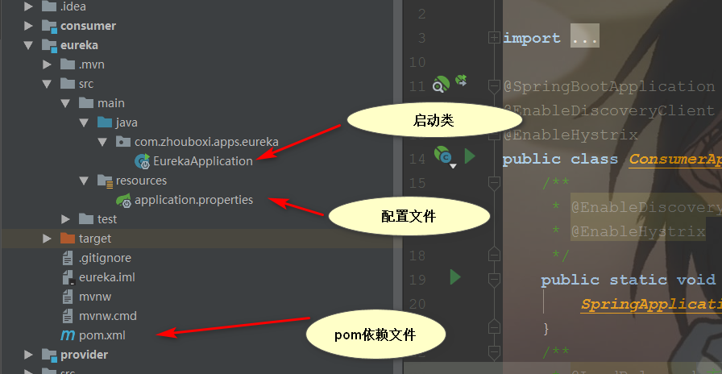
4.设置为注册中心
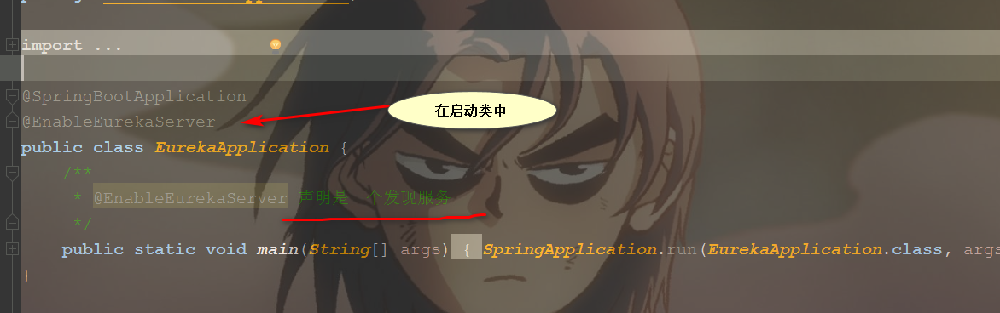
5.配置文件（配置文件支持两种风格yml 和properties）
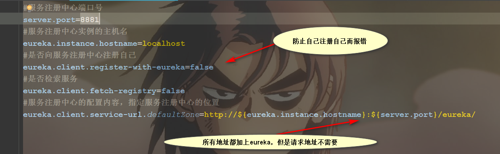
6.点击运行
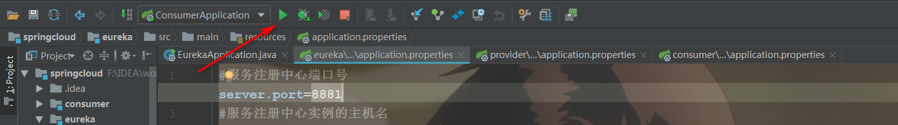
7.效果图
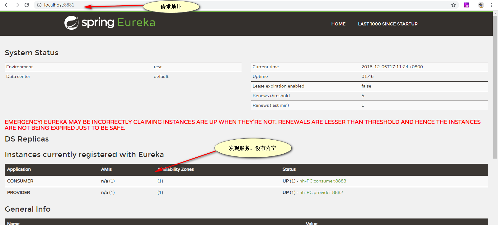
二、生产者的创建
创建方式和上面一样
不同点
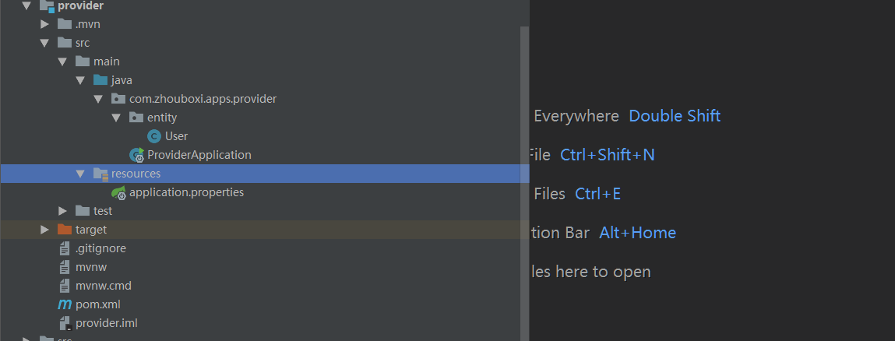
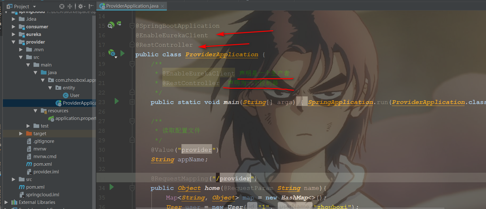
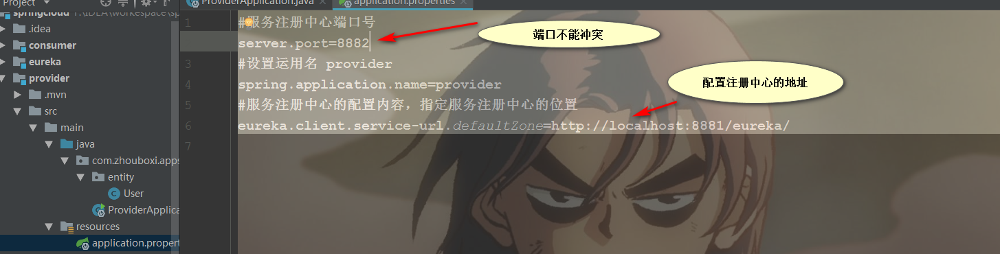
点击启动 
三、消费者创建（加入负载均衡（ribbon）断路器（Hystrix））
创建方式和上面一样

``` javascript?fancy=2,3&linenums=true
##pom文件加上
        <dependency>
            <groupId>org.springframework.boot</groupId>
            <artifactId>spring-boot-starter-web</artifactId>
        </dependency>
        <dependency>
            <groupId>org.springframework.cloud</groupId>
            <artifactId>spring-cloud-starter-netflix-eureka-server</artifactId>
        </dependency>
        <dependency>
            <groupId>org.springframework.cloud</groupId>
            <artifactId>spring-cloud-starter-eureka</artifactId>
        </dependency>
        <dependency>
            <groupId>org.springframework.cloud</groupId>
            <artifactId>spring-cloud-starter-ribbon</artifactId>
        </dependency>
        <!--断路器-->
        <dependency>
            <groupId>org.springframework.cloud</groupId>
            <artifactId>spring-cloud-starter-hystrix</artifactId>
        </dependency>
        <dependency>
            <groupId>com.netflix.hystrix</groupId>
            <artifactId>hystrix-javanica</artifactId>
            <version>RELEASE</version>
        </dependency>
```
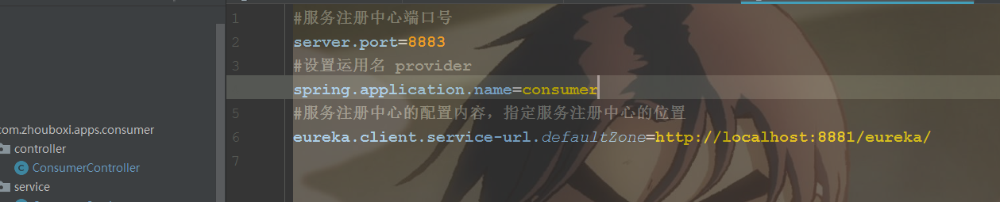
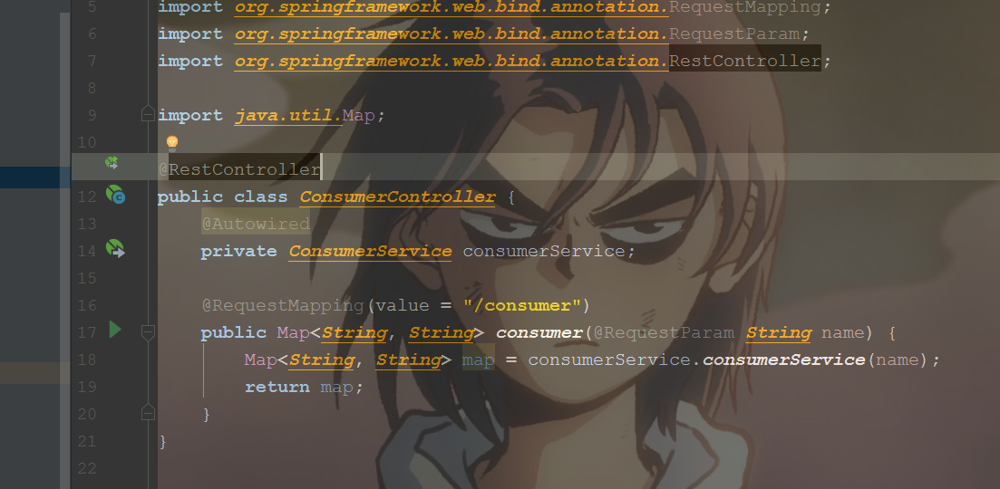
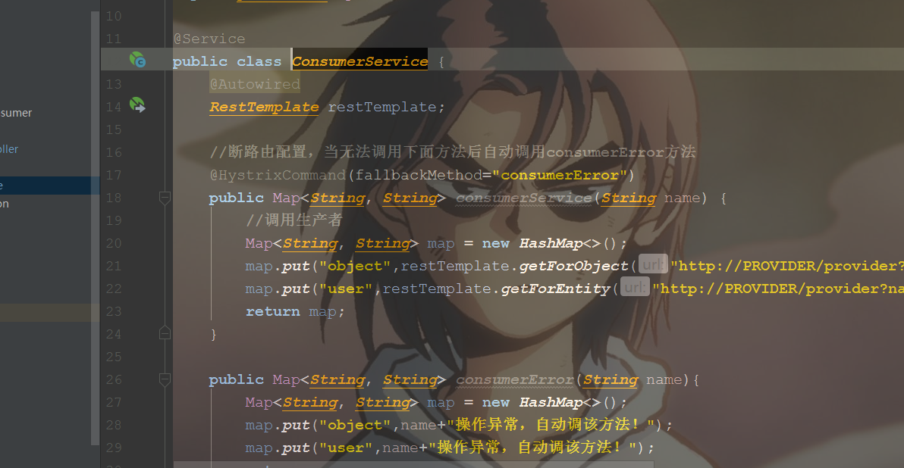
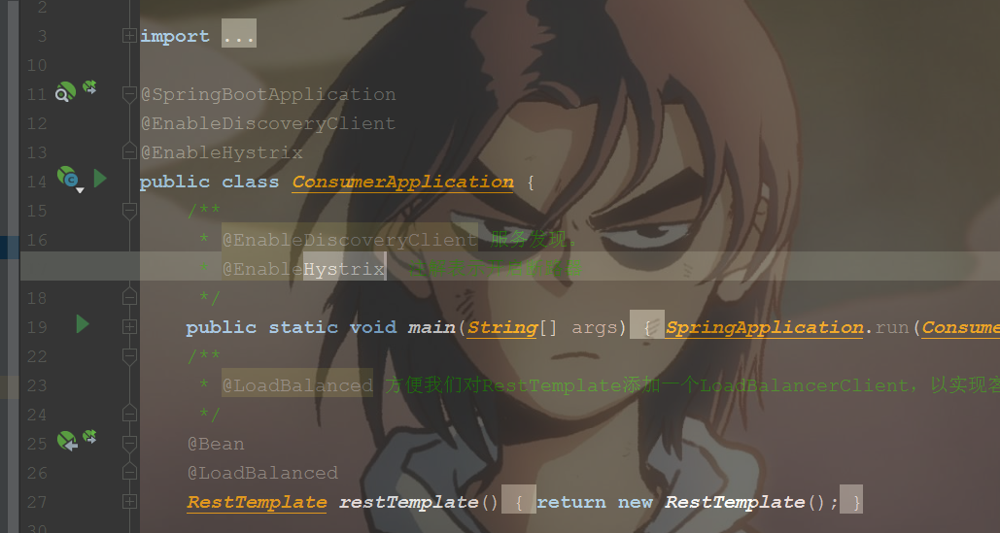
运行结果
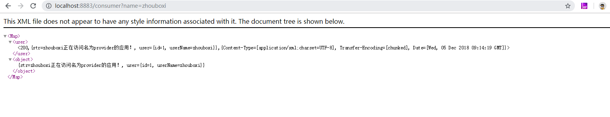
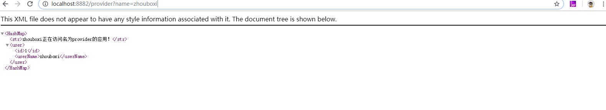
### 熔断器介绍
在微服务架构中，根据业务来拆分成一个个的服务，服务与服务之间可以相互调用（RPC），在Spring Cloud可以用RestTemplate+Ribbon和Feign来调用。为了保证其高可用，单个服务通常会集群部署。由于网络原因或者自身的原因，服务并不能保证100%可用，如果单个服务出现问题，调用这个服务就会出现线程阻塞，此时若有大量的请求涌入，Servlet容器的线程资源会被消耗完毕，导致服务瘫痪。服务与服务之间的依赖性，故障会传播，会对整个微服务系统造成灾难性的严重后果，这就是服务故障的“雪崩”效应。为了解决这个问题，业界提出了断路器模型。
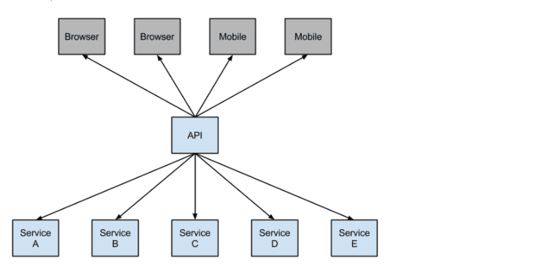
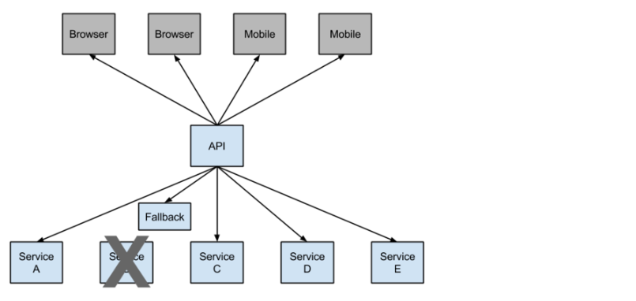
### 总结：
spring cloud 基于springboot 加上各种的组件组成，学习地方还要很多，这只是入门级的demo,希望对你们有所帮助。