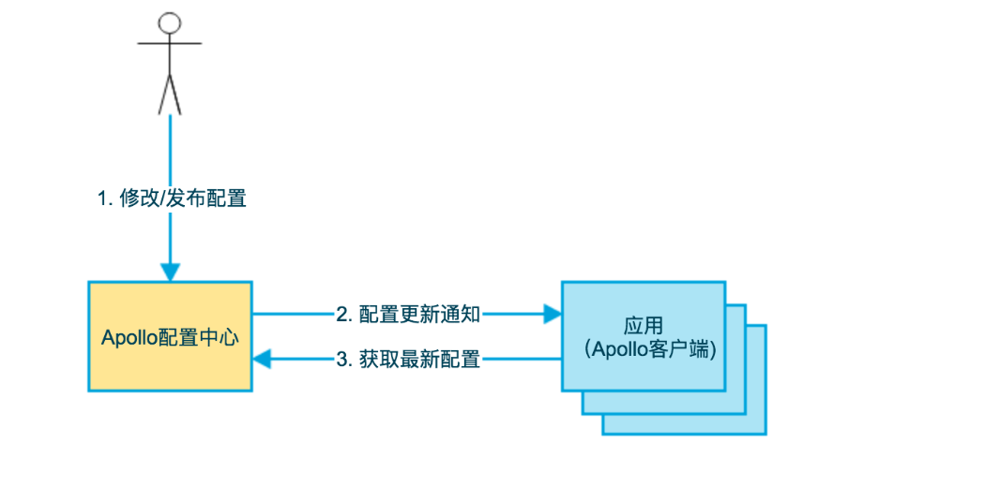
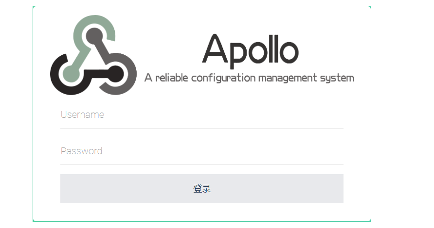
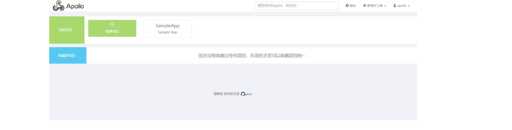

# Apollo
### 什么是 Apollo
Apollo（阿波罗）是携程框架部门研发的分布式配置中心，能够集中化管理应用不同环境、不同集群的配置，配置修改后能够实时推送到应用端，并且具备规范的权限、流程治理等特性，适用于微服务配置管理场景

GitHub：https://github.com/ctripcorp/apollo

### 为什么使用 Apollo
因为如今程序功能越来越复杂，程序的配置日益增多：各种功能的开关、参数配置、服务器地址、数据库链接等。对于配置的期望值越来越高：配置修改后实时生效、灰度发布、分环境、分集群管理配置、完善的权限、审核机制等。所以传统的配置文件越来越无法满足开发人员的需求。于是就有了 Apollo。

### 配置的基本概念
Apollo 支持 4 个维度管理 KV 格式的配置：

application：应用
environment：环境
cluster：集群
namespace：命名空间
既然 Apollo 定位于配置中心，首先了解一下什么是配置

### 配置是独立于程序的只读变量
配置首先独立于程序的，同一份程序在不同的配置下会有不同的行为。
配置对于程序是只读，程序通过读取配置来改变自己的行为，但是程序不应该去改变配置。
常见的配置如：数据库连接、线程池大小、超时时间等
### 配置伴随应用的整个生命周期
配置贯穿于应用的整个生命周期，应用启动时通过读取配置来初始化，在运行时根据配置调行为。
### 配置可有多种加载方式
配置也有很多种加载方式，常见的有程序内部 硬编码、配置文件、环境变量、启动参数、基于数据库等
### 配置需要治理
权限控制：由于配置能改变的程序的行为，不正确的配置甚至能引起灾难，所以对配置的修改必须有比较完善的权限控制
不同的环境、集群配置管理：同一份程序在不同的环境（开发、测试、生产）、不同的集群（如不同的数据中心）经常需要不同的配置，所以需要有完善的环境、集群配置管理
### Apollo 的特性
### 统一管理不同环境、不同集群的配置
Apollo 提供了一个统一界面集中式管理不同环境（environment）、不同集群（cluster）、不同命名空间（namespace）的配置。
同一份代码部署在不同的集群，可以有不同的配置，比如 zk 的地址等
通过命名空间（namespace）可以很方便的支持多个不同应用共享同一份配置，同时还允许应用对共享的配置进行覆盖
### 配置修改实时生效（热发布）
用户在 Apollo 修改完配置并发布后，客户端能实时（1秒）接收到最新的配置，并通知到应用程序
### 版本发布管理
所有的配置发布都有版本概念，从而可以方便地支持配置的回滚
### 灰度发布
支持配置的灰度发布，比如点了发布后，只对部分应用实例生效，等观察一段时间没问题后再推给所有应用实例
### 权限管理、发布审核、操作审计
应用和配置的管理都有完善的权限管理机制，对配置的管理还分为了编辑和发布两个环节，从而减少人为的错误。
所有的操作都有审计日志，可以方便的追踪问题
### 客户端配置信息监控
可以在界面上方便地看到配置在被哪些实例使用
### 提供 Java 和 .Net 原生客户端
提供了 Java 和 .Net 的原生客户端，方便应用集成
支持 Spring Placeholder, Annotation 和 Spring Boot 的 ConfigurationProperties，方便应用使用（需要 Spring 3.1.1 +）
同时提供了 HTTP 接口，非 Java 和 .Net 应用也可以方便的使用
### 提供开放平台 API
Apollo 自身提供了比较完善的统一配置管理界面，支持多环境、多数据中心配置管理、权限、流程治理等特性。
不过 Apollo 出于通用性考虑，对配置的修改不会做过多限制，只要符合基本的格式就能够保存
对于有些使用方，它们的配置可能会有比较复杂的格式，而且对输入的值也需要进行校验后方可保存，如检查数据库、用户名和密码是否匹配；对于这类应用，Apollo 支持应用方通过开放接口在 Apollo 进行配置的修改和发布，并且具备完善的授权和权限控制
### 部署简单
配置中心作为基础服务，可用性要求非常高，这就要求 Apollo 对外部依赖尽可能地少
目前唯一的外部依赖是 MySQL，所以部署非常简单，只要安装好 Java 和 MySQL 就可以让 Apollo 跑起来
Apollo 还提供了打包脚本，一键就可以生成所有需要的安装包，并且支持自定义运行时参数
### Apollo 的基础模型
用户在配置中心对配置进行修改并发布
配置中心通知 Apollo 客户端有配置更新
Apollo 客户端从配置中心拉取最新的配置、更新本地配置并通知到应用

# 基于 Docker 安装 Apollo
### 下载 Docker Quick Start 配置文件
下载地址：https://github.com/ctripcorp/apollo/tree/master/scripts/docker-quick-start

### Compose
```
version: '2'

services:
  apollo-quick-start:
    image: nobodyiam/apollo-quick-start
    container_name: apollo-quick-start
    depends_on:
      - apollo-db
    ports:
      - "8080:8080"
      - "8070:8070"
    links:
      - apollo-db
    environment:
      # 解决容器部署本地无法连接的问题
      eureka.instance.homePageUrl: http://192.168.10.146:8080

  apollo-db:
    image: mysql:5.7
    container_name: apollo-db
    environment:
      TZ: Asia/Shanghai
      MYSQL_ALLOW_EMPTY_PASSWORD: 'yes'
    depends_on:
      - apollo-dbdata
    ports:
      - "13306:3306"
    volumes:
      - ./sql:/docker-entrypoint-initdb.d
    volumes_from:
      - apollo-dbdata

  apollo-dbdata:
    image: alpine:latest
    container_name: apollo-dbdata
    volumes:
      - /var/lib/mysql
```
### 启动 Apollo 配置中心
在 docker-quick-start 目录下执行 docker-compose up -d，第一次执行会触发下载镜像等操作，需要耐心等待一些时间。

搜索所有 apollo-quick-start 开头的日志，看到以下日志说明启动成功：
```
apollo-quick-start    | ==== starting service ====
apollo-quick-start    | Service logging file is ./service/apollo-service.log
apollo-quick-start    | Started [45]
apollo-quick-start    | Waiting for config service startup.......
apollo-quick-start    | Config service started. You may visit http://localhost:8080 for service status now!
apollo-quick-start    | Waiting for admin service startup......
apollo-quick-start    | Admin service started
apollo-quick-start    | ==== starting portal ====
apollo-quick-start    | Portal logging file is ./portal/apollo-portal.log
apollo-quick-start    | Started [254]
apollo-quick-start    | Waiting for portal startup.......
apollo-quick-start    | Portal started. You can visit http://localhost:8070 now!
```
```
注1：数据库的端口映射为 13306，所以如果希望在宿主机上访问数据库，可以通过 localhost:13306，用户名是 `root，密码留空。
如要查看更多服务的日志，可以通过 docker exec -it apollo-quick-start bash 登录， 然后到 /apollo-quick-start/service 和 /apollo-quick-start/portal 下查看日志信息。
```
# 运行成功效果图
通过 http://192.168.10.131:8070/signin 访问 Apollo 配置中心

登录账号：apollo
登录密码：admin

