基于 Docker 安装 GitLab
我们使用 Docker 来安装和运行 GitLab 中文版，由于新版本问题较多，这里我们使用目前相对稳定的 10.5 版本，docker-compose.yml 配置如下：
```
version: '3'
services:
    web:
      image: 'twang2218/gitlab-ce-zh:10.5'
      restart: always
      hostname: '192.168.75.145'
      environment:
        TZ: 'Asia/Shanghai'
        GITLAB_OMNIBUS_CONFIG: |
          external_url 'http://192.168.75.145:8080'
          gitlab_rails['gitlab_shell_ssh_port'] = 2222
          unicorn['port'] = 8888
          nginx['listen_port'] = 8080
      ports:
        - '8080:8080'
        - '8443:443'
        - '2222:22'
      volumes:
        - /usr/local/docker/gitlab/config:/etc/gitlab
        - /usr/local/docker/gitlab/data:/var/opt/gitlab
        - /usr/local/docker/gitlab/logs:/var/log/gitlab
 ```
# 安装完成后的工作
访问地址：http://ip:8080
端口 8080 是因为我在配置中设置的外部访问地址为 8080，默认是 80
设置管理员初始密码，这里的密码最好是 字母 + 数字 组合，并且 大于等于 8 位
配置完成后登录，管理员账号是 root
# 虚拟机内存设置3G+不然启动502 密码设置字母 + 数字 组合，并且 大于等于 8 位不然500
## GitLab 的基本设置
第一次使用时需要做一些初始化设置，点击“管理区域”-->“设置”
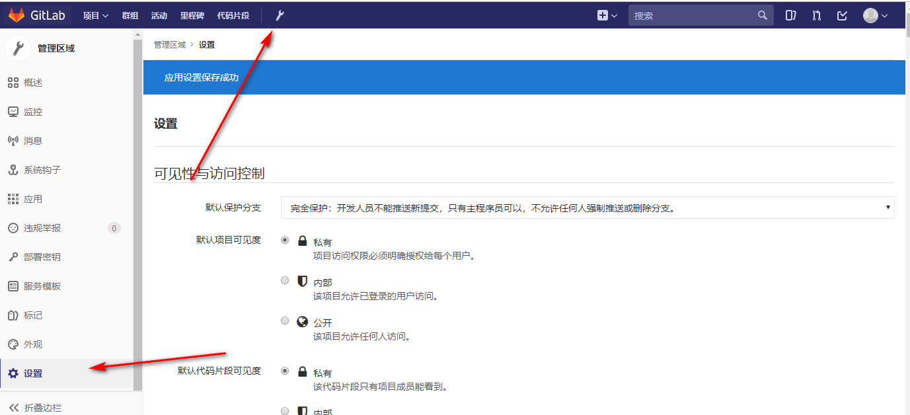
## 账户与限制设置
关闭头像功能，由于 Gravatar 头像为网络头像，在网络情况不理想时可能导致访问时卡顿
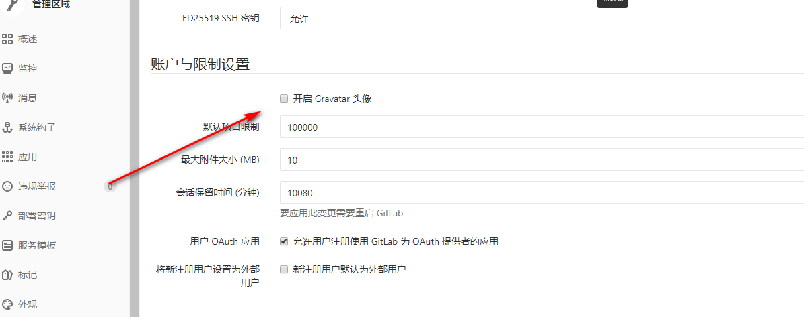
## 注册限制
由于是内部代码托管服务器，可以直接关闭注册功能，由管理员统一创建用户即可
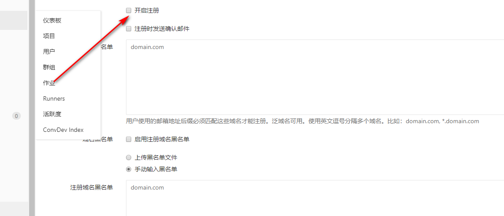
GitLab 的账户管理
使用时请不要直接通过 root 用户操作，需要先创建用户，然后通过创建的用户操作，如果你是管理员还需要为其他开发人员分配账户

## 创建用户
点击“管理区域”-->“新建用户”
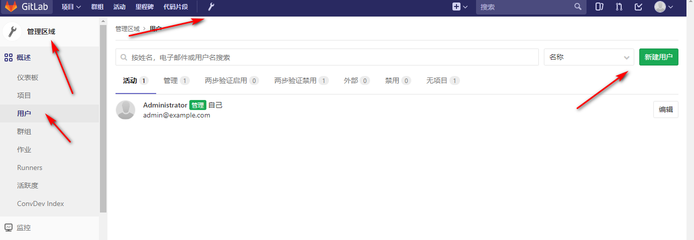
## 设置账户信息
同时你可以将自己设置为管理员
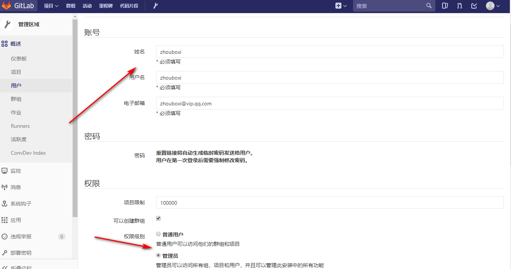
# #修改用户密码
由于我们创建时并没有配置邮箱，所以还需要重新编辑用户信息并手动设置密码
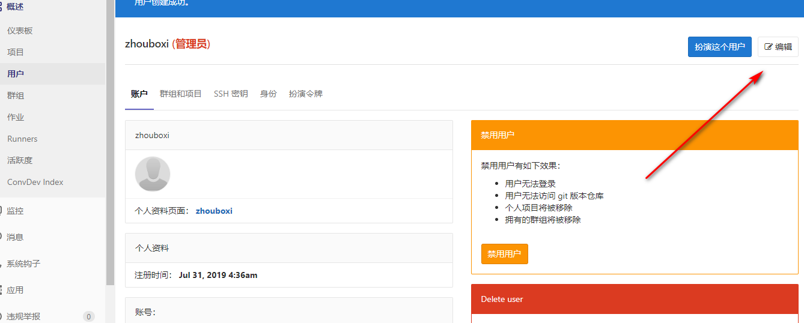
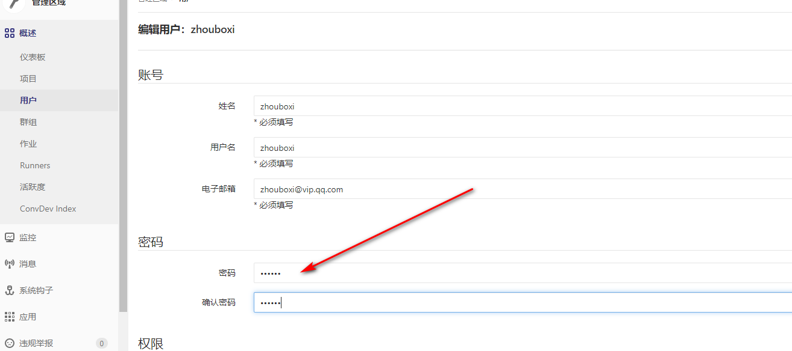
## 退出并使用新账户登录
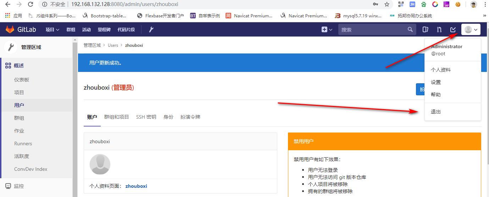
使用 SSH 的方式拉取和推送项目
## 生成 SSH KEY
使用 ssh-keygen 工具生成，位置在 Git 安装目录下，我的是 C:\Program Files\Git\usr\bin
输入命令：
```
ssh-keygen -t rsa -C "zhouboxi@vip.qq.com"
```
执行成功后的效果：
```
Microsoft Windows [版本 10.0.14393]
(c) 2016 Microsoft Corporation。保留所有权利。

C:\Program Files\Git\usr\bin>ssh-keygen -t rsa -C "topsale@vip.qq.com"
Generating public/private rsa key pair.
Enter file in which to save the key (/c/Users/Lusifer/.ssh/id_rsa):
Enter passphrase (empty for no passphrase):
Enter same passphrase again:
Your identification has been saved in /c/Users/Lusifer/.ssh/id_rsa.
Your public key has been saved in /c/Users/Lusifer/.ssh/id_rsa.pub.
The key fingerprint is:
SHA256:cVesJKa5VnQNihQOTotXUAIyphsqjb7Z9lqOji2704E topsale@vip.qq.com
The key's randomart image is:
+---[RSA 2048]----+
|  + ..=o=.  .+.  |
| o o + B .+.o.o  |
|o   . + +=o+..   |
|.=   .  oo...    |
|= o     So       |
|oE .    o        |
| .. .. .         |
| o*o+            |
| *B*oo           |
+----[SHA256]-----+
C:\Program Files\Git\usr\bin>
```
# 复制 SSH-KEY 信息到 GitLab
### 秘钥位置在：C:\Users\你的用户名\.ssh 目录下，找到 id_rsa.pub 并使用编辑器打开，如：
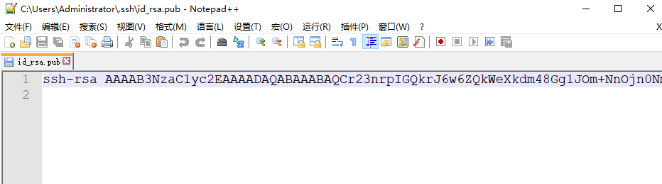
### 登录 GitLab，点击“用户头像”-->“设置”-->“SSH 密钥”
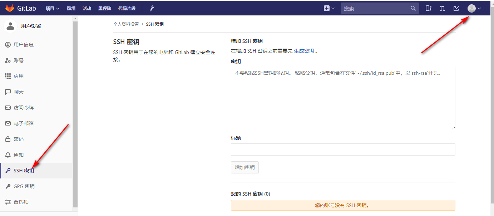
### 成功增加密钥后的效果
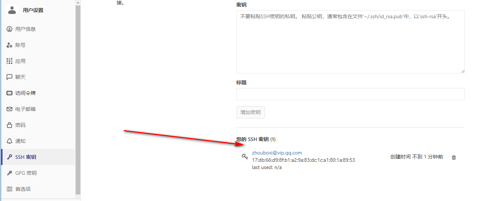
