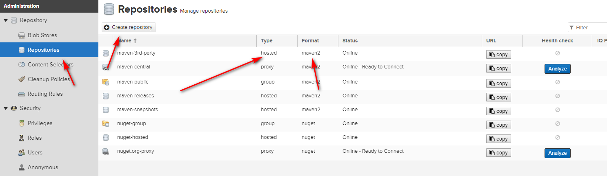
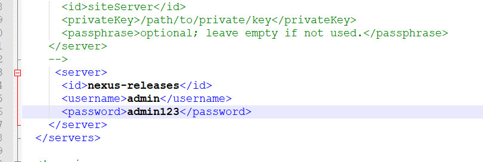

基于 Docker 安装 Nexus
我们使用 Docker 来安装和运行 Nexus，docker-compose.yml 配置如下：
```
version: '3.1'
services:
  nexus:
    restart: always
    image: sonatype/nexus3
    container_name: nexus
    ports:
      - 8081:8081
    volumes:
      - /usr/local/docker/nexus/data:/nexus-data
```
注： 启动时如果出现权限问题可以使用：chmod 777 /usr/local/docker/nexus/data 赋予数据卷目录可读可写的权限

# 登录控制台验证安装
地址：http://ip:port/ 用户名：admin 密码：admin123
Maven 仓库介绍
# 代理仓库（Proxy Repository）
意为第三方仓库，如：

maven-central
nuget.org-proxy
版本策略（Version Policy）：

Release: 正式版本
Snapshot: 快照版本
Mixed: 混合模式
布局策略（Layout Policy）：

Strict：严格
Permissive：宽松
# 宿主仓库（Hosted Repository）
存储本地上传的组件和资源的，如：

maven-releases
maven-snapshots
nuget-hosted
部署策略（Deployment Policy）：

Allow Redeploy：允许重新部署
Disable Redeploy：禁止重新部署
Read-Only：只读
# 仓库组（Repository Group）
通常包含了多个代理仓库和宿主仓库，在项目中只要引入仓库组就可以下载到代理仓库和宿主仓库中的包，如：

maven-public
nuget-group
配置认证信息
在 Maven settings.xml 中添加 Nexus 认证信息(servers 节点下)：
```
<server>
  <id>nexus-releases</id>
  <username>admin</username>
  <password>admin123</password>
</server>

<server>
  <id>nexus-snapshots</id>
  <username>admin</username>
  <password>admin123</password>
</server>
```
# Snapshots 与 Releases 的区别
nexus-releases: 用于发布 Release 版本
nexus-snapshots: 用于发布 Snapshot 版本（快照版）
Release 版本与 Snapshot 定义如下：

Release: 1.0.0/1.0.0-RELEASE
Snapshot: 1.0.0-SNAPSHOT
在项目 pom.xml 中设置的版本号添加 SNAPSHOT 标识的都会发布为 SNAPSHOT 版本，没有 SNAPSHOT 标识的都会发布为 RELEASE 版本。
SNAPSHOT 版本会自动加一个时间作为标识，如：1.0.0-SNAPSHOT 发布后为变成 1.0.0-SNAPSHOT-20180522.123456-1.jar
# 配置自动化部署
在 pom.xml 中添加如下代码：
```
<distributionManagement>  
  <repository>  
    <id>nexus-releases</id>  
    <name>Nexus Release Repository</name>  
    <url>http://127.0.0.1:8081/repository/maven-releases/</url>  
  </repository>  
  <snapshotRepository>  
    <id>nexus-snapshots</id>  
    <name>Nexus Snapshot Repository</name>  
    <url>http://127.0.0.1:8081/repository/maven-snapshots/</url>  
  </snapshotRepository>  
</distributionManagement> 
```
注意事项：

ID 名称必须要与 settings.xml 中 Servers 配置的 ID 名称保持一致。
项目版本号中有 SNAPSHOT 标识的，会发布到 Nexus Snapshots Repository, 否则发布到 Nexus Release Repository，并根据 ID 去匹配授权账号。
# 部署到仓库
```
mvn deploy
```
# 上传第三方 JAR 包
Nexus 3.0 不支持页面上传，可使用 maven 命令：

# 如第三方JAR包：aliyun-sdk-oss-2.2.3.jar
```
mvn deploy:deploy-file 
  -DgroupId=com.aliyun.oss 
  -DartifactId=aliyun-sdk-oss 
  -Dversion=2.2.3 
  -Dpackaging=jar 
  -Dfile=D:\aliyun-sdk-oss-2.2.3.jar 
  -Durl=http://127.0.0.1:8081/repository/maven-3rd/ 
  -DrepositoryId=nexus-releases
  ```
注意事项：

建议在上传第三方 JAR 包时，创建单独的第三方 JAR 包管理仓库，便于管理有维护。（maven-3rd）
-DrepositoryId=nexus-releases 对应的是 settings.xml 中 Servers 配置的 ID 名称。（授权）


# 配置代理仓库
```
<repositories>
    <repository>
        <id>nexus</id>
        <name>Nexus Repository</name>
        <url>http://127.0.0.1:8081/repository/maven-public/</url>
        <snapshots>
            <enabled>true</enabled>
        </snapshots>
        <releases>
            <enabled>true</enabled>
        </releases>
    </repository>
</repositories>
<pluginRepositories>
    <pluginRepository>
        <id>nexus</id>
        <name>Nexus Plugin Repository</name>
        <url>http://127.0.0.1:8081/repository/maven-public/</url>
        <snapshots>
            <enabled>true</enabled>
        </snapshots>
        <releases>
            <enabled>true</enabled>
        </releases>
    </pluginRepository>
</pluginRepositories>
```