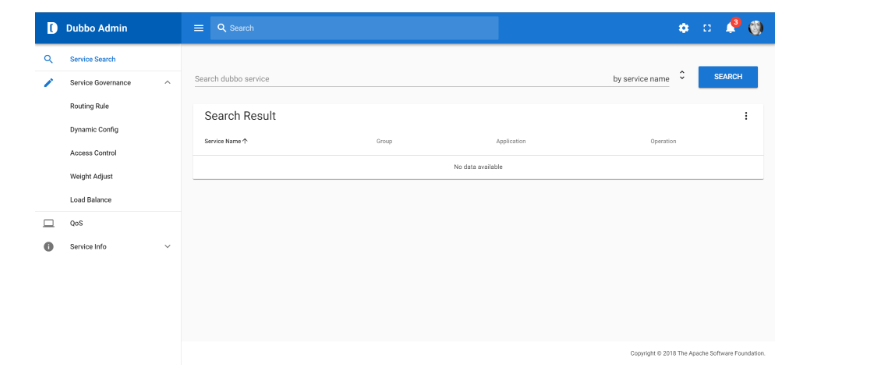

# Dubbo Admin 管理控制台
概述
管理控制台为内部裁剪版本，开源部分主要包含：路由规则，动态配置，服务降级，访问控制，权重调整，负载均衡，等管理功能。

GitHub：https://github.com/apache/incubator-dubbo-ops


### 打包
```
mvn clean package
````

### 运行
```
mvn --projects dubbo-admin-backend spring-boot:run
```
### 浏览
http://localhost:8080
### 遇到的问题处理
### NodeJS
现象：使用 mvn clean package 构建 DubboAdmin 控制台时会出现 npm install 操作
解决：新版控制台已改为前后分离模式，前端采用 Vue.js 开发，故需要 NodeJS 支持，请自行安装（运行到此处时会自动下载安装）。官网地址：http://nodejs.cn/
其他：配置淘宝镜像加速。官网地址：http://npm.taobao.org/
### 安装 cnpm 命令行工具
`
npm install -g cnpm --registry=https://registry.npm.taobao.org
`
### 安装模块
`
cnpm install [name]
`
### Will not attempt to authenticate using SASL (unknown error)
现象：使用 mvn --projects dubbo-admin-backend spring-boot:run 启动 DubboAdmin 控制台时，控制台日志中出现 Will not attempt to authenticate using SASL (unknown error) 提示
解决：修改 C:\Windows\System32\drivers\etc\hosts 文件，增加 192.168.10.131 ubuntu16 即可解决
注意： 此处的 192.168.10.131 为 Zookeeper 地址

### 两处 npm WARN
现象：使用 mvn clean package 构建 DubboAdmin 控制台时会出现 npm install 操作，此时还会出现两处警告，分别为
npm WARN optional SKIPPING OPTIONAL DEPENDENCY: fsevents@1.2.4 (node_modules\fsevents)
npm WARN notsup SKIPPING OPTIONAL DEPENDENCY: Unsupported platform for fsevents@1.2.4: wanted {"os":"darwin","arch":"any"} (current: {"os":"win32","arch":"x64"})
解决：从警告说明中可以看出，fsevents 模块用于 {"os":"darwin","arch":"any"} Mac 系统，当前系统为 (current: {"os":"win32","arch":"x64"}) Windows 系统，不予理会即可