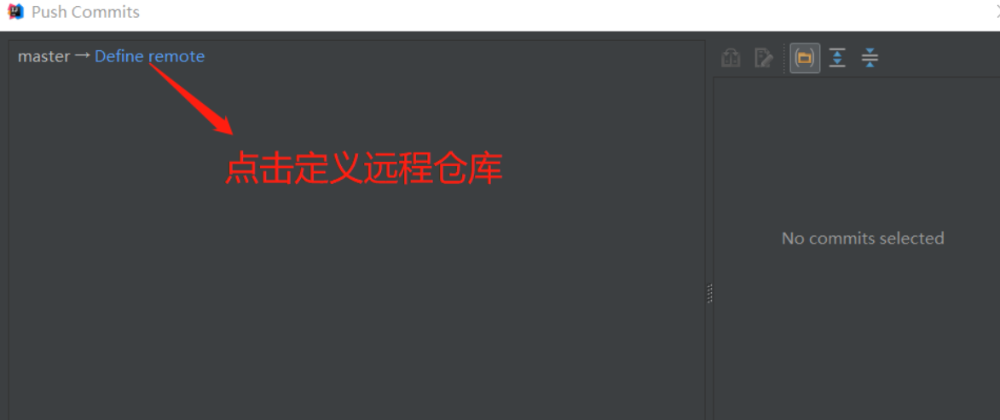

 # Idea和gitlab整合
 ### 首先，需要你自己登录GitLab,并新建一个项目的链接
 
 
 
 ### 在idea上新建一个项目，完成之后，需要创建一个git仓库；
 


### 遇到问题,push被拒绝
idea中，发布项目到OSChina的Git中，当时按照这样的流程添加Git，然后push，提示：push to origin/master war rejected"。
解决方案如下：
1.切换到自己项目所在的目录，右键选择GIT BASH Here
2.在terminl窗口中依次输入命令：
```
git pull
git pull origin master
git pull origin master --allow-unrelated-histories
wq!进行退出
```
3.在idea中重新push自己的项目，成功！！
### 扩展 ---断开git连接
1.删除.git连接,idea设置删除相关
2.对连接远程仓库地址时name为oragin