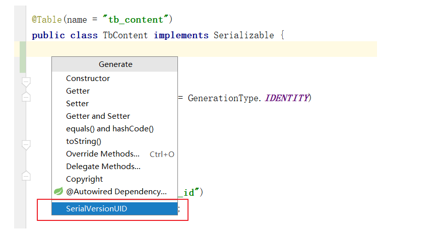
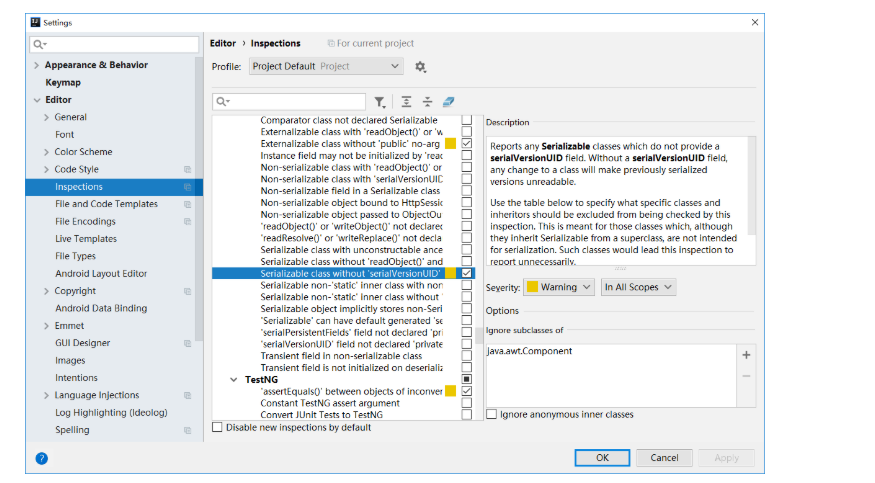

# MyBatis Redis 二级缓存
### MyBatis 缓存介绍
### 一级缓存
MyBatis 会在表示会话的 SqlSession 对象中建立一个简单的缓存，将每次查询到的结果结果缓存起来，当下次查询的时候，如果判断先前有个完全一样的查询，会直接从缓存中直接将结果取出，返回给用户，不需要再进行一次数据库查询了。

一级缓存是 SqlSession 级别的缓存。在操作数据库时需要构造 sqlSession 对象，在对象中有一个（内存区域）数据结构（HashMap）用于存储缓存数据。不同的 sqlSession 之间的缓存数据区域（HashMap）是互相不影响的。其作用域是同一个 SqlSession，在同一个 sqlSession 中两次执行相同的 sql 语句，第一次执行完毕会将数据库中查询的数据写到缓存（内存），第二次会从缓存中获取数据将不再从数据库查询，从而提高查询效率。当一个 sqlSession 结束后该 sqlSession 中的一级缓存也就不存在了。Mybatis 默认开启一级缓存。

### 二级缓存
二级缓存是 mapper 级别的缓存，多个 SqlSession 去操作同一个 Mapper 的 sql 语句，多个 SqlSession 去操作数据库得到数据会存在二级缓存区域，多个 SqlSession 可以共用二级缓存，二级缓存是跨 SqlSession 的。其作用域是 mapper 的同一个 namespace，不同的 sqlSession 两次执行相同 namespace下的 sql 语句且向 sql 中传递参数也相同即最终执行相同的 sql 语句，第一次执行完毕会将数据库中查询的数据写到缓存（内存），第二次会从缓存中获取数据将不再从数据库查询，从而提高查询效率。Mybatis 默认没有开启二级缓存需要在 setting 全局参数中配置开启二级缓存。

### 配置 MyBatis 二级缓存
### Spring Boot 中开启 MyBatis 二级缓存
以 myshop-service-user-provider 项目为例，完整配置如下：

### Spring boot application
```
spring:
  application:
    name: myshop-service-user-provider
  datasource:
    druid:
      url: jdbc:mysql://192.168.10.131:3306/myshop?useUnicode=true&characterEncoding=utf-8&useSSL=false
      username: root
      password: 123456
      initial-size: 1
      min-idle: 1
      max-active: 20
      test-on-borrow: true
      driver-class-name: com.mysql.cj.jdbc.Driver
  redis:
    lettuce:
      pool:
        max-active: 8
        max-idle: 8
        max-wait: -1ms
        min-idle: 0
    sentinel:
      master: mymaster
      nodes: 192.168.10.131:26379, 192.168.10.131:26380, 192.168.10.131:26381
server:
  port: 8501

### MyBatis Config properties

mybatis:
  configuration:
    cache-enabled: true
  type-aliases-package: com.funtl.myshop.commons.domain
  mapper-locations: classpath:mapper/*.xml

# Services Versions
services:
  versions:
    redis:
      v1: 1.0.0
    user:
      v1: 1.0.0

# Dubbo Config properties
dubbo:
  ## Base packages to scan Dubbo Component：@com.alibaba.dubbo.config.annotation.Service
  scan:
    basePackages: com.funtl.myshop.service.user.provider.api.impl
  ## ApplicationConfig Bean
  application:
    id: myshop-service-user-provider
    name: myshop-service-user-provider
    qos-port: 22222
    qos-enable: true
  ## ProtocolConfig Bean
  protocol:
    id: dubbo
    name: dubbo
    port: 20881
    status: server
    serialization: kryo
  ## RegistryConfig Bean
  registry:
    id: zookeeper
    address: zookeeper://192.168.10.131:2181?backup=192.168.10.131:2182,192.168.10.131:2183

# Enables Dubbo All Endpoints
management:
  endpoint:
    dubbo:
      enabled: true
    dubbo-shutdown:
      enabled: true
    dubbo-configs:
      enabled: true
    dubbo-services:
      enabled: true
    dubbo-references:
      enabled: true
    dubbo-properties:
      enabled: true
  # Dubbo Health
  health:
    dubbo:
      status:
        ## StatusChecker Name defaults (default : "memory", "load" )
        defaults: memory
        ## StatusChecker Name extras (default : empty )
        extras: load,threadpool

logging:
  level.com.funtl.myshop.commons.mapper: DEBUG
  ```
主要增加了如下配置：

MyBaits 二级缓存配置
```
mybatis:
  configuration:
    cache-enabled: true
```
Redis 配置
```
spring:
  redis:
    lettuce:
      pool:
        max-active: 8
        max-idle: 8
        max-wait: -1ms
        min-idle: 0
    sentinel:
      master: mymaster
      nodes: 192.168.10.131:26379, 192.168.10.131:26380, 192.168.10.131:26381
```
### 实体类实现序列化接口并声明序列号
```
private static final long serialVersionUID = 8289770415244673535L;
```
### 实现 MyBatis Cache 接口，自定义缓存为 Redis
为了增加通用性，请在 myshop-commons-mapper 项目中创建一个名为 RedisCache 的工具类，代码如下：
```
package com.funtl.myshop.commons.utils;

import com.funtl.myshop.commons.context.ApplicationContextHolder;
import org.apache.ibatis.cache.Cache;
import org.slf4j.Logger;
import org.slf4j.LoggerFactory;
import org.springframework.data.redis.core.RedisCallback;
import org.springframework.data.redis.core.RedisTemplate;
import org.springframework.data.redis.core.ValueOperations;

import java.util.concurrent.TimeUnit;
import java.util.concurrent.locks.ReadWriteLock;
import java.util.concurrent.locks.ReentrantReadWriteLock;

/**
 * Redis 缓存工具类
 * <p>Title: RedisCache</p>
 * <p>Description: </p>
 *
 * @author Lusifer
 * @version 1.0.0
 * @date 2018/8/13 6:03
 */
public class RedisCache implements Cache {
    private static final Logger logger = LoggerFactory.getLogger(RedisCache.class);

    private final ReadWriteLock readWriteLock = new ReentrantReadWriteLock();
    private final String id; // cache instance id
    private RedisTemplate redisTemplate;

    private static final long EXPIRE_TIME_IN_MINUTES = 30; // redis过期时间

    public RedisCache(String id) {
        if (id == null) {
            throw new IllegalArgumentException("Cache instances require an ID");
        }
        this.id = id;
    }

    @Override
    public String getId() {
        return id;
    }

    /**
     * Put query result to redis
     *
     * @param key
     * @param value
     */
    @Override
    public void putObject(Object key, Object value) {
        try {
            RedisTemplate redisTemplate = getRedisTemplate();
            ValueOperations opsForValue = redisTemplate.opsForValue();
            opsForValue.set(key, value, EXPIRE_TIME_IN_MINUTES, TimeUnit.MINUTES);
            logger.debug("Put query result to redis");
        } catch (Throwable t) {
            logger.error("Redis put failed", t);
        }
    }

    /**
     * Get cached query result from redis
     *
     * @param key
     * @return
     */
    @Override
    public Object getObject(Object key) {
        try {
            RedisTemplate redisTemplate = getRedisTemplate();
            ValueOperations opsForValue = redisTemplate.opsForValue();
            logger.debug("Get cached query result from redis");
//            System.out.println("****" + opsForValue.get(key).toString());
            return opsForValue.get(key);
        } catch (Throwable t) {
            logger.error("Redis get failed, fail over to db", t);
            return null;
        }
    }

    /**
     * Remove cached query result from redis
     *
     * @param key
     * @return
     */
    @Override
    @SuppressWarnings("unchecked")
    public Object removeObject(Object key) {
        try {
            RedisTemplate redisTemplate = getRedisTemplate();
            redisTemplate.delete(key);
            logger.debug("Remove cached query result from redis");
        } catch (Throwable t) {
            logger.error("Redis remove failed", t);
        }
        return null;
    }

    /**
     * Clears this cache instance
     */
    @Override
    public void clear() {
        RedisTemplate redisTemplate = getRedisTemplate();
        redisTemplate.execute((RedisCallback) connection -> {
            connection.flushDb();
            return null;
        });
        logger.debug("Clear all the cached query result from redis");
    }

    /**
     * This method is not used
     *
     * @return
     */
    @Override
    public int getSize() {
        return 0;
    }

    @Override
    public ReadWriteLock getReadWriteLock() {
        return readWriteLock;
    }

    private RedisTemplate getRedisTemplate() {
        if (redisTemplate == null) {
            redisTemplate = ApplicationContextHolder.getBean("redisTemplate");
        }
        return redisTemplate;
    }
}
```
### Mapper 接口中增加注解
在 Mapper 接口中增加 @CacheNamespace(implementation = RedisCache.class) 注解，声明需要使用二级缓存
```
package com.funtl.myshop.commons.mapper;

import com.funtl.myshop.commons.domain.TbUser;
import com.funtl.myshop.commons.utils.RedisCache;
import org.apache.ibatis.annotations.CacheNamespace;
import tk.mybatis.mapper.MyMapper;

@CacheNamespace(implementation = RedisCache.class)
public interface TbUserMapper extends MyMapper<TbUser> {}
```
附：IDEA 生成序列号的方法
使用 GenerateSerialVersionUID 插件生成，安装完插件后在实现了序列化接口的类中使用快捷键 alt + insert 即可呼出生成菜单


IDEA 提示生成序列号
默认情况下 Intellij IDEA 不会提示继承了 Serializable 接口的类生成 serialVersionUID 的警告。如果需要生成 serialVersionUID，需要手动配置。

File -> Settings -> Inspections -> Serialization issues -> Serialization class without ‘serialVersionUID’

