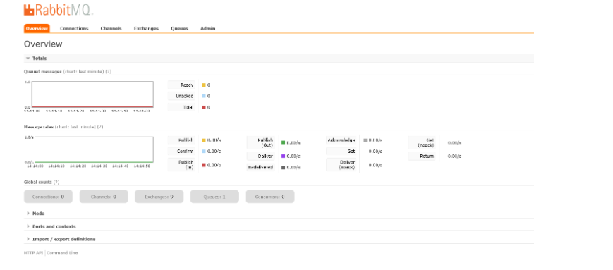
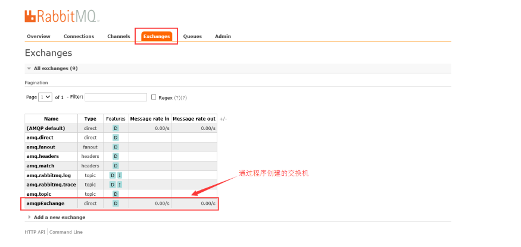
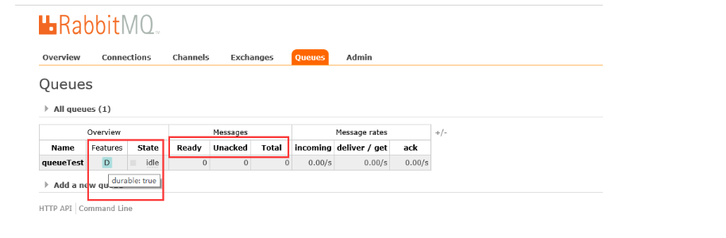

# RabbitMQ 简介
RabbitMQ 的优点
基于 ErLang 语言开发具有高可用高并发的优点，适合辑群服务器
健壮、稳定、易用、跨平台、支持多种语言、文档齐全
有消息确认机制和持久化机制，可靠性高
开源
### RabbitMQ 的概念
### 生产者和消费者
Producer：消息的生产者
Consumer：消息的消费者
### Queue
消息队列，提供了 FIFO 的处理机制，具有缓存消息的能力。RabbitMQ 中，队列消息可以设置为持久化，临时或者自动删除。
设置为持久化的队列，Queue 中的消息会在 Server 本地硬盘存储一份，防止系统 Crash，数据丢失
设置为临时队列，Queue 中的数据在系统重启之后就会丢失
设置为自动删除的队列，当不存在用户连接到 Server，队列中的数据会被自动删除
### ExChange
Exchange 类似于数据通信网络中的交换机，提供消息路由策略。RabbitMQ 中，Producer 不是通过信道直接将消息发送给 Queue，而是先发送给 ExChange。一个 ExChange 可以和多个 Queue 进行绑定，Producer 在传递消息的时候，会传递一个 ROUTING_KEY，ExChange 会根据这个 ROUTING_KEY 按照特定的路由算法，将消息路由给指定的 Queue。和 Queue 一样，ExChange 也可设置为持久化，临时或者自动删除

### ExChange 的 4 种类型
direct（默认）：直接交换器，工作方式类似于单播，ExChange 会将消息发送完全匹配 ROUTING_KEY 的 Queue（key 就等于 queue）
fanout：广播是式交换器，不管消息的 ROUTING_KEY 设置为什么，ExChange 都会将消息转发给所有绑定的 Queue（无视 key，给所有的 queue 都来一份）
topic：主题交换器，工作方式类似于组播，ExChange 会将消息转发和 ROUTING_KEY 匹配模式相同的所有队列（key 可以用“宽字符”模糊匹配 queue），比如，ROUTING_KEY 为 user.stock 的 Message 会转发给绑定匹配模式为 * .stock,user.stock， * . * 和 #.user.stock.# 的队列。（ * 表是匹配一个任意词组，# 表示匹配 0 个或多个词组）
headers：消息体的 header 匹配，无视 key，通过查看消息的头部元数据来决定发给那个 queue（AMQP 头部元数据非常丰富而且可以自定义）
### Binding
所谓绑定就是将一个特定的 ExChange 和一个特定的 Queue 绑定起来。ExChange 和 Queue 的绑定可以是多对多的关系

### Virtual Host 虚拟主机
在 RabbitMQ Server 上可以创建多个虚拟的 Message Broker，又叫做 Virtual Hosts (vhosts)。每一个 vhost 本质上是一个 mini-rabbitmq server，分别管理各自的 ExChange，和 bindings。vhost 相当于物理的 Server，可以为不同 app 提供边界隔离，使得应用安全的运行在不同的 vhost 实例上，相互之间不会干扰。Producer 和 Consumer 连接 rabbit server 需要指定一个 vhost

### RabbitMQ 的使用过程
客户端连接到消息队列服务器，打开一个 Channel。
客户端声明一个 ExChange，并设置相关属性。
客户端声明一个 Queue，并设置相关属性。
客户端使用 Routing Key，在 ExChange 和 Queue 之间建立好绑定关系。
客户端投递消息到 ExChange。
ExChange 接收到消息后，就根据消息的 key 和已经设置的 binding，进行消息路由，将消息投递到一个或多个队列里
# RabbitMQ 安装
### docker-compose.yml
```
version: '3.1'
services:
  rabbitmq:
    restart: always
    image: rabbitmq:management
    container_name: rabbitmq
    ports:
      - 5672:5672
      - 15672:15672
    environment:
      TZ: Asia/Shanghai
      RABBITMQ_DEFAULT_USER: rabbit
      RABBITMQ_DEFAULT_PASS: 123456
    volumes:
      - ./data:/var/lib/rabbitmq
```
### RabbitMQ WebUI
#### 访问地址
```
http://ip:15672
```
### 首页

### Global counts

Connections：连接数
Channels：频道数
Exchanges：交换机数
Queues：队列数
Consumers：消费者数
### 交换机页面

### 队列页面

Name：消息队列的名称，这里是通过程序创建的
Features：消息队列的类型，durable:true为会持久化消息
Ready：准备好的消息
Unacked：未确认的消息
Total：全部消息
备注：如果都为 0 则说明全部消息处理完成
# RabbitMQ 使用
### 生产者
创建一个名为 spring-boot-amqp-provider 的生产者项目

### application.yml
```
spring:
  application:
    name: spring-boot-amqp
  rabbitmq:
    host: 192.168.75.133
    port: 5672
    username: rabbit
    password: 123456
```
### 创建队列配置
```
package com.lusifer.spring.boot.amqp.config;

import org.springframework.amqp.core.Queue;
import org.springframework.context.annotation.Bean;
import org.springframework.context.annotation.Configuration;

/**
 * 队列配置
 * <p>Title: RabbitMQConfiguration</p>
 * <p>Description: </p>
 *
 * @author Lusifer
 * @version 1.0.0
 * @date 2018/5/1 22:39
 */
@Configuration
public class RabbitMQConfiguration {
    @Bean
    public Queue queue() {
        return new Queue("helloRabbit");
    }
}
```
### 创建消息提供者
```
package com.lusifer.spring.boot.amqp.provider;

import org.springframework.amqp.core.AmqpTemplate;
import org.springframework.beans.factory.annotation.Autowired;
import org.springframework.stereotype.Component;

import java.util.Date;

/**
 * 提供者
 * <p>Title: HelloRabbitProvider</p>
 * <p>Description: </p>
 *
 * @author Lusifer
 * @version 1.0.0
 * @date 2018/5/1 22:39
 */
@Component
public class HelloRabbitProvider {
    @Autowired
    private AmqpTemplate amqpTemplate;

    public void send() {
        String context = "hello" + new Date();
        System.out.println("Provider: " + context);
        amqpTemplate.convertAndSend("helloRabbit", context);
    }
}
```
### 创建测试用例
```
package com.lusifer.spring.boot.amqp.test;

import com.lusifer.spring.boot.amqp.Application;
import com.lusifer.spring.boot.amqp.provider.HelloRabbitProvider;
import org.junit.Test;
import org.junit.runner.RunWith;
import org.springframework.beans.factory.annotation.Autowired;
import org.springframework.boot.test.context.SpringBootTest;
import org.springframework.test.context.junit4.SpringRunner;

@RunWith(SpringRunner.class)
@SpringBootTest(classes = Application.class)
public class AmqpTest {
    @Autowired
    private HelloRabbitProvider helloRabbitProvider;

    @Test
    public void testSender() {
        for (int i = 0; i < 10; i++) {
            helloRabbitProvider.send();
        }
    }
}
```
### 消费者
创建一个名为 spring-boot-amqp-consumer 的消费者项目

### application.yml
```
spring:
  application:
    name: spring-boot-amqp-consumer
  rabbitmq:
    host: 192.168.75.133
    port: 5672
    username: rabbit
    password: 123456
```
### 创建消息消费者
```
package com.lusifer.spring.boot.amqp.consumer;

import org.springframework.amqp.rabbit.annotation.RabbitHandler;
import org.springframework.amqp.rabbit.annotation.RabbitListener;
import org.springframework.stereotype.Component;

@Component
@RabbitListener(queues = "helloRabbit")
public class HelloRabbitConsumer {
    @RabbitHandler
    public void process(String message) {
        System.out.println("Consumer: " + message);
    }
}
```