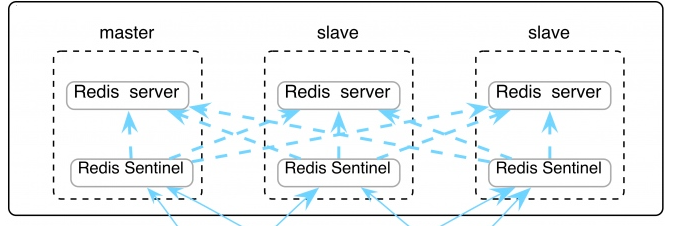

# Redis集群搭建
## 什么是 Redis
Redis 是用 C 语言开发的一个开源的高性能键值对（key-value）数据库。它通过提供多种键值数据类型来适应不同场景下的存储需求，目前为止 Redis 支持的键值数据类型如下：

1.字符串类型
2.散列类型
3.列表类型
4.集合类型
5.有序集合类型
## Redis 的应用场景
1.缓存（数据查询、短连接、新闻内容、商品内容等等）
2.分布式集群架构中的 session 分离
3.聊天室的在线好友列表
4.任务队列（秒杀、抢购、12306 等等）(时间戳加上redis生成3位数进行组合生成唯一)
5.应用排行榜
6.网站访问统计
7.数据过期处理（可以精确到毫秒）
## Redis Sentinel 集群部署
## 概述
Redis 集群可以在一组 redis 节点之间实现高可用性和 sharding。在集群中会有 1 个 master 和多个 slave 节点。当 master 节点失效时，应选举出一个 slave 节点作为新的 master。然而 Redis 本身(包括它的很多客户端)没有实现自动故障发现并进行主备切换的能力，需要外部的监控方案来实现自动故障恢复。

Redis Sentinel 是官方推荐的高可用性解决方案。它是 Redis 集群的监控管理工具，可以提供节点监控、通知、自动故障恢复和客户端配置发现服务。

## 搭建 Redis 集群
搭建一主两从环境，docker-compose.yml 配置如下：
```
version: '3.1'
services:
  master:
    image: redis
    container_name: redis-master
    ports:
      - 6379:6379

  slave1:
    image: redis
    container_name: redis-slave-1
    ports:
      - 6380:6379
    command: redis-server --slaveof redis-master 6379

  slave2:
    image: redis
    container_name: redis-slave-2
    ports:
      - 6381:6379
    command: redis-server --slaveof redis-master 6379
```
## 搭建 Sentinel 集群
我们至少需要创建三个 Sentinel 服务，docker-compose.yml 配置如下：
```
version: '3.1'
services:
  sentinel1:
    image: redis
    container_name: redis-sentinel-1
    ports:
      - 26379:26379
    command: redis-sentinel /usr/local/etc/redis/sentinel.conf
    volumes:
      - ./sentinel1.conf:/usr/local/etc/redis/sentinel.conf

  sentinel2:
    image: redis
    container_name: redis-sentinel-2
    ports:
      - 26380:26379
    command: redis-sentinel /usr/local/etc/redis/sentinel.conf
    volumes:
      - ./sentinel2.conf:/usr/local/etc/redis/sentinel.conf

  sentinel3:
    image: redis
    container_name: redis-sentinel-3
    ports:
      - 26381:26379
    command: redis-sentinel /usr/local/etc/redis/sentinel.conf
    volumes:
      - ./sentinel3.conf:/usr/local/etc/redis/sentinel.conf
  ```
## 修改 Sentinel 配置文件
需要三份 sentinel.conf 配置文件，分别为 sentinel1.conf，sentinel2.conf，sentinel3.conf，配置文件内容相同
```
port 26379
dir /tmp
# 自定义集群名，其中 127.0.0.1 为 redis-master 的 ip，6379 为 redis-master 的端口，2 为最小投票数（因为有 3 台 Sentinel 所以可以设置成 2）
sentinel monitor mymaster 127.0.0.1 6379 2
sentinel down-after-milliseconds mymaster 30000
sentinel parallel-syncs mymaster 1
sentinel failover-timeout mymaster 180000
sentinel deny-scripts-reconfig yes
```
## 查看集群是否生效
进入 Sentinel 容器，使用 Sentinel API 查看监控情况：
```
docker exec -it redis-sentinel-1 /bin/bash
redis-cli -p 26379
sentinel master mymaster
sentinel slaves mymaster
```
# Redis 命令汇总
## 参考资料
http://redisdoc.com/
http://redis.io/commands
## 连接操作相关的命令
ping：测试连接是否存活如果正常会返回 pong
echo：打印
select：切换到指定的数据库，数据库索引号 index 用数字值指定，以 0 作为起始索引值
quit：关闭连接（connection）
auth：简单密码认证
## 服务端相关命令
time：返回当前服务器时间
client list: 返回所有连接到服务器的客户端信息和统计数据 参见 http://redisdoc.com/server/client_list.html
client kill ip:port：关闭地址为 ip:port 的客户端
save：将数据同步保存到磁盘
bgsave：将数据异步保存到磁盘
lastsave：返回上次成功将数据保存到磁盘的Unix时戳
shundown：将数据同步保存到磁盘，然后关闭服务
info：提供服务器的信息和统计
config resetstat：重置 info 命令中的某些统计数据
config get：获取配置文件信息
config set：动态地调整 Redis 服务器的配置(configuration)而无须重启，可以修改的配置参数可以使用命令 CONFIG GET * 来列出
config rewrite：Redis 服务器时所指定的 redis.conf 文件进行改写
monitor：实时转储收到的请求
slaveof：改变复制策略设置
## 发布订阅相关命令
psubscribe：订阅一个或多个符合给定模式的频道 例如 psubscribe news.* tweet.*
publish：将信息 message 发送到指定的频道 channel 例如 publish msg "good morning"
pubsub channels：列出当前的活跃频道 例如 PUBSUB CHANNELS news.i*
pubsub numsub：返回给定频道的订阅者数量 例如 PUBSUB NUMSUB news.it news.internet news.sport news.music
pubsub numpat：返回客户端订阅的所有模式的数量总和
punsubscribe：指示客户端退订所有给定模式。
subscribe：订阅给定的一个或多个频道的信息。例如 subscribe msg chat_room
unsubscribe：指示客户端退订给定的频道。
## 对 KEY 操作的命令
exists(key)：确认一个 key 是否存在
del(key)：删除一个 key
type(key)：返回值的类型
keys(pattern)：返回满足给定 pattern 的所有 key
randomkey：随机返回 key 空间的一个
keyrename(oldname, newname)：重命名 key
dbsize：返回当前数据库中 key 的数目
expire：设定一个 key 的活动时间（s）
ttl：获得一个 key 的活动时间
move(key, dbindex)：移动当前数据库中的 key 到 dbindex 数据库
flushdb：删除当前选择数据库中的所有 key
flushall：删除所有数据库中的所有 key
## 对 String 操作的命令
set(key, value)：给数据库中名称为 key 的 string 赋予值 value
get(key)：返回数据库中名称为 key 的 string 的 value
getset(key, value)：给名称为 key 的 string 赋予上一次的 value
mget(key1, key2,…, key N)：返回库中多个 string 的 value
setnx(key, value)：添加 string，名称为 key，值为 value
setex(key, time, value)：向库中添加 string，设定过期时间 time
mset(key N, value N)：批量设置多个 string 的值
msetnx(key N, value N)：如果所有名称为 key i 的 string 都不存在
incr(key)：名称为 key 的 string 增 1 操作
incrby(key, integer)：名称为 key 的 string 增加 integer
decr(key)：名称为 key 的 string 减 1 操作
decrby(key, integer)：名称为 key 的 string 减少 integer
append(key, value)：名称为 key 的 string 的值附加 value
substr(key, start, end)：返回名称为 key 的 string 的 value 的子串
## 对 List 操作的命令
rpush(key, value)：在名称为 key 的 list 尾添加一个值为 value 的元素
lpush(key, value)：在名称为 key 的 list 头添加一个值为 value 的元素
llen(key)：返回名称为 key 的 list 的长度
lrange(key, start, end)：返回名称为 key 的 list 中 start 至 end 之间的元素
ltrim(key, start, end)：截取名称为 key 的 list
lindex(key, index)：返回名称为 key 的 list 中 index 位置的元素
lset(key, index, value)：给名称为 key 的 list 中 index 位置的元素赋值
lrem(key, count, value)：删除 count 个 key 的 list 中值为 value 的元素
lpop(key)：返回并删除名称为 key 的 list 中的首元素
rpop(key)：返回并删除名称为 key 的 list 中的尾元素
blpop(key1, key2,… key N, timeout)：lpop 命令的 block 版本。
brpop(key1, key2,… key N, timeout)：rpop 的 block 版本。
rpoplpush(srckey, dstkey)：返回并删除名称为 srckey 的 list 的尾元素，并将该元素添加到名称为 dstkey 的 list 的头部
## 对 Set 操作的命令
sadd(key, member)：向名称为 key 的 set 中添加元素 member
srem(key, member) ：删除名称为 key 的 set 中的元素 member
spop(key) ：随机返回并删除名称为 key 的 set 中一个元素
smove(srckey, dstkey, member) ：移到集合元素
scard(key) ：返回名称为 key 的 set 的基数
sismember(key, member) ：member 是否是名称为 key 的 set 的元素
sinter(key1, key2,…key N) ：求交集
sinterstore(dstkey, (keys)) ：求交集并将交集保存到 dstkey 的集合
sunion(key1, (keys)) ：求并集
sunionstore(dstkey, (keys)) ：求并集并将并集保存到 dstkey 的集合
sdiff(key1, (keys)) ：求差集
sdiffstore(dstkey, (keys)) ：求差集并将差集保存到 dstkey 的集合
smembers(key) ：返回名称为 key 的 set 的所有元素
srandmember(key) ：随机返回名称为 key 的 set 的一个元素
## 对 Hash 操作的命令
hset(key, field, value)：向名称为 key 的 hash 中添加元素 field
hget(key, field)：返回名称为 key 的 hash 中 field 对应的 value
hmget(key, (fields))：返回名称为 key 的 hash 中 field i 对应的 value
hmset(key, (fields))：向名称为 key 的 hash 中添加元素 field
hincrby(key, field, integer)：将名称为 key 的 hash 中 field 的 value 增加 integer
hexists(key, field)：名称为 key 的 hash 中是否存在键为 field 的域
hdel(key, field)：删除名称为 key 的 hash 中键为 field 的域
hlen(key)：返回名称为 key 的 hash 中元素个数
hkeys(key)：返回名称为 key 的 hash 中所有键
hvals(key)：返回名称为 key 的 hash 中所有键对应的 value
hgetall(key)：返回名称为 key 的 hash 中所有的键（field）及其对应的 value
## Redis Sentinel
ping ：返回 pong
sentinel masters ：列出所有被监视的主服务器，以及这些主服务器的当前状态。
sentinel slaves：列出给定主服务器的所有从服务器，以及这些从服务器的当前状态。
sentinel get-master-addr-by-name：返回给定名字的主服务器的 IP 地址和端口号。如果这个主服务器正在执行故障转移操作，或者针对这个主服务器的故障转移操作已经完成，那么这个命令返回新的主服务器的 IP 地址和端口号。
sentinel reset：重置所有名字和给定模式 pattern 相匹配的主服务器。pattern 参数是一个 Glob 风格的模式 重置操作清楚主服务器目前的所有状态，包括正在执行中的故障转移，并移除目前已经发现和关联的，主服务器的所有从服务器和 Sentinel 。
sentinel failover：当主服务器失效时，在不询问其他 Sentinel 意见的情况下，强制开始一次自动故障迁移（不过发起故障转移的 Sentinel 会向其他 Sentinel 发送一个新的配置，其他 Sentinel 会根据这个配置进行相应的更新）。
