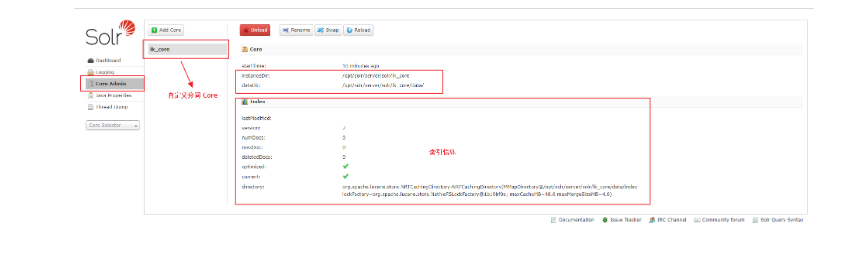

### Solr
概述
Solr 是一个开源搜索平台，用于构建搜索应用程序。它建立在 Lucene (全文搜索引擎)之上。Solr 是企业级的，快速的和高度可扩展的。使用 Solr 构建的应用程序非常复杂，可提供高性能。

为了在 CNET 网络的公司网站上添加搜索功能，Yonik Seely 于 2004 年创建了 Solr。并在 2006 年 1 月，它成为 Apache 软件基金会下的一个开源项目。并于2016年发布最新版本 Solr 6.0，支持并行SQL查询的执行。

Solr 可以和 Hadoop 一起使用。由于 Hadoop 处理大量数据，Solr 帮助我们从这么大的源中找到所需的信息。不仅限于搜索，Solr 也可以用于存储目的。像其他 NoSQL 数据库一样，它是一种非关系数据存储和处理技术。

总之，Solr 是一个可扩展的，可部署，搜索/存储引擎，优化搜索大量以文本为中心的数据库。

### Apache Solr 特点
Solr 是 Lucene 的 Java API 的包装。因此，使用 Solr，可以利用 Lucene 的所有功能。

Restful APIs − 要与 Solr 通信，并非一定需要有 Java 编程技能。相反，您可以使用 RESTful 服务与它通信。可使用文件格式(如XML，JSON和.CSV)在 Solr 中作为输入文档，并以相同的文件格式获取结果。
全文搜索 - Solr 提供了全文搜索所需的所有功能，例如令牌，短语，拼写检查，通配符和自动完成。
企业准备 - 根据企业/组织的需要，Solr 可以部署在任何类型的系统(大或小)，如独立，分布式，云等。
灵活和可扩展 - 通过扩展 Java 类并相应配置，可以轻松地定制 Solr 的组件。
NoSQL 数据库 - Solr 也可以用作大数据量级的 NOSQL 数据库，可以沿着集群分布搜索任务。
管理界面 - Solr 提供了一个易于使用，用户友好，功能强大的用户界面，使用它可以执行所有可能的任务，如管理日志，添加，删除，更新和搜索文档。
高度可扩展 - 在使用 Solr 与 Hadoop 时，我们可以通过添加副本来扩展其容量。
以文本为中心并按相关性排序 - Solr 主要用于搜索文本文档，结果根据与用户查询的相关性按顺序传送。
与 Lucene 不同，在使用 Apache Solr 时，可不需要具有 Java 编程技能。它提供了一个完整的准备部署服务，以构建一个自动完成的搜索框，Lucene 是不提供的。 使用 Solr 可以扩展，分配和管理大规模(大数据)应用程序的索引。

### 什么是搜索引擎
概述
搜索引擎是指一个庞大的互联网资源数据库，如网页，新闻组，程序，图像等。它有助于在万维网上定位信息。用户可以通过以关键字或短语的形式将查询传递到搜索引擎中来搜索信息。然后搜索引擎搜索其数据库并向用户返回相关链接。

# 搜索引擎组件
一般来说，搜索引擎有三个基本组件

Web爬虫 - Web爬虫也称为蜘蛛或机器人。 它是一个收集网络信息的软件组件。
数据库 - Web上的所有信息都存储在数据库中。它们包含大量的 Web 资源。
搜索接口 - 此组件是用户和数据库之间的接口。它帮助用户搜索数据库。
# 搜索引擎是如何工作的？
任何搜索应用程序都需要执行以下一些或全部操作

|    步骤 |  标题或名称   |  描述   |
| --- | --- | --- |
|   1  |    获取原始内容 |   任何搜索应用程序的第一步是收集要进行搜索的目标内容  |
|   2  |   构建文档  |  从原始内容构建文档，让搜索应用程序可以很容易地理解和解释   |
|   3  |   分析文档  |    在索引开始之前，将对文档进行分析 |
|   4  |   索引文档  |   当文档被构建和分析后，下一步是对它们建立索引，以便可以基于特定键而不是文档的全部内容来检索该文档。索引类似于在书开始页或末尾处的目录索引，其中常见单词以其页码显示，使得这些单词可以快速跟踪，而不是搜索整本书  |
|   5  |    用于搜索的用户接口 |   当索引数据库就绪，应用程序可以执行搜索操作。 为了帮助用户进行搜索，应用必须提供用户接口，用户可以在其中输入文本并启动搜索过程  |
|   6  |   构建查询  |  当用户做出搜索文本的请求，应用程序应该使用该文本来准备查询对象，然后可以使用该查询对象来查询索引数据库以获得相关的细节   |
|   7  |   搜索查询  |   使用查询对象，检查索引数据库以获取相关详细信息和内容文档  |
|   8  |    渲染结果 |   当收到所需的结果，应用程序应决定如何使用其用户界面向用户显示结果  |
### 基于 Docker 安装 Solr
基本部署
### docker-compose.yml
```
version: '3.1'
services:
  solr:
    image: solr
    restart: always
    container_name: solr
    ports:
      - 8983:8983
```
### 部署成功效果图
访问地址：http://192.168.10.131:8983/


### 什么是分词技术？
分词技术就是搜索引擎针对用户提交查询的关键词串进行的查询处理后根据用户的关键词串用各种匹配方法进行分词的一种技术。

### 中文分词算法分类
基于字符串匹配
基于字符串匹配，即扫描字符串，如果发现字符串的子串和词相同，就算匹配，这类分词通常会加入一些启发式规则，比如“正向/反向最大匹配”,“长词优先”等策略，这类算法优点是速度块，都是O(n)时间复杂度，实现简单，效果尚可。缺点，就是对歧义和未登录词处理不好

歧义的列子：歧义的例子很简单"长春市/长春/药店" "长春/市长/春药/店" 未登录：即词典中没有出现的词，当然也就处理不好

ikanalyzer, paoding 等就是基于字符串匹配的分词

基于统计以及机器学习的分词方式
这类分词基于人工标注的词性和统计特征，对中文进行建模，即根据观测到的数据（标注好的语料）对模型参数进行估计，即训练。在分词阶段再通过模型计算各种分词出现的概率，将概率最大的分词结果作为最终结果。常见的序列标注模型有 HMM 和 CRF。

这类分词算法能很好处理歧义和未登录词问题，效果比前一类效果好，但是需要大量的人工标注数据，以及较慢的分词速度。

### 什么是 IKAnalyzer
IKAnalyzer 是一个开源的，基于 Java 语言开发的轻量级的中文分词工具包，基于文本匹配，不需要投入大量人力进行训练和标注可以自定词典，方便加入特定领域的词语，能分出多粒度的结果

# 部署 Solr 并安装 IKAnalyzer
创建一个名为 /usr/local/docker/solr/ikanalyzer 目录
```
/usr/local/docker/solr：用于存放 docker-compose.yml 配置文件
/usr/local/docker/solr/ikanalyzer：用于存放 Dockerfile 镜像配置文件
```
### docker-compose.yml
```
version: '3.1'
services:
  solr:
    build: ikanalyzer
    restart: always
    container_name: solr
    ports:
      - 8983:8983
    volumes:
      - ./solrdata:/opt/solrdata
```
### Dockerfile
```
FROM solr
MAINTAINER Lusifer <topsale@vip.qq.com>

# 创建 Core
WORKDIR /opt/solr/server/solr
RUN mkdir ik_core
WORKDIR /opt/solr/server/solr/ik_core
RUN echo 'name=ik_core' > core.properties
RUN mkdir data
RUN cp -r ../configsets/sample_techproducts_configs/conf/ .

# 安装中文分词
WORKDIR /opt/solr/server/solr-webapp/webapp/WEB-INF/lib
ADD ik-analyzer-solr5-5.x.jar .
ADD solr-analyzer-ik-5.1.0.jar .
WORKDIR /opt/solr/server/solr-webapp/webapp/WEB-INF
ADD ext.dic .
ADD stopword.dic .
ADD IKAnalyzer.cfg.xml .

# 增加分词配置
COPY managed-schema /opt/solr/server/solr/ik_core/conf

WORKDIR /opt/solr
```
### 部署成功效果图
访问地址：http://192.168.10.131:8983/


### Solr 的基本操作
### 功能界面
### Dashboard


### Logging


### Core Admin


### Thread Dump


### Core


### 分析功能
### 修改 managed-schema 配置业务系统字段
需要用到的业务字段如下：

商品 ID
商品分类 ID
分类名称
商品名称
商品卖点
商品详情
由于 Solr 中自带 id 字段所以无需添加，其它字段需要手动添加 Solr 字段

# 字段域
```
<field name="tb_item_cid" type="plong" indexed="true" stored="true"/>
<field name="tb_item_cname"  type="text_ik" indexed="true" stored="true"/>
<field name="tb_item_title"  type="text_ik" indexed="true" stored="true"/>
<field name="tb_item_sell_point" type="text_ik" indexed="true" stored="true" />
<field name="tb_item_desc" type="text_ik" indexed="true" stored="true" />

# 复制域（Solr 的搜索优化功能，将多个字段域复制到一个域里，提高查询效率）
<field name="tb_item_keywords" type="text_ik" indexed="true" stored="false" multiValued="true"/>
<copyField source="tb_item_cname" dest="tb_item_keywords"/>
<copyField source="tb_item_title" dest="tb_item_keywords"/>
<copyField source="tb_item_sell_point" dest="tb_item_keywords"/>
<copyField source="tb_item_desc" dest="tb_item_keywords"/>
```

### 复制配置到容器并重启
### 复制到容器
```
docker cp managed-schema solr:/opt/solr/server/solr/ik_core/conf
```
### 重启容器
```
docker-compose restart
```
### 分词效果图


### 维护功能
维护功能即对数据库的 CRUD 操作

### 添加索引库
```
{
    "id": 536563,
    "tb_item_cid": 560,
    "tb_item_cname": "手机",
    "tb_item_title": "new2 - 阿尔卡特 (OT-927) 炭黑 联通3G手机 双卡双待",
    "tb_item_sell_point": "清仓！仅北京，武汉仓有货！"
}
```

### 测试查询


### 删除索引库
设置文档类型为 XML


### 根据 ID 删除
<delete>
    <id>536563</id>
</delete>
<commit />
### 根据查询删除
<delete>
    <query>*:*</query>
</delete>
<commit/>
### 查询功能
### 查询条件


说明：

q：查询条件，: 为查询所有域，单独查询某个域如：tb_item_title:手机
fq: 过滤条件
sort：排序条件
start,rows：分页条件
fl：字段列表返回域，如只希望返回 id
df：默认搜索域，如之前配置的复制域 tb_item_keywords
### 高亮显示


说明：上图意为在默认搜索域 tb_item_keywords 中搜索关键字 手机 并指定需要高亮显示的结果域 tb_item_title 以 红色 显示
### Spring Boot 整合 Solr
创建搜索服务接口
创建一个名为 myshop-service-search-api 项目，该项目只负责定义接口

### POM
```
<?xml version="1.0" encoding="UTF-8"?>
<project xmlns="http://maven.apache.org/POM/4.0.0" xmlns:xsi="http://www.w3.org/2001/XMLSchema-instance"
         xsi:schemaLocation="http://maven.apache.org/POM/4.0.0 http://maven.apache.org/xsd/maven-4.0.0.xsd">
    <modelVersion>4.0.0</modelVersion>

    <parent>
        <groupId>com.funtl</groupId>
        <artifactId>myshop-dependencies</artifactId>
        <version>1.0.0-SNAPSHOT</version>
        <relativePath>../myshop-dependencies/pom.xml</relativePath>
    </parent>

    <artifactId>myshop-service-search-api</artifactId>
    <packaging>jar</packaging>

    <url>http://www.funtl.com</url>
    <inceptionYear>2018-Now</inceptionYear>
</project>
```
### TbItemResult
为了实现全文检索的功能，我们需要将几张表的内容汇总到一个结果集中，此时需要使用多表联查将结果集汇总，SQL 语句如下：
```
SELECT
  a.id,
  a.cid AS tb_item_cid,
  b.name AS tb_item_cname,
  a.title AS tb_item_title,
  a.sell_point AS tb_item_sell_point,
  c.item_desc AS tb_item_desc
FROM
  tb_item AS a
  LEFT JOIN tb_item_cat AS b
    ON a.cid = b.id
  LEFT JOIN tb_item_desc AS c
    ON c.item_id = a.id
```
实体类如下：
```
package com.funtl.myshop.service.search.domain;

import java.io.Serializable;

public class TbItemResult implements Serializable {
    private Long id;
    private Long tbItemCid;
    private String tbItemCname;
    private String tbItemTitle;
    private String tbItemSellPoint;
    private String tbItemDesc;

    public Long getId() {
        return id;
    }

    public void setId(Long id) {
        this.id = id;
    }

    public Long getTbItemCid() {
        return tbItemCid;
    }

    public void setTbItemCid(Long tbItemCid) {
        this.tbItemCid = tbItemCid;
    }

    public String getTbItemCname() {
        return tbItemCname;
    }

    public void setTbItemCname(String tbItemCname) {
        this.tbItemCname = tbItemCname;
    }

    public String getTbItemTitle() {
        return tbItemTitle;
    }

    public void setTbItemTitle(String tbItemTitle) {
        this.tbItemTitle = tbItemTitle;
    }

    public String getTbItemSellPoint() {
        return tbItemSellPoint;
    }

    public void setTbItemSellPoint(String tbItemSellPoint) {
        this.tbItemSellPoint = tbItemSellPoint;
    }

    public String getTbItemDesc() {
        return tbItemDesc;
    }

    public void setTbItemDesc(String tbItemDesc) {
        this.tbItemDesc = tbItemDesc;
    }
}
```
###  SearchService
```
package com.funtl.myshop.service.search.api;

import com.funtl.myshop.service.search.domain.TbItemResult;

import java.util.List;

public interface SearchService {
    /**
     * 搜索商品
     * @param query 查询关键字
     * @param page 页码
     * @param rows 笔数
     * @return
     */
    List<TbItemResult> search(String query, int page, int rows);
}
```
###  创建搜索服务提供者
创建一个名为 myshop-service-search-provider 项目，该项目负责实现查询接口并初始化 Solr

###  POM
```
<?xml version="1.0" encoding="UTF-8"?>
<project xmlns="http://maven.apache.org/POM/4.0.0" xmlns:xsi="http://www.w3.org/2001/XMLSchema-instance"
         xsi:schemaLocation="http://maven.apache.org/POM/4.0.0 http://maven.apache.org/xsd/maven-4.0.0.xsd">
    <modelVersion>4.0.0</modelVersion>

    <parent>
        <groupId>com.funtl</groupId>
        <artifactId>myshop-dependencies</artifactId>
        <version>1.0.0-SNAPSHOT</version>
        <relativePath>../myshop-dependencies/pom.xml</relativePath>
    </parent>

    <artifactId>myshop-service-search-provider</artifactId>
    <packaging>jar</packaging>

    <url>http://www.funtl.com</url>
    <inceptionYear>2018-Now</inceptionYear>

    <dependencies>
        <!-- Spring Boot Starter Settings -->
        <dependency>
            <groupId>org.springframework.boot</groupId>
            <artifactId>spring-boot-starter-data-solr</artifactId>
        </dependency>
        <dependency>
            <groupId>org.springframework.boot</groupId>
            <artifactId>spring-boot-starter-test</artifactId>
            <scope>test</scope>
        </dependency>

        <!-- Commons Settings -->
        <dependency>
            <groupId>de.javakaffee</groupId>
            <artifactId>kryo-serializers</artifactId>
        </dependency>

        <!-- Projects Settings -->
        <dependency>
            <groupId>com.funtl</groupId>
            <artifactId>myshop-commons-dubbo</artifactId>
            <version>${project.parent.version}</version>
        </dependency>
        <dependency>
            <groupId>com.funtl</groupId>
            <artifactId>myshop-commons-mapper</artifactId>
            <version>${project.parent.version}</version>
        </dependency>
        <dependency>
            <groupId>com.funtl</groupId>
            <artifactId>myshop-service-search-api</artifactId>
            <version>${project.parent.version}</version>
        </dependency>
    </dependencies>

    <build>
        <plugins>
            <plugin>
                <groupId>org.springframework.boot</groupId>
                <artifactId>spring-boot-maven-plugin</artifactId>
                <configuration>
                    <mainClass>com.funtl.myshop.service.search.provider.MyShopServiceSearchProviderApplication</mainClass>
                </configuration>
            </plugin>
        </plugins>
    </build>
</project>
```
主要增加了 org.springframework.boot:spring-boot-starter-data-solr 依赖

###  TbItemResultMapper
创建原生 Mapper ，主要作用是通过多表联查将数据汇总
```
package com.funtl.myshop.service.search.provider.mapper;

import com.funtl.myshop.service.search.domain.TbItemResult;
import org.springframework.stereotype.Repository;

import java.util.List;

@Repository
public interface TbItemResultMapper {
    List<TbItemResult> selectAll();
}
TbItemResultMapper.xml
<?xml version="1.0" encoding="UTF-8"?>
<!DOCTYPE mapper PUBLIC "-//mybatis.org//DTD Mapper 3.0//EN" "http://mybatis.org/dtd/mybatis-3-mapper.dtd">
<mapper namespace="com.funtl.myshop.service.search.provider.mapper.TbItemResultMapper">
    <resultMap id="BaseResultMap" type="com.funtl.myshop.service.search.domain.TbItemResult">
        <id column="id" jdbcType="BIGINT" property="id" />
        <result column="tb_item_cid" jdbcType="BIGINT" property="tbItemCid" />
        <result column="tb_item_cname" jdbcType="VARCHAR" property="tbItemCname" />
        <result column="tb_item_title" jdbcType="VARCHAR" property="tbItemTitle" />
        <result column="tb_item_sell_point" jdbcType="VARCHAR" property="tbItemSellPoint" />
        <result column="tb_item_desc" jdbcType="VARCHAR" property="tbItemDesc" />
    </resultMap>

    <select id="selectAll" resultMap="BaseResultMap">
        SELECT
          a.id,
          a.cid AS tb_item_cid,
          b.name AS tb_item_cname,
          a.title AS tb_item_title,
          a.sell_point AS tb_item_sell_point,
          c.item_desc AS tb_item_desc
        FROM
          tb_item AS a
          LEFT JOIN tb_item_cat AS b
            ON a.cid = b.id
          LEFT JOIN tb_item_desc AS c
            ON c.item_id = a.id
    </select>
</mapper>
```
###  Application
这里使用 Spring 提供的 MyBatis 包扫面注解
```
package com.funtl.myshop.service.search.provider;

import com.alibaba.dubbo.container.Main;
import org.mybatis.spring.annotation.MapperScan;
import org.springframework.boot.SpringApplication;
import org.springframework.boot.autoconfigure.SpringBootApplication;
import org.springframework.cloud.netflix.hystrix.EnableHystrix;
import org.springframework.cloud.netflix.hystrix.dashboard.EnableHystrixDashboard;
import org.springframework.transaction.annotation.EnableTransactionManagement;

@EnableHystrix
@EnableHystrixDashboard
@SpringBootApplication(scanBasePackages = "com.funtl.myshop")
@EnableTransactionManagement
@MapperScan(basePackages = "com.funtl.myshop.service.search.provider.mapper")
public class MyShopServiceSearchProviderApplication {
    public static void main(String[] args) {
        SpringApplication.run(MyShopServiceSearchProviderApplication.class, args);
        Main.main(args);
    }
}
```
###  测试并初始化 Solr
```
package com.funtl.myshop.service.search.provider.test;

import com.funtl.myshop.service.search.domain.TbItemResult;
import com.funtl.myshop.service.search.provider.MyShopServiceSearchProviderApplication;
import com.funtl.myshop.service.search.provider.mapper.TbItemResultMapper;
import org.apache.solr.client.solrj.SolrClient;
import org.apache.solr.client.solrj.SolrQuery;
import org.apache.solr.client.solrj.SolrServerException;
import org.apache.solr.client.solrj.response.QueryResponse;
import org.apache.solr.common.SolrDocument;
import org.apache.solr.common.SolrDocumentList;
import org.apache.solr.common.SolrInputDocument;
import org.junit.Test;
import org.junit.runner.RunWith;
import org.springframework.beans.factory.annotation.Autowired;
import org.springframework.boot.test.context.SpringBootTest;
import org.springframework.test.context.junit4.SpringRunner;

import java.io.IOException;
import java.util.List;
import java.util.Map;

@RunWith(SpringRunner.class)
@SpringBootTest(classes = MyShopServiceSearchProviderApplication.class)
public class SearchServiceTest {

    @Autowired
    private SolrClient solrClient;

    @Autowired
    private TbItemResultMapper tbItemResultMapper;

    /**
     * 初始化 Solr
     */
    @Test
    public void testInitSolr() {
        List<TbItemResult> tbItemResults = tbItemResultMapper.selectAll();

        SolrInputDocument document = null;
        for (TbItemResult tbItemResult : tbItemResults) {
            document = new SolrInputDocument();
            document.addField("id", tbItemResult.getId());
            document.addField("tb_item_cid", tbItemResult.getTbItemCid());
            document.addField("tb_item_cname", tbItemResult.getTbItemCname());
            document.addField("tb_item_title", tbItemResult.getTbItemTitle());
            document.addField("tb_item_sell_point", tbItemResult.getTbItemSellPoint());
            document.addField("tb_item_desc", tbItemResult.getTbItemDesc());

            try {
                solrClient.add(document);
                solrClient.commit();
            } catch (SolrServerException e) {
                e.printStackTrace();
            } catch (IOException e) {
                e.printStackTrace();
            }
        }
    }

    /**
     * 添加索引库
     */
    @Test
    public void testAddDocument() {
        // 创建文档对象
        SolrInputDocument document = new SolrInputDocument();

        // 向文档中添加域
        document.addField("id", 536563);
        document.addField("tb_item_title", "new2 - 阿尔卡特 (OT-927) 炭黑 联通3G手机 双卡双待");

        // 将文档添加到索引库
        try {
            solrClient.add(document);
            solrClient.commit();
        } catch (SolrServerException e) {
            e.printStackTrace();
        } catch (IOException e) {
            e.printStackTrace();
        }
    }

    /**
     * 删除索引库
     */
    @Test
    public void testDeleteDocument() {
        try {
            solrClient.deleteByQuery("*:*");
            solrClient.commit();
        } catch (SolrServerException e) {
            e.printStackTrace();
        } catch (IOException e) {
            e.printStackTrace();
        }
    }

    /**
     * 查询索引库
     */
    @Test
    public void testQueryDocument() {
        // 创建查询对象
        SolrQuery query = new SolrQuery();

        // 设置查询条件
        query.setQuery("手机");

        // 设置分页
        query.setStart(0);
        query.setRows(10);

        // 设置默认搜索域
        query.set("df", "tb_item_keywords");

        // 设置高亮显示
        query.setHighlight(true);
        query.addHighlightField("tb_item_title");
        query.setHighlightSimplePre("<span style='color:red;'>");
        query.setHighlightSimplePost("</span>");

        try {
            // 执行查询操作
            QueryResponse response = solrClient.query(query);

            // 获取查询结果集
            SolrDocumentList results = response.getResults();

            // 获取高亮显示
            Map<String, Map<String, List<String>>> highlighting = response.getHighlighting();

            // 遍历结果集
            for (SolrDocument result : results) {
                String tbItemTitle = "";
                List<String> strings = highlighting.get(result.get("id")).get("tb_item_title");
                if (strings != null && strings.size() > 0) {
                    tbItemTitle = strings.get(0);
                } else {
                    tbItemTitle = (String) result.get("tb_item_title");
                }

                System.out.println(tbItemTitle);
            }
        } catch (SolrServerException e) {
            e.printStackTrace();
        } catch (IOException e) {
            e.printStackTrace();
        }
    }
}
```
###  SearchServiceImpl
```
package com.funtl.myshop.service.search.provider.api.impl;

import com.alibaba.dubbo.config.annotation.Service;
import com.funtl.myshop.service.search.api.SearchService;
import com.funtl.myshop.service.search.domain.TbItemResult;
import com.google.common.collect.Lists;
import org.apache.solr.client.solrj.SolrClient;
import org.apache.solr.client.solrj.SolrQuery;
import org.apache.solr.client.solrj.SolrServerException;
import org.apache.solr.client.solrj.response.QueryResponse;
import org.apache.solr.common.SolrDocument;
import org.apache.solr.common.SolrDocumentList;
import org.springframework.beans.factory.annotation.Autowired;

import java.io.IOException;
import java.util.List;
import java.util.Map;

@Service(version = "${services.versions.search.v1}")
public class SearchServiceImpl implements SearchService {

    @Autowired
    private SolrClient solrClient;

    @Override
    public List<TbItemResult> search(String query, int page, int rows) {
        List<TbItemResult> searchResults = Lists.newArrayList();

        // 创建查询对象
        SolrQuery solrQuery = new SolrQuery();

        // 设置查询条件
        solrQuery.setQuery(query);

        // 设置分页条件
        solrQuery.setStart((page - 1) * rows);
        solrQuery.setRows(rows);

        // 设置默认搜索域
        solrQuery.set("df", "tb_item_keywords");

        // 设置高亮显示
        solrQuery.setHighlight(true);
        solrQuery.addHighlightField("tb_item_title");
        solrQuery.setHighlightSimplePre("<span style='color:red'>");
        solrQuery.setHighlightSimplePost("</span>");

        try {
            // 执行查询操作
            QueryResponse queryResponse = solrClient.query(solrQuery);
            SolrDocumentList solrDocuments = queryResponse.getResults();
            Map<String, Map<String, List<String>>> highlighting = queryResponse.getHighlighting();
            for (SolrDocument solrDocument : solrDocuments) {
                TbItemResult result = new TbItemResult();

                result.setId(Long.parseLong(String.valueOf(solrDocument.get("id"))));
                result.setTbItemCid(Long.parseLong(String.valueOf(solrDocument.get("tb_item_cid"))));
                result.setTbItemCname((String) solrDocument.get("tb_item_cname"));
                result.setTbItemTitle((String) solrDocument.get("tb_item_title"));
                result.setTbItemSellPoint((String) solrDocument.get("tb_item_sell_point"));
                result.setTbItemDesc((String) solrDocument.get("tb_item_desc"));

                String tbItemTitle = "";
                List<String> list = highlighting.get(solrDocument.get("id")).get("tb_item_title");
                if (list != null && list.size() > 0) {
                    tbItemTitle = list.get(0);
                } else {
                    tbItemTitle = (String) solrDocument.get("tb_item_title");
                }
                result.setTbItemTitle(tbItemTitle);

                searchResults.add(result);
            }
        } catch (SolrServerException e) {
            e.printStackTrace();
        } catch (IOException e) {
            e.printStackTrace();
        }

        return searchResults;
    }
}
```
###  application.yml
主要增加了 spring.data.solr.host 配置：
```
spring:
  data:
    solr:
      host: http://192.168.10.131:8983/solr/ik_core
```
完整配置如下：

###  Spring boot application
```
spring:
  application:
    name: myshop-service-search-provider
  datasource:
    druid:
      url: jdbc:mysql://192.168.10.131:3306/myshop?useUnicode=true&characterEncoding=utf-8&useSSL=false
      username: root
      password: 123456
      initial-size: 1
      min-idle: 1
      max-active: 20
      test-on-borrow: true
      driver-class-name: com.mysql.cj.jdbc.Driver
  data:
    solr:
      host: http://192.168.10.131:8983/solr/ik_core
server:
  port: 8504

# MyBatis Config properties
mybatis:
  type-aliases-package: com.funtl.myshop.commons.domain
  mapper-locations: classpath:mapper/*.xml

# Services Versions
services:
  versions:
    search:
      v1: 1.0.0

# Dubbo Config properties
dubbo:
  ## Base packages to scan Dubbo Component：@com.alibaba.dubbo.config.annotation.Service
  scan:
    basePackages: com.funtl.myshop.service.search.provider.api.impl
  ## ApplicationConfig Bean
  application:
    id: myshop-service-search-provider
    name: myshop-service-search-provider
    qos-port: 22225
    qos-enable: true
  ## ProtocolConfig Bean
  protocol:
    id: dubbo
    name: dubbo
    port: 20884
    status: server
    serialization: kryo
  ## RegistryConfig Bean
  registry:
    id: zookeeper
    address: zookeeper://192.168.10.131:2181?backup=192.168.10.131:2182,192.168.10.131:2183

# Enables Dubbo All Endpoints
management:
  endpoint:
    dubbo:
      enabled: true
    dubbo-shutdown:
      enabled: true
    dubbo-configs:
      enabled: true
    dubbo-services:
      enabled: true
    dubbo-references:
      enabled: true
    dubbo-properties:
      enabled: true
  # Dubbo Health
  health:
    dubbo:
      status:
        ## StatusChecker Name defaults (default : "memory", "load" )
        defaults: memory
        ## StatusChecker Name extras (default : empty )
        extras: load,threadpool


logging:
  level.com.funtl.myshop.commons.mapper: DEBUG
```
###  创建搜索服务消费者
创建一个名为 myshop-service-search-cosumer 项目

###  POM
```
<?xml version="1.0" encoding="UTF-8"?>
<project xmlns="http://maven.apache.org/POM/4.0.0" xmlns:xsi="http://www.w3.org/2001/XMLSchema-instance"
         xsi:schemaLocation="http://maven.apache.org/POM/4.0.0 http://maven.apache.org/xsd/maven-4.0.0.xsd">
    <modelVersion>4.0.0</modelVersion>

    <parent>
        <groupId>com.funtl</groupId>
        <artifactId>myshop-dependencies</artifactId>
        <version>1.0.0-SNAPSHOT</version>
        <relativePath>../myshop-dependencies/pom.xml</relativePath>
    </parent>

    <artifactId>myshop-service-search-consumer</artifactId>
    <packaging>jar</packaging>

    <url>http://www.funtl.com</url>
    <inceptionYear>2018-Now</inceptionYear>

    <dependencies>
        <!-- Spring Boot Starter Settings -->
        <dependency>
            <groupId>org.springframework.boot</groupId>
            <artifactId>spring-boot-starter-test</artifactId>
            <scope>test</scope>
        </dependency>

        <!-- Commons Settings -->
        <dependency>
            <groupId>de.javakaffee</groupId>
            <artifactId>kryo-serializers</artifactId>
        </dependency>

        <!-- Projects Settings -->
        <dependency>
            <groupId>com.funtl</groupId>
            <artifactId>myshop-commons-dubbo</artifactId>
            <version>${project.parent.version}</version>
        </dependency>
        <dependency>
            <groupId>com.funtl</groupId>
            <artifactId>myshop-static-backend</artifactId>
            <version>${project.parent.version}</version>
        </dependency>
        <dependency>
            <groupId>com.funtl</groupId>
            <artifactId>myshop-service-search-api</artifactId>
            <version>${project.parent.version}</version>
        </dependency>
    </dependencies>

    <build>
        <plugins>
            <plugin>
                <groupId>org.springframework.boot</groupId>
                <artifactId>spring-boot-maven-plugin</artifactId>
                <configuration>
                    <mainClass>com.funtl.myshop.service.search.consumer.MyShopServiceSearchConsumerApplication</mainClass>
                </configuration>
            </plugin>
        </plugins>
    </build>

</project>
```
###  Application
```
package com.funtl.myshop.service.search.consumer;

import com.alibaba.dubbo.container.Main;
import org.springframework.boot.SpringApplication;
import org.springframework.boot.autoconfigure.SpringBootApplication;
import org.springframework.boot.autoconfigure.jdbc.DataSourceAutoConfiguration;
import org.springframework.cloud.netflix.hystrix.EnableHystrix;
import org.springframework.cloud.netflix.hystrix.dashboard.EnableHystrixDashboard;

@EnableHystrix
@EnableHystrixDashboard
@SpringBootApplication(scanBasePackages = "com.funtl.myshop", exclude = DataSourceAutoConfiguration.class)
public class MyShopServiceSearchConsumerApplication {
    public static void main(String[] args) {
        SpringApplication.run(MyShopServiceSearchConsumerApplication.class, args);
        Main.main(args);
    }
}
```
###  application.yml
###  Spring boot application
```
spring:
  application:
    name: myshop-service-search-consumer
  thymeleaf:
    cache: false # 开发时关闭缓存,不然没法看到实时页面
    mode: LEGACYHTML5 # 用非严格的 HTML
    encoding: UTF-8
    servlet:
      content-type: text/html
server:
  port: 8603

# Services Versions
services:
  versions:
    search:
      v1: 1.0.0

# Dubbo Config properties
dubbo:
  scan:
    basePackages: com.funtl.myshop.service.search.consumer
  ## ApplicationConfig Bean
  application:
    id: myshop-service-search-consumer
    name: myshop-service-search-consumer
  ## ProtocolConfig Bean
  protocol:
    id: dubbo
    name: dubbo
    port: 30883
    status: server
    serialization: kryo
  ## RegistryConfig Bean
  registry:
    id: zookeeper
    address: zookeeper://192.168.10.131:2181?backup=192.168.10.131:2182,192.168.10.131:2183

# Dubbo Endpoint (default status is disable)
endpoints:
  dubbo:
    enabled: true

management:
  server:
    port: 8703
  # Dubbo Health
  health:
    dubbo:
      status:
        ## StatusChecker Name defaults (default : "memory", "load" )
        defaults: memory
  # Enables Dubbo All Endpoints
  endpoint:
    dubbo:
      enabled: true
    dubbo-shutdown:
      enabled: true
    dubbo-configs:
      enabled: true
    dubbo-services:
      enabled: true
    dubbo-references:
      enabled: true
    dubbo-properties:
      enabled: true
  endpoints:
    web:
      exposure:
        include: "*"
```
### Controller
```
package com.funtl.myshop.service.search.consumer.controller;

import com.alibaba.dubbo.config.annotation.Reference;
import com.funtl.myshop.service.search.api.SearchService;
import com.funtl.myshop.service.search.domain.TbItemResult;
import org.springframework.web.bind.annotation.PathVariable;
import org.springframework.web.bind.annotation.RequestMapping;
import org.springframework.web.bind.annotation.RequestMethod;
import org.springframework.web.bind.annotation.RestController;

import java.util.List;

@RestController
public class SearchController {

    @Reference(version = "${services.versions.search.v1}")
    private SearchService searchService;

    @RequestMapping(value = "search/{query}/{page}/{size}", method = RequestMethod.GET)
    public List<TbItemResult> search(
            @PathVariable(required = true) String query,
            @PathVariable(required = true) int page,
            @PathVariable(required = true) int size) {
        List<TbItemResult> tbItemResults = searchService.search(query, page, size);
        return tbItemResults;
    }
}
```
# 测试效果图
在浏览器访问：http://localhost:8603/search/手机/1/10


