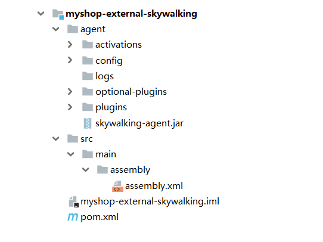

# Spring-Cloud-Alibaba 创建外部的链路追踪
## 目录结构


## POM
```
<?xml version="1.0" encoding="UTF-8"?>
<project xmlns="http://maven.apache.org/POM/4.0.0" xmlns:xsi="http://www.w3.org/2001/XMLSchema-instance"
         xsi:schemaLocation="http://maven.apache.org/POM/4.0.0 http://maven.apache.org/xsd/maven-4.0.0.xsd">
    <modelVersion>4.0.0</modelVersion>

    <parent>
        <groupId>com.funtl</groupId>
        <artifactId>myshop-dependencies</artifactId>
        <version>1.0.0-SNAPSHOT</version>
        <relativePath>../myshop-dependencies/pom.xml</relativePath>
    </parent>

    <artifactId>myshop-external-skywalking</artifactId>
    <packaging>jar</packaging>

    <name>myshop-external-skywalking</name>
    <url>http://www.funtl.com</url>
    <inceptionYear>2018-Now</inceptionYear>

    <build>
        <plugins>
            <plugin>
                <groupId>org.apache.maven.plugins</groupId>
                <artifactId>maven-assembly-plugin</artifactId>
                <executions>
                    <!-- 配置执行器 -->
                    <execution>
                        <id>make-assembly</id>
                        <!-- 绑定到 package 生命周期阶段上 -->
                        <phase>package</phase>
                        <goals>
                            <!-- 只运行一次 -->
                            <goal>single</goal>
                        </goals>
                        <configuration>
                            <finalName>skywalking</finalName>
                            <descriptors>
                                <!-- 配置描述文件路径 -->
                                <descriptor>src/main/assembly/assembly.xml</descriptor>
                            </descriptors>
                        </configuration>
                    </execution>
                </executions>
            </plugin>
        </plugins>
    </build>
</project>
```
## 打包归档文件的配置
```
创建 src/main/assembly/assembly.xml 配置文件

<assembly>
    <id>6.0.0-Beta</id>
    <formats>
        <!-- 打包的文件格式，支持 zip、tar.gz、tar.bz2、jar、dir、war -->
        <format>tar.gz</format>
    </formats>
    <!-- tar.gz 压缩包下是否生成和项目名相同的根目录，有需要请设置成 true -->
    <includeBaseDirectory>false</includeBaseDirectory>
    <dependencySets>
        <dependencySet>
            <!-- 是否把本项目添加到依赖文件夹下，有需要请设置成 true -->
            <useProjectArtifact>false</useProjectArtifact>
            <outputDirectory>lib</outputDirectory>
            <!-- 将 scope 为 runtime 的依赖包打包 -->
            <scope>runtime</scope>
        </dependencySet>
    </dependencySets>
    <fileSets>
        <fileSet>
            <!-- 设置需要打包的文件路径 -->
            <directory>agent</directory>
            <!-- 打包后的输出路径 -->
            <outputDirectory></outputDirectory>
        </fileSet>
    </fileSets>
</assembly>
```
## SkyWalking 下载地址
```
http://skywalking.apache.org/downloads/
```