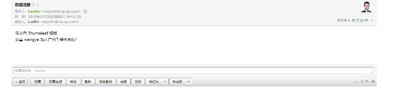

#  Spring-Cloud-Alibaba发送注册成功邮件
## 概述
本章节指导使用 Spring Boot + RocketMQ + Thymeleaf 实现 异步消息队列发送模板邮件 的功能，体验一下微服务架构中的 异步通信 场景；所有代码都是基于之前课程已完成的代码进行开发；

## POM
## 用户注册服务增加依赖
```
<dependency>
    <groupId>org.springframework.cloud</groupId>
    <artifactId>spring-cloud-starter-stream-rocketmq</artifactId>
</dependency>
```
## 创建邮件服务
```
<?xml version="1.0" encoding="UTF-8"?>
<project xmlns="http://maven.apache.org/POM/4.0.0" xmlns:xsi="http://www.w3.org/2001/XMLSchema-instance"
         xsi:schemaLocation="http://maven.apache.org/POM/4.0.0 http://maven.apache.org/xsd/maven-4.0.0.xsd">
    <modelVersion>4.0.0</modelVersion>

    <parent>
        <groupId>com.funtl</groupId>
        <artifactId>myshop-dependencies</artifactId>
        <version>1.0.0-SNAPSHOT</version>
        <relativePath>../myshop-dependencies/pom.xml</relativePath>
    </parent>

    <artifactId>myshop-service-email</artifactId>
    <packaging>jar</packaging>

    <name>myshop-service-email</name>
    <url>http://www.funtl.com</url>
    <inceptionYear>2018-Now</inceptionYear>

    <dependencies>
        <!-- Spring Boot Begin -->
        <dependency>
            <groupId>org.springframework.boot</groupId>
            <artifactId>spring-boot-starter-web</artifactId>
        </dependency>
        <dependency>
            <groupId>org.springframework.boot</groupId>
            <artifactId>spring-boot-starter-actuator</artifactId>
        </dependency>
        <dependency>
            <groupId>org.springframework.boot</groupId>
            <artifactId>spring-boot-starter-test</artifactId>
            <scope>test</scope>
        </dependency>

        <dependency>
            <groupId>org.springframework.boot</groupId>
            <artifactId>spring-boot-starter-mail</artifactId>
        </dependency>

        <dependency>
            <groupId>net.sourceforge.nekohtml</groupId>
            <artifactId>nekohtml</artifactId>
        </dependency>
        <dependency>
            <groupId>org.springframework.boot</groupId>
            <artifactId>spring-boot-starter-thymeleaf</artifactId>
        </dependency>
        <!-- Spring Boot End -->

        <!-- Spring Cloud Begin -->
        <dependency>
            <groupId>org.springframework.cloud</groupId>
            <artifactId>spring-cloud-starter-alibaba-nacos-config</artifactId>
        </dependency>
        <dependency>
            <groupId>org.springframework.cloud</groupId>
            <artifactId>spring-cloud-starter-alibaba-nacos-discovery</artifactId>
        </dependency>
        <dependency>
            <groupId>org.springframework.cloud</groupId>
            <artifactId>spring-cloud-starter-alibaba-sentinel</artifactId>
        </dependency>
        <dependency>
            <groupId>org.springframework.cloud</groupId>
            <artifactId>spring-cloud-starter-stream-rocketmq</artifactId>
        </dependency>
        <!-- Spring Cloud End -->

        <!-- Projects Begin -->
        <dependency>
            <groupId>com.funtl</groupId>
            <artifactId>myshop-commons-domain</artifactId>
            <version>${project.parent.version}</version>
        </dependency>
        <!-- Projects End -->
    </dependencies>

    <build>
        <plugins>
            <plugin>
                <groupId>org.springframework.boot</groupId>
                <artifactId>spring-boot-maven-plugin</artifactId>
                <configuration>
                    <mainClass>com.funtl.myshop.service.reg.MyShopServiceEmailApplication</mainClass>
                </configuration>
            </plugin>
        </plugins>
    </build>
</project>
```
## Application
## 用户注册服务
主要增加了 @EnableBinding 和 @EnableAsync 注解，其中 @EnableAsync 注解用于开启异步调用功能
```
package com.funtl.myshop.service.reg;

import org.springframework.boot.SpringApplication;
import org.springframework.boot.autoconfigure.SpringBootApplication;
import org.springframework.cloud.client.discovery.EnableDiscoveryClient;
import org.springframework.cloud.stream.annotation.EnableBinding;
import org.springframework.cloud.stream.messaging.Source;
import org.springframework.context.annotation.ComponentScan;
import org.springframework.scheduling.annotation.EnableAsync;
import tk.mybatis.spring.annotation.MapperScan;

@SpringBootApplication
@EnableDiscoveryClient
@ComponentScan(basePackages = "com.funtl.myshop")
@MapperScan(basePackages = "com.funtl.myshop.commons.mapper")
@EnableBinding({Source.class})
@EnableAsync
public class MyShopServiceRegApplication {
    public static void main(String[] args) {
        SpringApplication.run(MyShopServiceRegApplication.class, args);
    }
}
```
## 邮件发送服务
```
package com.funtl.myshop.service.email;

import org.springframework.boot.SpringApplication;
import org.springframework.boot.autoconfigure.SpringBootApplication;
import org.springframework.cloud.client.discovery.EnableDiscoveryClient;
import org.springframework.cloud.stream.annotation.EnableBinding;
import org.springframework.cloud.stream.messaging.Sink;
import org.springframework.context.annotation.ComponentScan;
import org.springframework.scheduling.annotation.EnableAsync;

@SpringBootApplication
@EnableDiscoveryClient
@ComponentScan(basePackages = "com.funtl.myshop")
@EnableBinding({Sink.class})
@EnableAsync
public class MyShopServiceEmailApplication {
    public static void main(String[] args) {
        SpringApplication.run(MyShopServiceEmailApplication.class, args);
    }
}
```
## Service
## 用户注册服务
点击获取 MapperUtils 工具类

PS：听说有人有强迫症，问为什么不叫 JacksonUtils ，因为我们是在封装 Jackson 中的 ObjectMapper ╮(￣▽￣)╭
```
package com.funtl.myshop.service.reg.service;

import com.funtl.myshop.commons.domain.TbUser;
import com.funtl.myshop.commons.utils.MapperUtils;
import org.springframework.beans.factory.annotation.Autowired;
import org.springframework.messaging.MessageChannel;
import org.springframework.messaging.support.MessageBuilder;
import org.springframework.scheduling.annotation.Async;
import org.springframework.stereotype.Service;

@Service
public class RegService {

    @Autowired
    private MessageChannel output;

    /**
     * 该方法将被异步调用
     * @param tbUser
     */
    @Async
    public void sendEmail(TbUser tbUser) {
        try {
            output.send(MessageBuilder.withPayload(MapperUtils.obj2json(tbUser)).build());
        } catch (Exception e) {
            e.printStackTrace();
        }
    }
}
```
## 邮件发送服务
```
package com.funtl.myshop.service.email.service;

import com.funtl.myshop.commons.domain.TbUser;
import com.funtl.myshop.commons.utils.MapperUtils;
import org.springframework.beans.factory.annotation.Autowired;
import org.springframework.cloud.stream.annotation.StreamListener;
import org.springframework.context.ConfigurableApplicationContext;
import org.springframework.mail.SimpleMailMessage;
import org.springframework.mail.javamail.JavaMailSender;
import org.springframework.mail.javamail.MimeMessageHelper;
import org.springframework.scheduling.annotation.Async;
import org.springframework.stereotype.Service;
import org.thymeleaf.TemplateEngine;
import org.thymeleaf.context.Context;

import javax.mail.internet.MimeMessage;

@Service
public class EmailService {

    @Autowired
    private ConfigurableApplicationContext applicationContext;

    @Autowired
    private JavaMailSender javaMailSender;

    @Autowired
    private TemplateEngine templateEngine;

    @StreamListener("input")
    public void receive(String tbUserJson) {
        try {
            // 发送普通邮件
            TbUser tbUser = MapperUtils.json2pojo(tbUserJson, TbUser.class);
            sendEmail("欢迎注册", "欢迎 " + tbUser.getUsername() + " 加入广州千锋大家庭！", tbUser.getEmail());

            // 发送 HTML 模板邮件
            Context context = new Context();
            context.setVariable("username", tbUser.getUsername());
            String emailTemplate = templateEngine.process("reg", context);
            sendTemplateEmail("欢迎注册", emailTemplate, tbUser.getEmail());
        } catch (Exception e) {
            e.printStackTrace();
        }
    }

    /**
     * 发送普通邮件
     * @param subject
     * @param body
     * @param to
     */
    @Async
    public void sendEmail(String subject, String body, String to) {
        SimpleMailMessage message = new SimpleMailMessage();
        message.setFrom(applicationContext.getEnvironment().getProperty("spring.mail.username"));
        message.setTo(to);
        message.setSubject(subject);
        message.setText(body);
        javaMailSender.send(message);
    }

    /**
     * 发送 HTML 模板邮件
     * @param subject
     * @param body
     * @param to
     */
    @Async
    public void sendTemplateEmail(String subject, String body, String to) {
        MimeMessage message = javaMailSender.createMimeMessage();
        try {
            MimeMessageHelper helper = new MimeMessageHelper(message, true);
            helper.setFrom(applicationContext.getEnvironment().getProperty("spring.mail.username"));
            helper.setTo(to);
            helper.setSubject(subject);
            helper.setText(body, true);
            javaMailSender.send(message);
        } catch (Exception e) {

        }
    }
}
```
## 配置文件
温馨提示

RocketMQ 配置在 Nacos Config 配置中心会导致无法连接 RocketMQ Server 的问题，故我们还需要在项目中额外配置 application.yml

## 用户注册服务
创建 application.yml 配置文件
```
spring:
  cloud:
    stream:
      rocketmq:
        binder:
          namesrv-addr: 192.168.10.149:9876
      bindings:
        output: {destination: topic-email, content-type: application/json}
```
## 邮件发送服务
创建 bootstrap.properties 配置文件
```
spring.application.name=myshop-service-email-config
spring.cloud.nacos.config.file-extension=yaml
spring.cloud.nacos.config.server-addr=192.168.10.151:8848
创建 application.yml 配置文件

spring:
  cloud:
    stream:
      rocketmq:
        binder:
          namesrv-addr: 192.168.10.149:9876
        bindings:
          input: {consumer.orderly: true}
      bindings:
        input: {destination: topic-email, content-type: application/json, group: group-email, consumer.maxAttempts: 1}
  thymeleaf:
    cache: false
    mode: HTML
    encoding: UTF-8
    servlet:
      content-type: text/html
Nacos Config 中创建名为 myshop-service-email-config.yaml 配置文件

spring:
  application:
    name: myshop-service-email
  mail:
    host: smtp.qq.com
    # 你的邮箱授权码
    password: 
    properties:
      mail:
        smtp:
          auth: true
          starttls:
            enable: true
            required: true
    # 发送邮件的邮箱地址
    username: 
  cloud:
    nacos:
      discovery:
        server-addr: 192.168.10.151:8848
    sentinel:
      transport:
        port: 8719
        dashboard: 192.168.10.151:8080

server:
  port: 9507

management:
  endpoints:
    web:
      exposure:
        include: "*"
```
## 模板文件
```
在 myshop-service-email 服务的 src/main/resources/templates 目录下创建名为 reg.html 的模板文件

<!DOCTYPE html SYSTEM "http://www.thymeleaf.org/dtd/xhtml1-strict-thymeleaf-spring4-4.dtd">
<html xmlns="http://www.w3.org/1999/xhtml" xmlns:th="http://www.thymeleaf.org">
<head>
    <meta charset="UTF-8">
    <meta name="viewport"
          content="width=device-width, user-scalable=no, initial-scale=1.0, maximum-scale=1.0, minimum-scale=1.0">
    <meta http-equiv="X-UA-Compatible" content="ie=edge">
    <title>注册通知</title>
</head>
<body>
    <div>
        我来自 Thymeleaf 模板 <br />
        恭喜 <span th:text="${username}"></span> 加入广州千锋大家庭！
    </div>
</body>
</html>
```
# 测试效果
至此 Spring Boot + RocketMQ + Thymeleaf 实现 异步消息队列发送模板邮件 的功能配置完成，发送成功后效果图如下：


