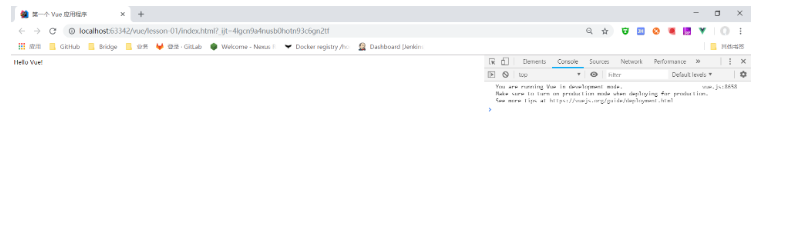
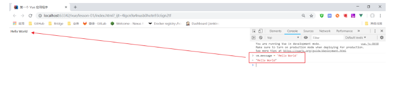

# Vue第一个 程序
## 兼容性
Vue 不支持 IE8 及以下版本，因为 Vue 使用了 IE8 无法模拟的 ECMAScript 5 特性。但它支持所有兼容 ECMAScript 5 的浏览器。

## 下载地址
开发版本
包含完整的警告和调试模式：https://vuejs.org/js/vue.js
删除了警告，30.96KB min + gzip：https://vuejs.org/js/vue.min.js
CDN
```
<script src="https://cdn.jsdelivr.net/npm/vue@2.5.21/dist/vue.js"></script>
<script src="https://cdn.jsdelivr.net/npm/vue@2.5.21/dist/vue.min.js"></script>
```
## 第一个 Vue 应用程序
Vue.js 的核心是实现了 MVVM 模式，她扮演的角色就是 ViewModel 层，那么所谓的第一个应用程序就是展示她的 数据绑定 功能，操作流程如下：

## 创建一个 HTML 文件
```
<!DOCTYPE html>
<html>
<head>
    <meta charset="UTF-8">
    <title>第一个 Vue 应用程序</title>
</head>
<body>

</body>
</html>
```
## 引入 Vue.js
```
<script src="https://cdn.jsdelivr.net/npm/vue@2.5.21/dist/vue.js"></script>
```
## 创建一个 Vue 的实例
```
<script type="text/javascript">
    var vm = new Vue({
        el: '#vue',
        data: {
            message: 'Hello Vue!'
        }
    });
</script>
```
## 说明
el:'#vue'：绑定元素的 ID
data:{message:'Hello Vue!'}：数据对象中有一个名为 message 的属性，并设置了初始值 Hello Vue!
## 将数据绑定到页面元素
```
<div id="vue">
    {{message}}
</div>
```
说明：只需要在绑定的元素中使用 双花括号 将 Vue 创建的名为 message 属性包裹起来，即可实现数据绑定功能，也就实现了 ViewModel 层所需的效果，是不是和 EL 表达式非常像？

#{message} => {{message}}
## 完整的 HTML
```
<!DOCTYPE html>
<html>
<head>
    <meta charset="UTF-8">
    <title>第一个 Vue 应用程序</title>
    <script src="https://cdn.jsdelivr.net/npm/vue@2.5.21/dist/vue.js"></script>
</head>
<body>
    <div id="vue">
        {{message}}
    </div>

<script type="text/javascript">
    var vm = new Vue({
        el: '#vue',
        data: {
            message: 'Hello Vue!'
        }
    });
</script>
</body>
</html>
```
注：我是在 IDEA 上创建的 HTML，并使用 IDEA 内置的 HTTP 服务器运行

## 测试 Vue
为了能够更直观的体验 Vue 带来的数据绑定功能，我们需要在浏览器测试一番，操作流程如下：

在 Chrome 浏览器上运行第一个 Vue 应用程序，并按 F12 进入 开发者工具


在控制台输入 vm.message = 'Hello World' ，然后 回车，你会发现浏览器中显示的内容会直接变成 Hello World


## 说明
在之前的代码中，我们创建了一个名为 vm 的 Vue 实例
```
var vm = new Vue({
    el: '#vue',
    data: {
        message: 'Hello Vue!'
    }
});
```
此时就可以在控制台直接输入 vm.message 来修改值，中间是可以省略 data 的，在这个操作中，我并没有主动操作 DOM，就让页面的内容发生了变化，这就是借助了 Vue 的 数据绑定 功能实现的；MVVM 模式中要求 ViewModel 层就是使用 观察者模式 来实现数据的监听与绑定，以做到数据与视图的快速响应。