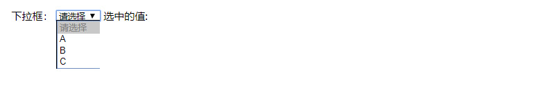
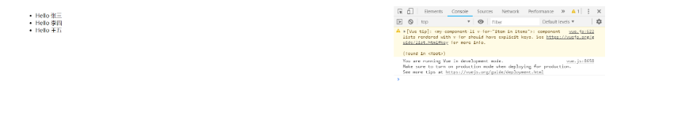
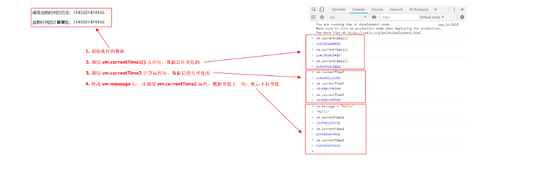
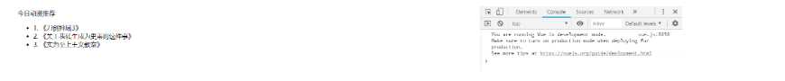

# Vue语法
## v-if,v-else
条件判断语句
v-if
v-else
什么是条件判断语句，就不需要我说明了吧（￣▽￣），直接看语法上效果

### HTML
```
<div id="vue">
    <h1 v-if="ok">YES</h1>
    <h1 v-else>NO</h1>
</div>
## JavaScript
<script type="text/javascript">
    var vm = new Vue({
        el: '#vue',
        data: {
            ok: true
        }
    });
</script>
```
### 测试效果
在 Chrome 浏览器上运行，并按 F12 进入 开发者工具


在控制台输入 vm.ok = false ，然后 回车，你会发现浏览器中显示的内容会直接变成 NO


注：使用 v-* 属性绑定数据是不需要 双花括号 包裹的

### 完整的 HTML
```
<!DOCTYPE html>
<html>
<head>
    <meta charset="UTF-8">
    <title>语法篇 v-if</title>
    <script src="https://cdn.jsdelivr.net/npm/vue@2.5.21/dist/vue.js"></script>
</head>
<body>

<div id="vue">
    <h1 v-if="ok">YES</h1>
    <h1 v-else>NO</h1>
</div>

<script type="text/javascript">
    var vm = new Vue({
        el: '#vue',
        data: {
            ok: true
        }
    });
</script>
</body>
</html>
```
# v-else-if
连续的条件判断语句
v-if
v-else-if
v-else
### HTML
```
<div id="vue">
    <h1 v-if="type === 'A'">A</h1>
    <h1 v-else-if="type === 'B'">B</h1>
    <h1 v-else-if="type === 'C'">C</h1>
    <h1 v-else>你看不见我</h1>
</div>
```
注：=== 三个等号在 JS 中表示绝对等于（就是数据与类型都要相等）

### JavaScript
```
<script type="text/javascript">
    var vm = new Vue({
        el: '#vue',
        data: {
            type: 'A'
        }
    });
</script>
```
### 测试效果
在 Chrome 浏览器上运行，并按 F12 进入 开发者工具


分别观察在控制台输入 vm.type = 'B'、'C'、'D' 的变化


### 完整的 HTML
```
<!DOCTYPE html>
<html>
<head>
    <meta charset="UTF-8">
    <title>语法篇 v-else-if</title>
    <script src="https://cdn.jsdelivr.net/npm/vue@2.5.21/dist/vue.js"></script>
</head>
<body>

<div id="vue">
    <h1 v-if="type === 'A'">A</h1>
    <h1 v-else-if="type === 'B'">B</h1>
    <h1 v-else-if="type === 'C'">C</h1>
    <h1 v-else>你看不见我</h1>
</div>

<script type="text/javascript">
    var vm = new Vue({
        el: '#vue',
        data: {
            type: 'A'
        }
    });
</script>
</body>
</html>
```
## v-for
循环遍历语句
v-for
### HTML
```
<div id="vue">
    <li v-for="item in items">
        {{ item.message }}
    </li>
</div>
注：items 是源数据数组并且 item 是数组元素迭代的别名。是不是像极了 Thymeleaf

# JavaScript
<script type="text/javascript">
    var vm = new Vue({
        el: '#vue',
        data: {
            items: [
                {message: 'Foo'},
                {message: 'Bar'}
            ]
        }
    });
</script>
```
### 测试效果
在 Chrome 浏览器上运行，并按 F12 进入 开发者工具


在控制台输入 vm.items.push({message: 'Baz'}) ，尝试追加一条数据，你会发现浏览器中显示的内容会增加一条 Baz


### 完整的 HTML
```
<!DOCTYPE html>
<html>
<head>
    <meta charset="UTF-8">
    <title>语法篇 v-for</title>
    <script src="https://cdn.jsdelivr.net/npm/vue@2.5.21/dist/vue.js"></script>
</head>
<body>

<div id="vue">
    <li v-for="item in items">
        {{ item.message }}
    </li>
</div>

<script type="text/javascript">
    var vm = new Vue({
        el: '#vue',
        data: {
            items: [
                {message: 'Foo'},
                {message: 'Bar'}
            ]
        }
    });
</script>
</body>
</html>
```
# Vue事件
## v-on
监听事件
v-on
### HTML
```
<div id="vue">
    <button v-on:click="sayHi">点我</button>
</div>
```
注：在这里我们使用了 v-on 绑定了 click 事件，并指定了名为 sayHi 的方法

### JavaScript
方法必须定义在 Vue 实例的 methods 对象中
```
<script type="text/javascript">
    var vm = new Vue({
        el: '#vue',
        data: {
            message: 'Hello World'
        },
        // 在 `methods` 对象中定义方法
        methods: {
            sayHi: function (event) {
                // `this` 在方法里指向当前 Vue 实例
                alert(this.message);
            }
        }
    });
</script>
```
### 测试效果


### 完整的 HTML
```
<!DOCTYPE html>
<html xmlns:v-on="">
<head>
    <meta charset="UTF-8">
    <title>事件篇 v-on</title>
    <script src="https://cdn.jsdelivr.net/npm/vue@2.5.21/dist/vue.js"></script>
</head>
<body>

<div id="vue">
    <button v-on:click="sayHi">点我</button>
</div>

<script type="text/javascript">
    var vm = new Vue({
        el: '#vue',
        data: {
            message: 'Hello World'
        },
        // 在 `methods` 对象中定义方法
        methods: {
            sayHi: function (event) {
                // `this` 在方法里指向当前 Vue 实例
                alert(this.message);
            }
        }
    });
</script>
</body>
</html>
```
# Vue网络篇
## 使用 Axios 实现异步通信
### 什么是 Axios
Axios 是一个开源的可以用在浏览器端和 NodeJS 的异步通信框架，她的主要作用就是实现 AJAX 异步通信，其功能特点如下：

从浏览器中创建 XMLHttpRequests
从 node.js 创建 http 请求
支持 Promise API
拦截请求和响应
转换请求数据和响应数据
取消请求
自动转换 JSON 数据
客户端支持防御 XSRF（跨站请求伪造）
GitHub：https://github.com/axios/axios

### 为什么要使用 Axios
由于 Vue.js 是一个 视图层框架 并且作者（尤雨溪）严格准守 SoC （关注度分离原则），所以 Vue.js 并不包含 AJAX 的通信功能，为了解决通信问题，作者单独开发了一个名为 vue-resource 的插件，不过在进入 2.0 版本以后停止了对该插件的维护并推荐了 Axios 框架

### 第一个 Axios 应用程序
咱们开发的接口大部分都是采用 JSON 格式，可以先在项目里模拟一段 JSON 数据，数据内容如下：
```
{
  "name": "广州千锋",
  "url": "http://www.funtl.com",
  "page": 88,
  "isNonProfit": true,
  "address": {
    "street": "元岗路.",
    "city": "广东广州",
    "country": "中国"
  },
  "links": [
    {
      "name": "Google",
      "url": "http://www.google.com"
    },
    {
      "name": "Baidu",
      "url": "http://www.baidu.com"
    },
    {
      "name": "SoSo",
      "url": "http://www.SoSo.com"
    }
  ]
}
```
创建一个名为 data.json 的文件并填入上面的内容，放在项目的根目录下，如图所示：


### 创建 HTML
```
<div id="vue">
    <div>名称：{{info.name}}</div>
    <div>地址：{{info.address.country}}-{{info.address.city}}-{{info.address.street}}</div>
    <div>链接：<a v-bind:href="info.url" target="_blank">{{info.url}}</a> </div>
</div>
```
注：在这里使用了 v-bind 将 a:href 的属性值与 Vue 实例中的数据进行绑定

### 引入 JS 文件
```
<script src="https://cdn.jsdelivr.net/npm/vue@2.5.21/dist/vue.js"></script>
<script src="https://unpkg.com/axios/dist/axios.min.js"></script>
### JavaScript
<script type="text/javascript">
    var vm = new Vue({
        el: '#vue',
        data() {
            return {
                info: {
                    name: null,
                    address: {
                        country: null,
                        city: null,
                        street: null
                    },
                    url: null
                }
            }
        },
        mounted() {
            axios
                .get('data.json')
                .then(response => (this.info = response.data));
        }
    });
</script>
```
使用 axios 框架的 get 方法请求 AJAX 并自动将数据封装进了 Vue 实例的数据对象中

### 数据对象
这里的数据结构与 JSON 数据结构是匹配的
```
info: {
    name: null,
    address: {
        country: null,
        city: null,
        street: null
    },
    url: null
}
```
### 调用 get 请求
调用 axios 的 get 请求并自动装箱数据
```
axios
    .get('data.json')
    .then(response => (this.info = response.data));
```
### 测试效果


### 完整的 HTML
```
<!DOCTYPE html>
<html>
<head>
    <meta charset="UTF-8">
    <title>网络篇 Axios</title>
    <script src="https://cdn.jsdelivr.net/npm/vue@2.5.21/dist/vue.js"></script>
    <script src="https://unpkg.com/axios/dist/axios.min.js"></script>
</head>
<body>

<div id="vue">
    <div>名称：{{info.name}}</div>
    <div>地址：{{info.address.country}}-{{info.address.city}}-{{info.address.street}}</div>
    <div>链接：<a v-bind:href="info.url" target="_blank">{{info.url}}</a> </div>
</div>

<script type="text/javascript">
    var vm = new Vue({
        el: '#vue',
        data() {
            return {
                info: {
                    name: null,
                    address: {
                        country: null,
                        city: null,
                        street: null
                    },
                    url: null
                }
            }
        },
        mounted() {
            axios
                .get('data.json')
                .then(response => (this.info = response.data));
        }
    });
</script>
</body>
</html>
```
## Vue布局 
### 表单输入
### 什么是双向数据绑定
Vue.js 是一个 MVVM 框架，即数据双向绑定，即当数据发生变化的时候，视图也就发生变化，当视图发生变化的时候，数据也会跟着同步变化。这也算是 Vue.js 的精髓之处了。值得注意的是，我们所说的数据双向绑定，一定是对于 UI 控件来说的，非 UI 控件不会涉及到数据双向绑定。单向数据绑定是使用状态管理工具的前提。如果我们使用 vuex，那么数据流也是单项的，这时就会和双向数据绑定有冲突。

### 为什么要实现数据的双向绑定
在 Vue.js 中，如果使用 vuex，实际上数据还是单向的，之所以说是数据双向绑定，这是用的 UI 控件来说，对于我们处理表单，Vue.js 的双向数据绑定用起来就特别舒服了。即两者并不互斥，在全局性数据流使用单项，方便跟踪；局部性数据流使用双向，简单易操作。

### 在表单中使用双向数据绑定
```
你可以用 v-model 指令在表单 <input>、<textarea> 及 <select> 元素上创建双向数据绑定。它会根据控件类型自动选取正确的方法来更新元素。尽管有些神奇，但 v-model 本质上不过是语法糖。它负责监听用户的输入事件以更新数据，并对一些极端场景进行一些特殊处理。

注意：v-model 会忽略所有表单元素的 value、checked、selected 特性的初始值而总是将 Vue 实例的数据作为数据来源。你应该通过 JavaScript 在组件的 data 选项中声明初始值。
```

### 单行文本
```
<div id="vue">
    单行文本：<input type="text" v-model="message" />&nbsp;&nbsp;单行文本是：{{message}}
</div>
<script type="text/javascript">
    var vm = new Vue({
        el: '#vue',
        data: {
            message: "Hello Vue"
        }
    });
</script>
```

### 多行文本
```
<div id="vue">
    多行文本：<textarea v-model="message"></textarea>&nbsp;&nbsp;多行文本是：{{message}}
</div>
<script type="text/javascript">
    var vm = new Vue({
        el: '#vue',
        data: {
            message: "Hello Textarea"
        }
    });
</script>
```

### 单复选框
```
<div id="vue">
    单复选框：<input type="checkbox" id="checkbox" v-model="checked">&nbsp;&nbsp;<label for="checkbox">{{ checked }}</label>
</div>
<script type="text/javascript">
    var vm = new Vue({
        el: '#vue',
        data: {
            checked: false
        }
    });
</script>
```

### 多复选框
```
<div id="vue">
    多复选框：
    <input type="checkbox" id="jack" value="Jack" v-model="checkedNames">
    <label for="jack">Jack</label>
    <input type="checkbox" id="john" value="John" v-model="checkedNames">
    <label for="john">John</label>
    <input type="checkbox" id="mike" value="Mike" v-model="checkedNames">
    <label for="mike">Mike</label>
    <span>选中的值: {{ checkedNames }}</span>
</div>
<script type="text/javascript">
    var vm = new Vue({
        el: '#vue',
        data: {
            checkedNames: []
        }
    });
</script>
```

### 单选按钮
```
<div id="vue">
    单选按钮：
    <input type="radio" id="one" value="One" v-model="picked">
    <label for="one">One</label>
    <input type="radio" id="two" value="Two" v-model="picked">
    <label for="two">Two</label>
    <span>选中的值: {{ picked }}</span>
</div>
<script type="text/javascript">
    var vm = new Vue({
        el: '#vue',
        data: {
            picked: ''
        }
    });
</script>
```

### 下拉框
```
<div id="vue">
    下拉框：
    <select v-model="selected">
        <option disabled value="">请选择</option>
        <option>A</option>
        <option>B</option>
        <option>C</option>
    </select>
    <span>选中的值: {{ selected }}</span>
</div>
<script type="text/javascript">
    var vm = new Vue({
        el: '#vue',
        data: {
            selected: ''
        }
    });
</script>
```

```
注意：如果 v-model 表达式的初始值未能匹配任何选项，<select> 元素将被渲染为“未选中”状态。在 iOS 中，这会使用户无法选择第一个选项。因为这样的情况下，iOS 不会触发 change 事件。因此，更推荐像上面这样提供一个值为空的禁用选项。
```
## 组件基础

### 什么是组件
组件是可复用的 Vue 实例，说白了就是一组可以重复使用的模板，跟 JSTL 的自定义标签、Thymeleaf 的 th:fragment 以及 Sitemesh3 框架有着异曲同工之妙。通常一个应用会以一棵嵌套的组件树的形式来组织：


例如，你可能会有页头、侧边栏、内容区等组件，每个组件又包含了其它的像导航链接、博文之类的组件。

### 第一个 Vue 组件
注意：在实际开发中，我们并不会用以下方式开发组件，而是采用 vue-cli 创建 .vue 模板文件的方式开发，以下方法只是为了让大家理解什么是组件。

### 使用 Vue.component() 方法注册组件
### JavaScript
```
<script type="text/javascript">
    // 先注册组件
    Vue.component('my-component-li', {
        template: '<li>Hello li</li>'
    });

    // 再实例化 Vue
    var vm = new Vue({
        el: '#vue'
    });
</script>
```
### HTML
```
<div id="vue">
    <ul>
        <my-component-li></my-component-li>
    </ul>
</div>
```
### 说明
Vue.component()：注册组件
my-component-li：自定义组件的名字
template：组件的模板
### 测试效果


### 使用 props 属性传递参数
像上面那样用组件没有任何意义，所以我们是需要传递参数到组件的，此时就需要使用 props 属性了

注意：默认规则下 props 属性里的值不能为大写；感谢来自 Java微服务技术交流群2 的群友 [CV战士蛋蛋面] 帮助大家踩坑；

### JavaScript
```
<script type="text/javascript">
    // 先注册组件
    Vue.component('my-component-li', {
        props: ['item'],
        template: '<li>Hello {{item}}</li>'
    });

    // 再实例化 Vue
    var vm = new Vue({
        el: '#vue',
        data: {
            items: ["张三", "李四", "王五"]
        }
    });
</script>
### HTML
<div id="vue">
    <ul>
        <my-component-li v-for="item in items" v-bind:item="item"></my-component-li>
    </ul>
</div>
```
### 说明
v-for="item in items"：遍历 Vue 实例中定义的名为 items 的数组，并创建同等数量的组件
v-bind:item="item"：将遍历的 item 项绑定到组件中 props 定义的名为 item 属性上；= 号左边的 item 为 props 定义的属性名，右边的为 item in items 中遍历的 item 项的值
### 测试效果


### 完整的 HTML
```
<!DOCTYPE html>
<html>
<head>
    <meta charset="UTF-8">
    <title>布局篇 组件基础</title>
    <script src="https://cdn.jsdelivr.net/npm/vue@2.5.21/dist/vue.js"></script>
</head>
<body>

<div id="vue">
    <ul>
        <my-component-li v-for="item in items" v-bind:item="item"></my-component-li>
    </ul>
</div>

<script type="text/javascript">
    // 先注册组件
    Vue.component('my-component-li', {
        props: ['item'],
        template: '<li>Hello {{item}}</li>'
    });

    // 再实例化 Vue
    var vm = new Vue({
        el: '#vue',
        data: {
            items: ["张三", "李四", "王五"]
        }
    });
</script>
</body>
</html>
```
## 计算属性
什么是计算属性
计算属性的重点突出在 属性 两个字上（属性是名词），首先它是个 属性 其次这个属性有 计算 的能力（计算是动词），这里的 计算 就是个函数；简单点说，它就是一个能够将计算结果缓存起来的属性（将行为转化成了静态的属性），仅此而已；

### 计算属性与方法的区别
### 完整的 HTML
```
<!DOCTYPE html>
<html>
<head>
    <meta charset="UTF-8">
    <title>布局篇 计算属性</title>
    <script src="https://cdn.jsdelivr.net/npm/vue@2.5.21/dist/vue.js"></script>
</head>
<body>

<div id="vue">
    <p>调用当前时间的方法：{{currentTime1()}}</p>
    <p>当前时间的计算属性：{{currentTime2}}</p>
</div>

<script type="text/javascript">
    var vm = new Vue({
        el: '#vue',
        data: {
            message: 'Hello Vue'
        },
        methods: {
            currentTime1: function () {
                return Date.now();
            }
        },
        computed: {
            currentTime2: function () {
                this.message;
                return Date.now();
            }
        }
    });
</script>
</body>
</html>
```
### 说明
methods：定义方法，调用方法使用 currentTime1()，需要带括号
computed：定义计算属性，调用属性使用 currentTime2，不需要带括号；this.message 是为了能够让 currentTime2 观察到数据变化而变化
注意：methods 和 computed 里不能重名

### 测试效果
仔细看图中说明，观察其中的差异



### 结论
调用方法时，每次都需要进行计算，既然有计算过程则必定产生系统开销，那如果这个结果是不经常变化的呢？此时就可以考虑将这个结果缓存起来，采用计算属性可以很方便的做到这一点；计算属性的主要特性就是为了将不经常变化的计算结果进行缓存，以节约我们的系统开销

## 内容分发与自定义事件
### Vue 中的内容分发
在 Vue.js 中我们使用 <slot> 元素作为承载分发内容的出口，作者称其为 插槽，可以应用在组合组件的场景中

### 利用插槽功能实现一个组合组件
比如准备制作一个待办事项组件（todo），该组件由待办标题（todo-title）和待办内容（todo-items）组成，但这三个组件又是相互独立的，该如何操作呢？

### 定义一个名为 todo 的待办事项组件
```
Vue.component('todo', {
    template: '<div>\
                    <slot name="todo-title"></slot>\
                    <ul>\
                        <slot name="todo-items"></slot>\
                    </ul>\
               </div>'
});
```
该组件中放置了两个插槽，分别为 todo-title 和 todo-items

### 定义一个名为 todo-title 的待办标题组件
```
Vue.component('todo-title', {
    props: ['title'],
    template: '<div>{{title}}</div>'
});
```
### 定义一个名为 todo-items 的待办内容组件
```
Vue.component('todo-items', {
    props: ['item', 'index'],
    template: '<li>{{index + 1}}. {{item}}</li>'
});
```
### 实例化 Vue 并初始化数据
```
var vm = new Vue({
    el: '#vue',
    data: {
        todoItems: ['《刀剑神域3》', '《关于我转生成为史莱姆这件事》', '《实力至上主义教室》']
    }
});
```
### HTML
```
<div id="vue">
    <todo>
        <todo-title slot="todo-title" title="今日动漫推荐"></todo-title>
        <todo-items slot="todo-items" v-for="(item, index) in todoItems" v-bind:item="item" v-bind:index="index" :key="index"></todo-items>
    </todo>
</div>
```
此时，我们的 todo-title 和 todo-items 组件分别被分发到了 todo 组件的 todo-title 和 todo-items 插槽中

### 测试效果


### 使用自定义事件删除待办事项
通过以上代码不难发现，数据项在 Vue 的实例中，但删除操作要在组件中完成，那么组件如何才能删除 Vue 实例中的数据呢？此时就涉及到参数传递与事件分发了，Vue 为我们提供了自定义事件的功能很好的帮助我们解决了这个问题；使用 this.$emit('自定义事件名', 参数)，操作过程如下

### 修改创建 Vue 实例代码
```
var vm = new Vue({
    el: '#vue',
    data: {
        todoItems: ['《刀剑神域3》', '《关于我转生成为史莱姆这件事》', '《实力至上主义教室》']
    },
    methods: {
        // 该方法可以被模板中自定义事件触发
        removeTodoItems: function (index) {
            console.log("删除 " + this.todoItems[index] + " 成功");
            // splice() 方法向/从数组中添加/删除项目，然后返回被删除的项目，其中 index 为添加/删除项目的位置，1 表示删除的数量
            this.todoItems.splice(index, 1);
        }
    }
});
增加了 methods 对象并定义了一个名为 removeTodoItems 的方法
```
### 修改 todo-items 待办内容组件的代码
```
Vue.component('todo-items', {
    props: ['item', 'index'],
    template: '<li>{{index + 1}}. {{item}} <button @click="remove">删除</button></li>',
    methods: {
        remove: function (index) {
            // 这里的 remove 是自定义事件的名称，需要在 HTML 中使用 v-on:remove 的方式指派
            this.$emit('remove', index);
        }
    }
});
```
增加了 <button @click="remove">删除</button> 元素并绑定了组件中定义的 remove 事件

### 修改 todo-items 待办内容组件的 HTML 代码
```
<todo-items slot="todo-items" v-for="(item, index) in todoItems" v-bind:item="item" v-bind:index="index" :key="index" v-on:remove="removeTodoItems(index)"></todo-items>
```
增加了 v-on:remove="removeTodoItems(index)" 自定义事件，该事件会调用 Vue 实例中定义的名为 removeTodoItems 的方法

### 测试效果


### 完整的 HTML
```
<!DOCTYPE html>
<html>
<head>
    <meta charset="UTF-8">
    <title>布局篇 内容分发与自定义事件</title>
    <script src="https://cdn.jsdelivr.net/npm/vue@2.5.21/dist/vue.js"></script>
</head>
<body>

<div id="vue">
    <todo>
        <todo-title slot="todo-title" title="今日动漫推荐"></todo-title>
        <todo-items slot="todo-items" v-for="(item, index) in todoItems" v-bind:item="item" v-bind:index="index" :key="index" v-on:remove="removeTodoItems(index)"></todo-items>
    </todo>
</div>

<script type="text/javascript">
    // 定义一个待办事项组件
    Vue.component('todo', {
        template: '<div>\
                        <slot name="todo-title"></slot>\
                        <ul>\
                            <slot name="todo-items"></slot>\
                        </ul>\
                   </div>'
    });

    // 定义一个待办事项标题组件
    Vue.component('todo-title', {
        props: ['title'],
        template: '<div>{{title}}</div>'
    });

    // 定义一个待办事项内容组件
    Vue.component('todo-items', {
        props: ['item', 'index'],
        template: '<li>{{index + 1}}. {{item}} <button @click="remove">删除</button></li>',
        methods: {
            remove: function (index) {
                this.$emit('remove', index);
            }
        }
    });

    var vm = new Vue({
        el: '#vue',
        data: {
            todoItems: ['《刀剑神域3》', '《关于我转生成为史莱姆这件事》', '《实力至上主义教室》']
        },
        methods: {
            // 该方法可以被模板中自定义事件触发
            removeTodoItems: function (index) {
                console.log("删除 " + this.todoItems[index] + " 成功");
                this.todoItems.splice(index, 1);
            }
        }
    });
</script>
</body>
</html>
```

