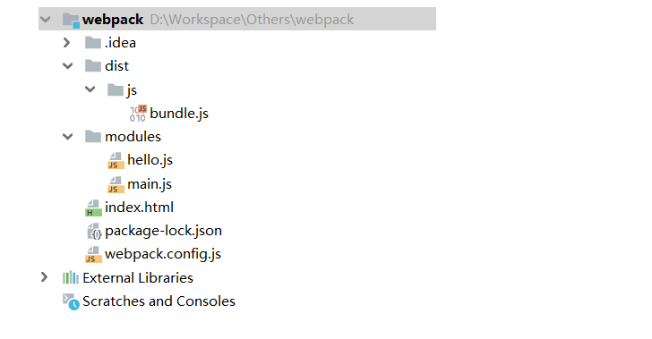

# Webpack
## 概述
本质上，webpack 是一个现代 JavaScript 应用程序的静态模块打包器(module bundler)。当 webpack 处理应用程序时，它会递归地构建一个依赖关系图(dependency graph)，其中包含应用程序需要的每个模块，然后将所有这些模块打包成一个或多个 bundle。

## 简介
Webpack 是当下最热门的前端资源模块化管理和打包工具，它可以将许多松散耦合的模块按照依赖和规则打包成符合生产环境部署的前端资源。还可以将按需加载的模块进行代码分离，等到实际需要时再异步加载。通过 loader 转换，任何形式的资源都可以当做模块，比如 CommonsJS、AMD、ES6、CSS、JSON、CoffeeScript、LESS 等；

## 现状
伴随着移动互联网的大潮，当今越来越多的网站已经从网页模式进化到了 WebApp 模式。它们运行在现代浏览器里，使用 HTML5、CSS3、ES6 等新的技术来开发丰富的功能，网页已经不仅仅是完成浏览器的基本需求；WebApp 通常是一个 SPA （单页面应用），每一个视图通过异步的方式加载，这导致页面初始化和使用过程中会加载越来越多的 JS 代码，这给前端的开发流程和资源组织带来了巨大挑战。

前端开发和其他开发工作的主要区别，首先是前端基于多语言、多层次的编码和组织工作，其次前端产品的交付是基于浏览器的，这些资源是通过增量加载的方式运行到浏览器端，如何在开发环境组织好这些碎片化的代码和资源，并且保证他们在浏览器端快速、优雅的加载和更新，就需要一个模块化系统，这个理想中的模块化系统是前端工程师多年来一直探索的难题。

## 模块化的演进
## Script 标签
```
<script src="module1.js"></scirpt>
<script src="module2.js"></scirpt>
<script src="module3.js"></scirpt>
<script src="module4.js"></scirpt>
```
这是最原始的 JavaScript 文件加载方式，如果把每一个文件看做是一个模块，那么他们的接口通常是暴露在全局作用域下，也就是定义在 window 对象中，不同模块的调用都是一个作用域。

这种原始的加载方式暴露了一些显而易见的弊端：

全局作用域下容易造成变量冲突
文件只能按照``` <script>``` 的书写顺序进行加载
开发人员必须主观解决模块和代码库的依赖关系
在大型项目中各种资源难以管理，长期积累的问题导致代码库混乱不堪
## CommonsJS
服务器端的 NodeJS 遵循 CommonsJS 规范，该规范核心思想是允许模块通过 require 方法来同步加载所需依赖的其它模块，然后通过 exports 或 module.exports 来导出需要暴露的接口。
```
require("module");
require("../module.js");
export.doStuff = function() {};
module.exports = someValue;
```
## 优点
服务器端模块便于重用
NPM 中已经有超过 45 万个可以使用的模块包
简单易用
## 缺点
同步的模块加载方式不适合在浏览器环境中，同步意味着阻塞加载，浏览器资源是异步加载的
不能非阻塞的并行加载多个模块
## 实现
服务端的 NodeJS
Browserify，浏览器端的 CommonsJS 实现，可以使用 NPM 的模块，但是编译打包后的文件体积较大
modules-webmake，类似 Browserify，但不如 Browserify 灵活
wreq，Browserify 的前身
## AMD
Asynchronous Module Definition 规范其实主要一个主要接口 define(id?, dependencies?, factory); 它要在声明模块的时候指定所有的依赖 dependencies，并且还要当做形参传到 factory 中，对于依赖的模块提前执行。
```
define("module", ["dep1", "dep2"], function(d1, d2) {
  return someExportedValue;
});
require(["module", "../file.js"], function(module, file) {});
```
## 优点
适合在浏览器环境中异步加载模块
可以并行加载多个模块
# 缺点
提高了开发成本，代码的阅读和书写比较困难，模块定义方式的语义不畅
不符合通用的模块化思维方式，是一种妥协的实现
## 实现
RequireJS
curl
## CMD
Commons Module Definition 规范和 AMD 很相似，尽量保持简单，并与 CommonsJS 和 NodeJS 的 Modules 规范保持了很大的兼容性。
```
define(function(require, exports, module) {
  var $ = require("jquery");
  var Spinning = require("./spinning");
  exports.doSomething = ...;
  module.exports = ...;
});
```
## 优点
依赖就近，延迟执行
可以很容易在 NodeJS 中运行
## 缺点
依赖 SPM 打包，模块的加载逻辑偏重
## 实现
Sea.js
coolie
## ES6 模块
EcmaScript6 标准增加了 JavaScript 语言层面的模块体系定义。 ES6 模块的设计思想，是尽量静态化，使编译时就能确定模块的依赖关系，以及输入和输出的变量。CommonsJS 和 AMD 模块，都只能在运行时确定这些东西。
```
import "jquery";
export function doStuff() {}
module "localModule" {}
```
## 优点
容易进行静态分析
面向未来的 EcmaScript 标准
## 缺点
原生浏览器端还没有实现该标准
全新的命令，新版的 NodeJS 才支持
### 实现
Babel
## 期望的模块系统
可以兼容多种模块风格，尽量可以利用已有的代码，不仅仅只是 JavaScript 模块化，还有 CSS、图片、字体等资源也需要模块化。
# 安装 WebPack
概述
WebPack 是一款模块加载器兼打包工具，它能把各种资源，如 JS、JSX、ES6、SASS、LESS、图片等都作为模块来处理和使用。

## 安装
```
npm install webpack -g
npm install webpack-cli -g
```
## 配置
创建 webpack.config.js 配置文件

entry：入口文件，指定 WebPack 用哪个文件作为项目的入口
output：输出，指定 WebPack 把处理完成的文件放置到指定路径
module：模块，用于处理各种类型的文件
plugins：插件，如：热更新、代码重用等
resolve：设置路径指向
watch：监听，用于设置文件改动后直接打包
```
module.exports = {
    entry: "",
    output: {
        path: "",
        filename: ""
    },
    module: {
        loaders: [
            {test: /\.js$/, loader: ""}
        ]
    },
    plugins: {},
    resolve: {},
    watch: true
}
```
## 执行
直接运行 webpack 命令打包
# 使用 WebPack
概述
使用 WebPack 打包项目非常简单，主要步骤如下：

创建项目
创建一个名为 modules 的目录，用于放置 JS 模块等资源文件
创建模块文件，如 hello.js，用于编写 JS 模块相关代码
创建一个名为 main.js 的入口文件，用于打包时设置 entry 属性
创建 webpack.config.js 配置文件，使用 webpack 命令打包
创建 HTML 页面，如 index.html，导入 WebPack 打包后的 JS 文件
运行 HTML 看效果
# 目录结构


# 模块代码
创建一个名为 hello.js 的 JavaScript 模块文件，代码如下：
```
exports.sayHi = function () {
  document.write("<div>Hello WebPack</div>");
};
```
# 入口代码
创建一个名为 main.js 的 JavaScript 入口模块，代码如下：
```
var hello = require("./hello");
hello.sayHi();
```
# 配置文件
创建名为 webpack.config.js 的配置文件，代码如下：
```
module.exports = {
    entry: "./modules/main.js",
    output: {
        filename: "./js/bundle.js"
    }
};
```
# HTML
创建一个名为 index.html，代码如下：
```
<!doctype html>
<html lang="en">
<head>
    <meta charset="UTF-8">
    <meta name="viewport"
          content="width=device-width, user-scalable=no, initial-scale=1.0, maximum-scale=1.0, minimum-scale=1.0">
    <meta http-equiv="X-UA-Compatible" content="ie=edge">
    <title>Document</title>
</head>
<body>
<script src="dist/js/bundle.js"></script>
</body>
</html>
```
# 打包
```
# 用于监听变化
webpack --watch
```
# 运行
运行 HTML 文件，你会在浏览器看到：
```
Hello WebPack
```