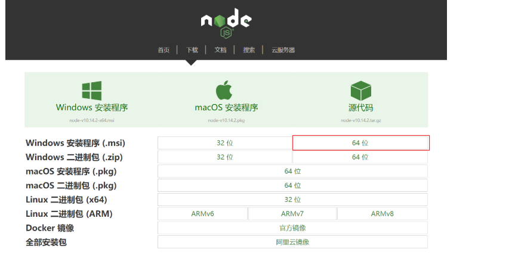
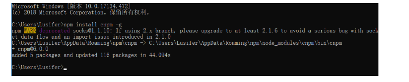
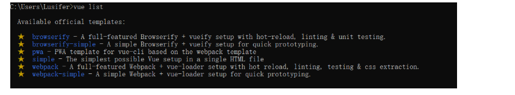
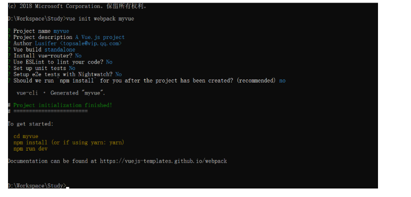
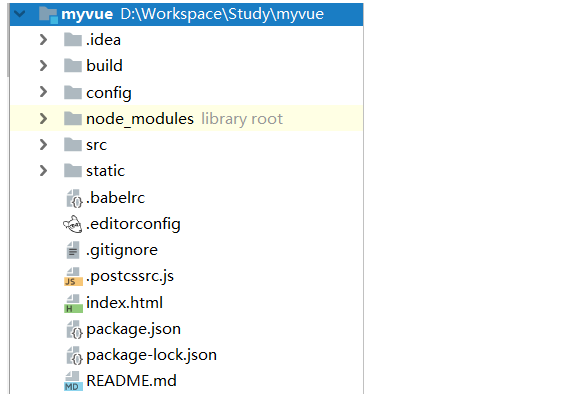
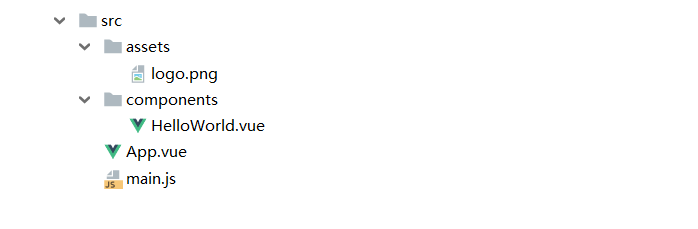
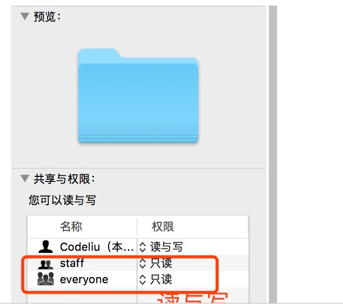
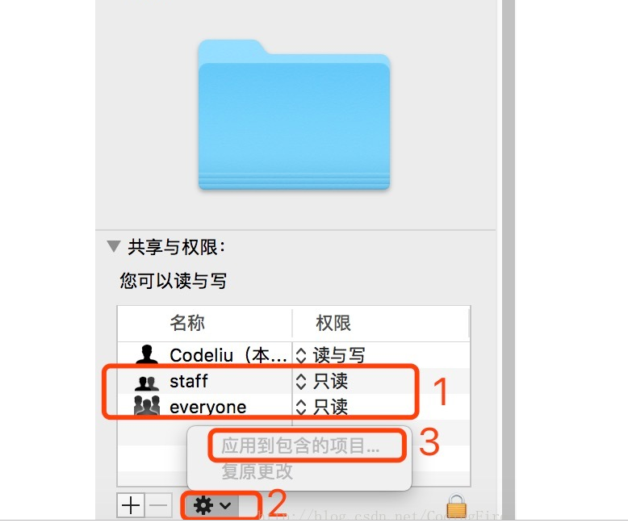

# vue-cli 脚手架
## 第一个 vue-cli 应用程序
什么是 vue-cli
vue-cli 官方提供的一个脚手架（预先定义好的目录结构及基础代码，咱们在创建 Maven 项目时可以选择创建一个骨架项目，这个骨架项目就是脚手架；可以参考我以前写的 LeeSite 项目骨架生成工具），用于快速生成一个 vue 的项目模板

## 主要功能
统一的目录结构
本地调试
热部署
单元测试
集成打包上线
## 环境准备
Node.js（>= 6.x，首选 8.x）
git
## 安装 vue-cli
安装 Node.js
请自行前往 http://nodejs.cn/download 官网下载安装，此处不再赘述



安装 Node.js 淘宝镜像加速器（cnpm）
```
npm install cnpm -g

# 或使用如下语句解决 npm 速度慢的问题
npm install --registry=https://registry.npm.taobao.org
```

安装 vue-cli
```
cnpm install vue-cli -g
```
测试是否安装成功
```
# 查看可以基于哪些模板创建 vue 应用程序，通常我们选择 webpack
vue list
```


## 第一个 vue-cli 应用程序
```
创建Vue项目出错，提示vue : 无法加载文件C:\Users\xxx\AppData\Roaming\npm\vue.ps1，因为在此系统上禁止运行脚本。有关详细信息，请参阅  https:/go.microsoft.com/fwlink/?LinkID=135170
1. 以管理员身份运行PowerShell
2. 执行：get-ExecutionPolicy，回复Restricted，表示状态是禁止的
3.执行：set-ExecutionPolicy RemoteSigned
4.选择Y
注意：一定要以管理员的身份运行PowerShell，不是cmd窗口！
```
## 创建一个基于 webpack 模板的 vue 应用程序
```
#这里的 myvue 是项目名称，可以根据自己的需求起名
vue init webpack myvue
```


## 说明
Project name：项目名称，默认 回车 即可
Project description：项目描述，默认 回车 即可
Author：项目作者，默认 回车 即可
Install vue-router：是否安装 vue-router，选择 n 不安装（后期需要再手动添加）
Use ESLint to lint your code：是否使用 ESLint 做代码检查，选择 n 不安装（后期需要再手动添加）
Set up unit tests：单元测试相关，选择 n 不安装（后期需要再手动添加）
Setup e2e tests with Nightwatch：单元测试相关，选择 n 不安装（后期需要再手动添加）
Should we run npm install for you after the project has been created：创建完成后直接初始化，选择 n，我们手动执行
## 初始化并运行
```
cd myvue
npm install
npm run dev
```

安装并运行成功后在浏览器输入：http://localhost:8080

# vue-cli 目录结构
## 概述


build 和 config：WebPack 配置文件
node_modules：用于存放 npm install 安装的依赖文件
src： 项目源码目录
static：静态资源文件
.babelrc：Babel 配置文件，主要作用是将 ES6 转换为 ES5
.editorconfig：编辑器配置
eslintignore：需要忽略的语法检查配置文件
.gitignore：git 忽略的配置文件
.postcssrc.js：css 相关配置文件，其中内部的 module.exports 是 NodeJS 模块化语法
index.html：首页，仅作为模板页，实际开发时不使用
package.json：项目的配置文件
	name：项目名称
	version：项目版本
	description：项目描述
	author：项目作者
	scripts：封装常用命令
	dependencies：生产环境依赖
	devDependencies：开发环境依赖
# vue-cli src 目录
概述
src 目录是项目的源码目录，所有代码都会写在这里



## main.js
项目的入口文件，我们知道所有的程序都会有一个入口
```
// The Vue build version to load with the `import` command
// (runtime-only or standalone) has been set in webpack.base.conf with an alias.
import Vue from 'vue'
import App from './App'

Vue.config.productionTip = false

/* eslint-disable no-new */
new Vue({
  el: '#app',
  components: { App },
  template: '<App/>'
})
```
import Vue from 'vue'：ES6 写法，会被转换成 require("vue"); （require 是 NodeJS 提供的模块加载器）
import App from './App'：意思同上，但是指定了查找路径，./ 为当前目录
Vue.config.productionTip = false：关闭浏览器控制台关于环境的相关提示
new Vue({...})：实例化 Vue
el: '#app'：查找 index.html 中 id 为 app 的元素
template: '<App/>'：模板，会将 index.html 中 <div id="app"></div> 替换为 <App />
components: { App }：引入组件，使用的是 import App from './App' 定义的 App 组件
## App.vue
组件模板
```
<template>
  <div id="app">
    
    <HelloWorld/>
  </div>
</template>

<script>
import HelloWorld from './components/HelloWorld'

export default {
  name: 'App',
  components: {
    HelloWorld
  }
}
</script>

<style>
#app {
  <!-- 字体 -->
  font-family: 'Avenir', Helvetica, Arial, sans-serif;
  <!-- 文字平滑效果 -->
  -webkit-font-smoothing: antialiased;
  -moz-osx-font-smoothing: grayscale;
  text-align: center;
  color: #2c3e50;
  margin-top: 60px;
}
</style>
```
template：HTML 代码模板，会替换 <App /> 中的内容
import HelloWorld from './components/HelloWorld'：引入 HelloWorld 组件，用于替换 template 中的 <HelloWorld/>
export default{...}：导出 NodeJS 对象，作用是可以通过 import 关键字导入
name: 'App'：定义组件的名称
components: { HelloWorld }：定义子组件
## HelloWorld.vue
基本同上，不解释..
```
关于 <style scoped> 的说明：CSS 样式仅在当前组件有效，声明了样式的作用域
```
## Mac 系统操作 Vue 的权限问题
## 概述
MacOS 很多命令都需要加上 sudo 来执行，这是因为 Mac 本身的保护机制，需要取得管理员权限。那么问题来了，创建的文件无法操作，不能修改，简单来说：只读。要解决这个问题其实很简单，但是每次都需要手动来修改权限：

有件选中文件夹，记住，使整个工程的文件夹，先是简介，最下面，如图，全都修改成读与写，这只是第一步，第二步：

然后再去操作你的 Vue 文件就不会再报错了。

## 原文链接
https://blog.csdn.net/codingfire/article/details/79295940
