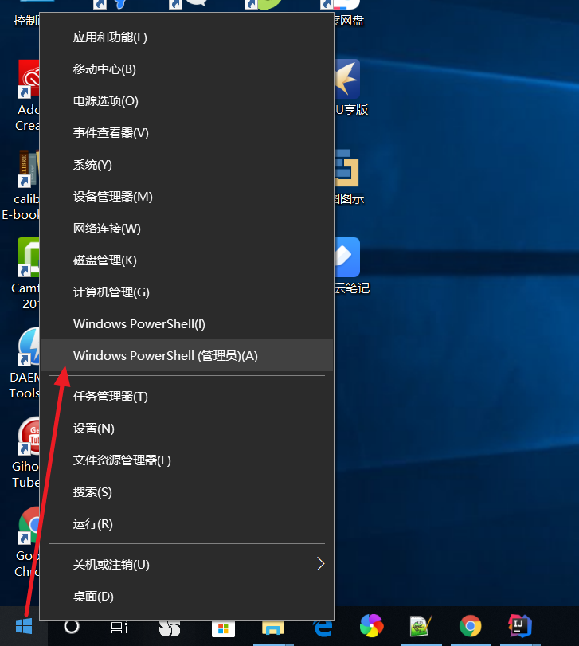
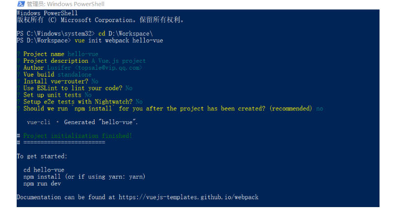
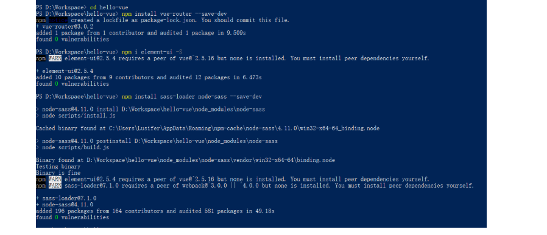
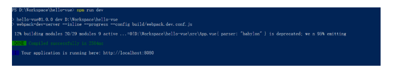
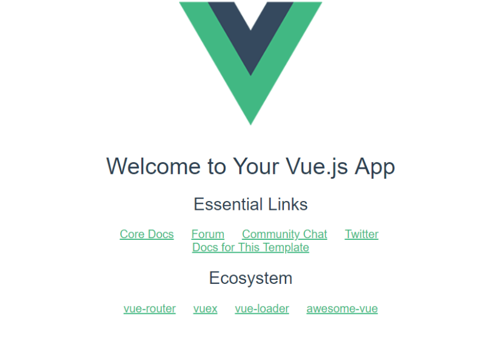
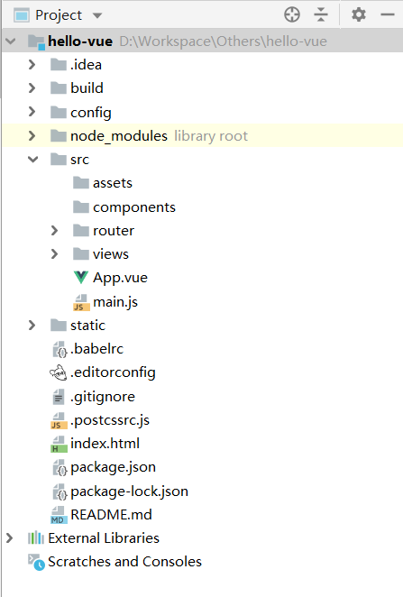
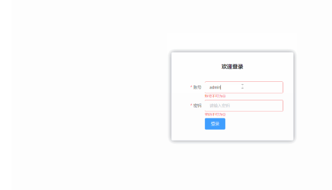
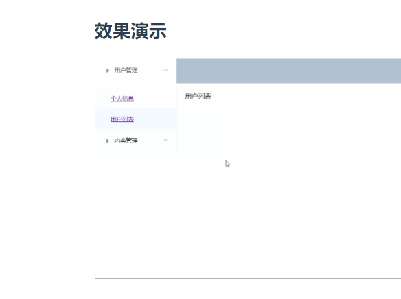

# vue-router 路由

## 第一个 vue-router 路由
## 概述
Vue Router 是 Vue.js 官方的路由管理器。它和 Vue.js 的核心深度集成，让构建单页面应用变得易如反掌。包含的功能有：

嵌套的路由/视图表
模块化的、基于组件的路由配置
路由参数、查询、通配符
基于 Vue.js 过渡系统的视图过渡效果
细粒度的导航控制
带有自动激活的 CSS class 的链接
HTML5 历史模式或 hash 模式，在 IE9 中自动降级
自定义的滚动条行为
## 安装
vue-router 是一个插件包，所以我们还是需要用 npm/cnpm 来进行安装的。打开命令行工具，进入你的项目目录，输入下面命令。
```
npm install vue-router --save-dev
```
如果在一个模块化工程中使用它，必须要通过 Vue.use() 明确地安装路由功能：
```
import Vue from 'vue'
import VueRouter from 'vue-router'

Vue.use(VueRouter);
```
## 使用
以下案例在 vue-cli 项目中使用 vue-router

## 创建组件页面
创建一个名为 src/components 的目录专门放置我们开发的 Vue 组件，在 src/components 目录下创建一个名为 Content.vue 的组件，代码如下：
```
<template>
    <div>
      我是内容页
    </div>
</template>

<script>
    export default {
        name: "Content"
    }
</script>

<style>
  #app {
    font-family: 'Avenir', Helvetica, Arial, sans-serif;
    -webkit-font-smoothing: antialiased;
    -moz-osx-font-smoothing: grayscale;
    text-align: center;
    color: #2c3e50;
    margin-top: 60px;
  }
</style>
```
## 安装路由
创建一个名为 src/router 的目录专门放置我们的路由配置代码，在 src/router 目录下创建一个名为 index.js 路由配置文件，代码如下：
```
import Vue from 'vue'
// 导入路由插件
import Router from 'vue-router'
// 导入上面定义的组件
import Content from '@/components/Content'

// 安装路由
Vue.use(Router);

// 配置路由
export default new Router({
  routes: [
    {
      // 路由路径
      path: '/content',
      // 路由名称
      name: 'Content',
      // 跳转到组件
      component: Content
    }
  ]
});
```
## 配置路由
修改 main.js 入口文件，增加配置路由的相关代码
```
import Vue from 'vue'
import App from './App'
// 导入上面创建的路由配置目录
import router from './router'

Vue.config.productionTip = false;

new Vue({
  el: '#app',
  // 配置路由
  router,
  components: { App },
  template: '<App/>'
});
```
## 使用路由
修改 App.vue 组件，代码如下：
```
<template>
  <div id="app">
    <router-link to="/">首页</router-link>
    <router-link to="/content">内容</router-link>
    <router-view></router-view>
  </div>
</template>

<script>
export default {
  name: 'App'
}
</script>

<style>
  #app {
    font-family: 'Avenir', Helvetica, Arial, sans-serif;
    -webkit-font-smoothing: antialiased;
    -moz-osx-font-smoothing: grayscale;
    text-align: center;
    color: #2c3e50;
    margin-top: 60px;
  }
</style>
```
说明：

router-link： 默认会被渲染成一个 <a> 标签，to 属性为指定链接
router-view： 用于渲染路由匹配到的组件

# 第一个 Vue 工程项目
## 概述
从本章节开始，我们采用实战教学模式并结合 ElementUI 组件库，将所需知识点应用到实际中，以最快速度带领大家掌握 Vue 的使用

## 创建工程
使用 NPM 安装相关组件依赖时可能会遇到权限问题，此时使用 PowerShell 管理员模式运行即可；开始菜单 -> 鼠标右击 -> Windows PowerShell (管理员)



创建一个名为 hello-vue 的工程
```
# 使用 webpack 打包工具初始化一个名为 hello-vue 的工程
vue init webpack hello-vue
```

## 安装依赖
我们需要安装 vue-router、element-ui、sass-loader 和 node-sass 四个插件
```
# 进入工程目录
cd hello-vue
# 安装 vue-router
npm install vue-router --save-dev
# 安装 element-ui
npm i element-ui -S
# 安装 SASS 加载器
npm install sass-loader node-sass --save-dev
```

```
# 安装依赖
npm install
```

## 启动工程
```
npm run dev
```

## 运行效果
在浏览器打开 http://localhost:8080 你会看到如下效果



## 附：NPM 相关命令说明
npm install moduleName：安装模块到项目目录下
npm install -g moduleName：-g 的意思是将模块安装到全局，具体安装到磁盘哪个位置，要看 npm config prefix 的位置
npm install -save moduleName：--save 的意思是将模块安装到项目目录下，并在 package 文件的 dependencies 节点写入依赖，-S 为该命令的缩写
npm install -save-dev moduleName：--save-dev 的意思是将模块安装到项目目录下，并在 package 文件的 devDependencies 节点写入依赖，-D 为该命令的缩写

# 第一个 ElementUI 页面 (登录页)
## 目录结构
在源码目录中创建如下结构：

assets：用于存放资源文件
components：用于存放 Vue 功能组件
views：用于存放 Vue 视图组件
router：用于存放 vue-router 配置


## 创建视图
## 创建首页视图
在 views 目录下创建一个名为 Main.vue 的视图组件；该组件在当前章节无任何作用，主要用于登录后展示登录成功的跳转效果；
```
<template>
    <div>
      首页
    </div>
</template>

<script>
    export default {
        name: "Main"
    }
</script>

<style scoped>

</style>
```
## 创建登录页视图
在 views 目录下创建一个名为 Login.vue 的视图组件，其中 el-* 的元素为 ElementUI 组件；
```
<template>
  <div>
    <el-form ref="loginForm" :model="form" :rules="rules" label-width="80px" class="login-box">
      <h3 class="login-title">欢迎登录</h3>
      <el-form-item label="账号" prop="username">
        <el-input type="text" placeholder="请输入账号" v-model="form.username"/>
      </el-form-item>
      <el-form-item label="密码" prop="password">
        <el-input type="password" placeholder="请输入密码" v-model="form.password"/>
      </el-form-item>
      <el-form-item>
        <el-button type="primary" v-on:click="onSubmit('loginForm')">登录</el-button>
      </el-form-item>
    </el-form>

    <el-dialog
      title="温馨提示"
      :visible.sync="dialogVisible"
      width="30%"
      :before-close="handleClose">
      <span>请输入账号和密码</span>
      <span slot="footer" class="dialog-footer">
        <el-button type="primary" @click="dialogVisible = false">确 定</el-button>
      </span>
    </el-dialog>
  </div>
</template>

<script>
  export default {
    name: "Login",
    data() {
      return {
        form: {
          username: '',
          password: ''
        },

        // 表单验证，需要在 el-form-item 元素中增加 prop 属性
        rules: {
          username: [
            {required: true, message: '账号不可为空', trigger: 'blur'}
          ],
          password: [
            {required: true, message: '密码不可为空', trigger: 'blur'}
          ]
        },

        // 对话框显示和隐藏
        dialogVisible: false
      }
    },
    methods: {
      onSubmit(formName) {
        // 为表单绑定验证功能
        this.$refs[formName].validate((valid) => {
          if (valid) {
            // 使用 vue-router 路由到指定页面，该方式称之为编程式导航
            this.$router.push("/main");
          } else {
            this.dialogVisible = true;
            return false;
          }
        });
      }
    }
  }
</script>

<style lang="scss" scoped>
  .login-box {
    border: 1px solid #DCDFE6;
    width: 350px;
    margin: 180px auto;
    padding: 35px 35px 15px 35px;
    border-radius: 5px;
    -webkit-border-radius: 5px;
    -moz-border-radius: 5px;
    box-shadow: 0 0 25px #909399;
  }

  .login-title {
    text-align: center;
    margin: 0 auto 40px auto;
    color: #303133;
  }
</style>
```
## 创建路由
在 router 目录下创建一个名为 index.js 的 vue-router 路由配置文件
```
import Vue from 'vue'
import Router from 'vue-router'

import Login from "../views/Login"
import Main from '../views/Main'

Vue.use(Router);

export default new Router({
  routes: [
    {
      // 登录页
      path: '/login',
      name: 'Login',
      component: Login
    },
    {
      // 首页
      path: '/main',
      name: 'Main',
      component: Main
    }
  ]
});
```
## 配置路由
## 修改入口代码
修改 main.js 入口代码
```
import Vue from 'vue'
import VueRouter from 'vue-router'
import router from './router'

// 导入 ElementUI
import ElementUI from 'element-ui'
import 'element-ui/lib/theme-chalk/index.css'

import App from './App'

// 安装路由
Vue.use(VueRouter);

// 安装 ElementUI
Vue.use(ElementUI);

new Vue({
  el: '#app',
  // 启用路由
  router,
  // 启用 ElementUI
  render: h => h(App)
});
```
修改 App.vue 组件代码
```
<template>
  <div id="app">
    <router-view/>
  </div>
</template>

<script>
  export default {
    name: 'App',
  }
</script>
```
## 效果演示
在浏览器打开 http://localhost:8080/#/login 你会看到如下效果


# 配置嵌套路由
## 什么是嵌套路由
嵌套路由又称子路由，在实际应用中，通常由多层嵌套的组件组合而成。同样地，URL 中各段动态路径也按某种结构对应嵌套的各层组件，例如：
```
/user/foo/profile                     /user/foo/posts
+------------------+                  +-----------------+
| User             |                  | User            |
| +--------------+ |                  | +-------------+ |
| | Profile      | |  +------------>  | | Posts       | |
| |              | |                  | |             | |
| +--------------+ |                  | +-------------+ |
+------------------+                  +-----------------+
```
## 创建嵌套视图组件
## 用户信息组件
在 views/user 目录下创建一个名为 Profile.vue 的视图组件；该组件在当前章节无任何作用，主要用于展示嵌套效果；
```
<template>
    <div>
      个人信息
    </div>
</template>

<script>
    export default {
        name: "UserProfile"
    }
</script>

<style scoped>

</style>
```
## 用户列表组件
在 views/user 目录下创建一个名为 List.vue 的视图组件；该组件在当前章节无任何作用，主要用于展示嵌套效果；
```
<template>
    <div>
      用户列表
    </div>
</template>

<script>
    export default {
        name: "UserList"
    }
</script>

<style scoped>

</style>
```
## 配置嵌套路由
修改 router 目录下的 index.js 路由配置文件，代码如下：
```
import Vue from 'vue'
import Router from 'vue-router'

import Login from "../views/Login"
import Main from '../views/Main'

// 用于嵌套的路由组件
import UserProfile from '../views/user/Profile'
import UserList from '../views/user/List'

Vue.use(Router);

export default new Router({
  routes: [
    {
      // 登录页
      path: '/login',
      name: 'Login',
      component: Login
    },
    {
      // 首页
      path: '/main',
      name: 'Main',
      component: Main,
      // 配置嵌套路由
      children: [
        {path: '/user/profile', component: UserProfile},
        {path: '/user/list', component: UserList},
      ]
    }
  ]
});
```
说明：主要在路由配置中增加了 children 数组配置，用于在该组件下设置嵌套路由

## 修改首页视图
接着上一节的代码，我们修改 Main.vue 视图组件，此处使用了 ElementUI 布局容器组件，代码如下：
```
<template>
    <div>
      <el-container>
        <el-aside width="200px">
          <el-menu :default-openeds="['1']">
            <el-submenu index="1">
              <template slot="title"><i class="el-icon-caret-right"></i>用户管理</template>
              <el-menu-item-group>
                <el-menu-item index="1-1">
                  <router-link to="/user/profile">个人信息</router-link>
                </el-menu-item>
                <el-menu-item index="1-2">
                  <router-link to="/user/list">用户列表</router-link>
                </el-menu-item>
              </el-menu-item-group>
            </el-submenu>
            <el-submenu index="2">
              <template slot="title"><i class="el-icon-caret-right"></i>内容管理</template>
              <el-menu-item-group>
                <el-menu-item index="2-1">分类管理</el-menu-item>
                <el-menu-item index="2-2">内容列表</el-menu-item>
              </el-menu-item-group>
            </el-submenu>
          </el-menu>
        </el-aside>

        <el-container>
          <el-header style="text-align: right; font-size: 12px">
            <el-dropdown>
              <i class="el-icon-setting" style="margin-right: 15px"></i>
              <el-dropdown-menu slot="dropdown">
                <el-dropdown-item>个人信息</el-dropdown-item>
                <el-dropdown-item>退出登录</el-dropdown-item>
              </el-dropdown-menu>
            </el-dropdown>
            <span>Lusifer</span>
          </el-header>

          <el-main>
            <router-view />
          </el-main>
        </el-container>
      </el-container>
    </div>
</template>

<script>
    export default {
        name: "Main"
    }
</script>

<style scoped lang="scss">
  .el-header {
    background-color: #B3C0D1;
    color: #333;
    line-height: 60px;
  }

  .el-aside {
    color: #333;
  }
</style>
```
说明：

在 <el-main> 元素中配置了 <router-view /> 用于展示嵌套路由
主要使用 <router-link to="/user/profile">个人信息</router-link> 展示嵌套路由内容
## 效果演示


# 参数传递
## 概述
我们经常需要把某种模式匹配到的所有路由，全都映射到同个组件。例如，我们有一个 User 组件，对于所有 ID 各不相同的用户，都要使用这个组件来渲染。此时我们就需要传递参数了；

## 使用路径匹配的方式
## 修改路由配置
```
{path: '/user/profile/:id', name:'UserProfile', component: UserProfile}
```
说明：主要是在 path 属性中增加了 :id 这样的占位符

## 传递参数
 router-link
 ```
<router-link :to="{name: 'UserProfile', params: {id: 1}}">个人信息</router-link>
```
说明：此时我们将 to 改为了 :to，是为了将这一属性当成对象使用，注意 router-link 中的 name 属性名称 一定要和 路由中的 name 属性名称 匹配，因为这样 Vue 才能找到对应的路由路径；

## 代码方式
```
this.$router.push({ name: 'UserProfile', params: {id: 1}});
```
# 接收参数
在目标组件中使用
```
{{ $route.params.id }}
```
来接收参数

## 使用 props 的方式
## 修改路由配置
```
{path: '/user/profile/:id', name:'UserProfile', component: UserProfile, props: true}
```
说明：主要增加了 props: true 属性

## 传递参数
同上

## 接收参数
为目标组件增加 props 属性，代码如下：
```
  export default {
    props: ['id'],
    name: "UserProfile"
  }
  ```
模板中使用
```
{{ id }}
```
接收参数

# 组件重定向
## 概述
重定向的意思大家都明白，但 Vue 中的重定向是作用在路径不同但组件相同的情况下

## 配置重定向
## 修改路由配置
```
    {
      path: '/main',
      name: 'Main',
      component: Main
    },
    {
      path: '/goHome',
      redirect: '/main'
    }
```
说明：这里定义了两个路径，一个是 /main ，一个是 /goHome，其中 /goHome 重定向到了 /main 路径，由此可以看出重定向不需要定义组件；

## 重定向到组件
设置对应路径即可
```
<router-link to="/goHome">回到首页</router-link>
```
## 带参数的重定向
## 修改路由配置
```
    {
      // 首页
      path: '/main/:username',
      name: 'Main',
      component: Main
    },
    {
      path: '/goHome/:username',
      redirect: '/main/:username'
    }
```
## 重定向到组件
```
<router-link to="/goHome/Lusifer">回到首页</router-link>
```
# 路由模式与 404
## 路由模式
路由模式有两种
```
hash：路径带 # 符号，如 http://localhost/#/login
history：路径不带 # 符号，如 http://localhost/login
修改路由配置，代码如下：

export default new Router({
  mode: 'history',
  routes: [
  ]
});
```
## 处理 404
创建一个名为 NotFound.vue 的视图组件，代码如下：
```
<template>
    <div>
      页面不存在，请重试！
    </div>
</template>

<script>
    export default {
        name: "NotFount"
    }
</script>

<style scoped>

</style>
```
修改路由配置，代码如下：
```
    {
      path: '*',
      component: NotFound
    }
```
# 路由钩子与异步请求
## 由中的钩子函数
beforeRouteEnter：在进入路由前执行
beforeRouteLeave：在离开路由前执行
案例代码如下：
```
  export default {
    props: ['id'],
    name: "UserProfile",
    beforeRouteEnter: (to, from, next) => {
      console.log("准备进入个人信息页");
      next();
    },
    beforeRouteLeave: (to, from, next) => {
      console.log("准备离开个人信息页");
      next();
    }
  }
```
参数说明：

to：路由将要跳转的路径信息
from：路径跳转前的路径信息
next：路由的控制参数
next() 跳入下一个页面
next('/path') 改变路由的跳转方向，使其跳到另一个路由
next(false) 返回原来的页面
next((vm)=>{}) 仅在 beforeRouteEnter 中可用，vm 是组件实例
## 在钩子函数中使用异步请求
安装 Axios
```
npm install axios -s
```
引用 Axios
```
import axios from 'axios'
Vue.prototype.axios = axios;
```
在 beforeRouteEnter 中进行异步请求，案例代码如下：
```
  export default {
    props: ['id'],
    name: "UserProfile",
    beforeRouteEnter: (to, from, next) => {
      console.log("准备进入个人信息页");
      // 注意，一定要在 next 中请求，因为该方法调用时 Vue 实例还没有创建，此时无法获取到 this 对象，在这里使用官方提供的回调函数拿到当前实例
      next(vm => {
        vm.getData();
      });
    },
    beforeRouteLeave: (to, from, next) => {
      console.log("准备离开个人信息页");
      next();
    },
    methods: {
      getData: function () {
        this.axios({
          method: 'get',
          url: 'http://localhost:8080/data.json'
        }).then(function (repos) {
          console.log(repos);
        }).catch(function (error) {
          console.log(error);
        });
      }
    }
  }
```
