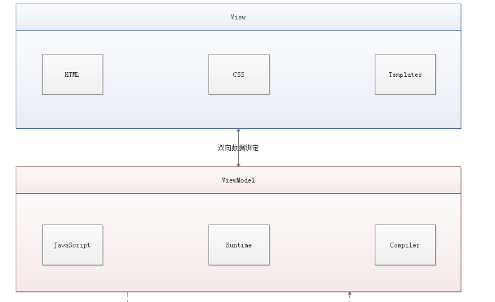
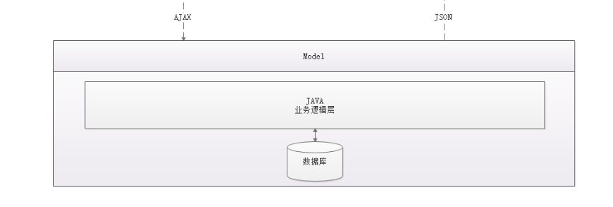

# 前端 MVVM 模式
## 什么是 MVVM
MVVM（Model-View-ViewModel）是一种软件架构设计模式，由微软 WPF（用于替代 WinForm，以前就是用这个技术开发桌面应用程序的）和 Silverlight（类似于 Java Applet，简单点说就是在浏览器上运行的 WPF） 的架构师 Ken Cooper 和 Ted Peters 开发，是一种简化用户界面的**事件驱动编程方式**。由 John Gossman（同样也是 WPF 和 Silverlight 的架构师）于 2005 年在他的博客上发表。

MVVM 源自于经典的 MVC（Model-View-Controller）模式（期间还演化出了 MVP（Model-View-Presenter） 模式）。MVVM 的核心是 ViewModel 层，负责转换 Model 中的数据对象来让数据变得更容易管理和使用，其作用如下：

该层向上与视图层进行双向数据绑定
向下与 Model 层通过接口请求进行数据交互

MVVM 已经相当成熟了，主要运用但不仅仅在网络应用程序开发中。当下流行的 MVVM 框架有 Vue.js，AngularJS 等。

## 为什么要使用 MVVM
MVVM 模式和 MVC 模式一样，主要目的是分离视图（View）和模型（Model），有几大好处

低耦合： 视图（View）可以独立于 Model 变化和修改，一个 ViewModel 可以绑定到不同的 View 上，当 View 变化的时候 Model 可以不变，当 Model 变化的时候 View 也可以不变。
可复用： 你可以把一些视图逻辑放在一个 ViewModel 里面，让很多 View 重用这段视图逻辑。
独立开发： 开发人员可以专注于业务逻辑和数据的开发（ViewModel），设计人员可以专注于页面设计。
可测试： 界面素来是比较难于测试的，而现在测试可以针对 ViewModel 来写。
## MVVM 的组成部分

## View
View 是视图层，也就是用户界面。前端主要由 HTML 和 CSS 来构建，为了更方便地展现 ViewModel 或者 Model 层的数据，已经产生了各种各样的前后端模板语言，比如 FreeMarker、Thymeleaf 等等，各大 MVVM 框架如 Vue.js，AngularJS，EJS 等也都有自己用来构建用户界面的内置模板语言。

## Model
Model 是指数据模型，泛指后端进行的各种业务逻辑处理和数据操控，主要围绕数据库系统展开。这里的难点主要在于需要和前端约定统一的 接口规则

## ViewModel
ViewModel 是由前端开发人员组织生成和维护的视图数据层。在这一层，前端开发者对从后端获取的 Model 数据进行转换处理，做二次封装，以生成符合 View 层使用预期的视图数据模型。

需要注意的是 ViewModel 所封装出来的数据模型包括视图的状态和行为两部分，而 Model 层的数据模型是只包含状态的

比如页面的这一块展示什么，那一块展示什么这些都属于视图状态（展示）
页面加载进来时发生什么，点击这一块发生什么，这一块滚动时发生什么这些都属于视图行为（交互）
视图状态和行为都封装在了 ViewModel 里。这样的封装使得 ViewModel 可以完整地去描述 View 层`。由于实现了双向绑定，ViewModel 的内容会实时展现在 View 层，这是激动人心的，因为前端开发者再也不必低效又麻烦地通过操纵 DOM 去更新视图。

MVVM 框架已经把最脏最累的一块做好了，我们开发者只需要处理和维护 ViewModel，更新数据视图就会自动得到相应更新，真正实现 事件驱动编程。

View 层展现的不是 Model 层的数据，而是 ViewModel 的数据，由 ViewModel 负责与 Model 层交互，这就完全解耦了 View 层和 Model 层，这个解耦是至关重要的，它是前后端分离方案实施的重要一环