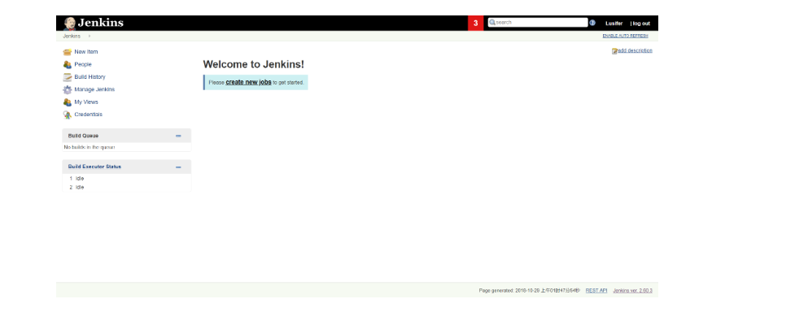
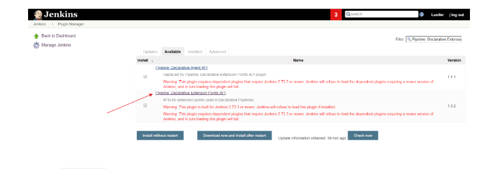
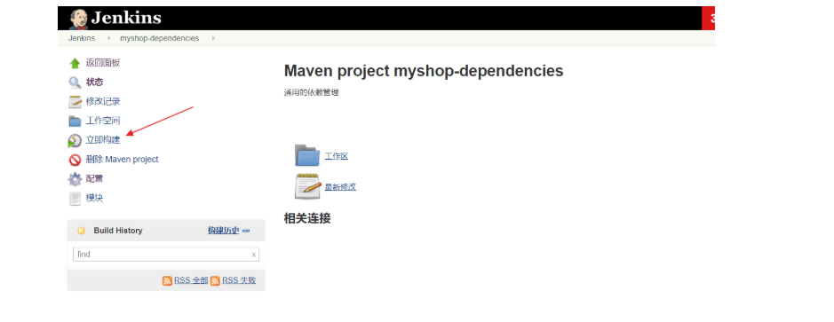

# 基于 Docker 安装 Jenkins
### docker-compose
Jenkins 是一个简单易用的持续集成软件平台，我们依然采用 Docker 的方式部署，docker-compose.yml 配置文件如下：
```
version: '3.1'
services:
  jenkins:
    restart: always
    image: jenkinsci/jenkins
    container_name: jenkins
    ports:
      # 发布端口
      - 8080:8080
      # 基于 JNLP 的 Jenkins 代理通过 TCP 端口 50000 与 Jenkins master 进行通信
      - 50000:50000
    environment:
      TZ: Asia/Shanghai
    volumes:
      - ./data:/var/jenkins_home
```
安装过程中会出现 Docker 数据卷 权限问题，用以下命令解决：
```
chown -R 1000 /usr/local/docker/jenkins/data
```
### 解锁 Jenkins
Jenkins 第一次启动时需要输入一个初始密码用以解锁安装流程，使用 docker logs jenkins 即可方便的查看到初始密码


注意： 安装时可能会因为网速等原因导致安装时间比较长，请大家耐心等待。如果长时间停留在安装页没反应，请尝试使用 F5 刷新一下。

### 使用自定义插件的方式安装
插件是 Jenkins 的核心，其丰富的插件（截止到 2018.10.29 共有 77350 个插件）可以满足不同人群的不同需求

插件地址：https://plugins.jenkins.io/


注意： 除了默认勾选的插件外，一定要勾选 Publish over SSH 插件，这是我们实现持续交付的重点插件。


开始安装了，根据网络情况，安装时间可能会比较长，请耐心等待


很多插件装不上怎么办？不要慌，记住这些插件的名字，咱们稍后可以手动安装


### 安装成功效果图
创建管理员


安装完成，进入首页


### 附：Jenkins 手动安装插件
### 使用插件管理器安装
Manage Jenkins -> Manage Plugins -> Avaliable


过滤出想要安装的插件，然后点击 Download now and install after restart


### 手动上传 .hpi 文件
点击进入插件中心


点击 Archives


下载需要的版本


在插件管理器中选择 Advanced


选择上传即可


### 重启 Jenkins
```
docker-compose down
docker-compose up -d
```
注意： 请留意需要下载插件的警告信息，如果不满足安装条件，Jenkins 是会拒绝安装的。如下图：


# 配置 Jenkins

### 配置 JDK & Maven
上传 JDK 和 Maven 的 tar 包到服务器（容器数据卷目录）

Manage Jenkins -> Global Tool Configuration

安装 JDK（JAVA_HOME 的路径是宿主机目录，切记！不明白的看视频！）
```
/var/jenkins_home/jdk1.8.0_152
```


安装 Maven（MAVEN_HOME 的路径是宿主机目录，切记！不明白的看视频！）
```
/var/jenkins_home/apache-maven-3.5.3
```


别忘记保存
### 配置本地化（显示中文）
安装 Locale 插件


Manage Jenkins -> Configure System -> Locale


本地化效果图


### 安装动态参数插件
该插件的主要目的是为了方便我们后面在做项目构建时可以按照版本进行构建（支持一键回滚哦）


# 持续交付实战用户管理服务

### 写在前面
Jenkins 的持续交付流程与 GitLab Runner 的持续集成差不多，但 GitLab Runner 已经默认是配置好了 Git，所以 Jenkins 需要额外配置多一个 GitLab 的 SSH 登录。按照之前 GitLab Runner 的持续集成流程，Jenkins 的持续交付流程大致如下（其实原理还是挺简单的，但对于刚刚接触 Jenkins 同学理解起来可能还是有一点难度的，最好看下本节视频加深理解）：

1.拉取代码
2.打包构建
3.上传镜像
4.运行容器
5.维护清理
### 配置 Jenkins 的 GitLab SSH 免密登录
步骤同 使用 SSH 的方式拉取和推送项目

交互式进入 Jenkins 容器
```
docker exec -it jenkins /bin/bash
```
生成 SSH KEY
```
ssh-keygen -t rsa -C "your_email@example.com"
```
查看公钥
```
cat /var/jenkins_home/.ssh/id_rsa.pub
```
复制公钥到 GitLab


手动克隆一次项目，该步骤的主要作用是为了生成和服务器的验证信息

查看刚才生成的文件


### 配置 Publish over SSH
系统管理 -> 系统设置 -> Publish over SSH


其中 Remote Directory 是指 Jenkins 可以在目标服务器操作的目录

测试是否能够正常通信


别忘记保存
### 持续交付依赖管理项目
由于我们所有项目的父工程都是依赖于 myshop-dependencies，所以我们的第一步是实现该项目的持续交付

### 为项目创建标签
在 GitLab 中为项目创建标签


### 创建 Maven Project
在 Jenkins 中创建一个基于 Maven 的任务


### 配置 Maven Project
### 配置第一次构建


构建项目


查看构建日志


### 配置正式构建
增加参数化构建过程


这里使用了 Groovy 脚本来查询最近的 tags 版本，代码如下：
```
def ver_keys = [ 'bash', '-c', 'cd /var/jenkins_home/workspace/myshop-dependencies;git pull>/dev/null; git remote prune origin >/dev/null; git tag -l|sort -r |head -10 ' ]
ver_keys.execute().text.tokenize('\n')
```
关闭源码管理


增加构建步骤

```
echo $RELEASE_VERSION
cd /var/jenkins_home/workspace/myshop-dependencies
git checkout $RELEASE_VERSION
git pull origin $RELEASE_VERSION
mvn clean package
```
使用参数化构建项目


查看构建日志


### 持续交付用户服务提供者
在 Jenkins 中创建一个基于 Maven 的任务


### 配置 Maven Project
### 配置第一次构建


构建项目


查看构建日志


### 配置正式构建
增加参数化构建过程


这里使用了 Groovy 脚本来查询最近的 tags 版本，代码如下：
```
def ver_keys = [ 'bash', '-c', 'cd /var/jenkins_home/workspace/myshop-service-user-provider;git pull>/dev/null; git remote prune origin >/dev/null; git tag -l|sort -r |head -10 ' ]
ver_keys.execute().text.tokenize('\n')
```
关闭源码管理


增加构建步骤


Execute Shell（本地执行 Shell 脚本）
```
echo $RELEASE_VERSION
cd /var/jenkins_home/workspace/myshop-service-user-provider
git checkout $RELEASE_VERSION
git pull origin $RELEASE_VERSION
mvn clean package
```
Send files or execute commands over SSH（发送文件或执行远程命令）

Source files：需要传输到远程目标服务器的文件
```
`**/*.jar,docker/**`
```
```
Remove prefix：删除前缀。比如传输   **/*.jar，我们打包的 .jar 文件是在 target 目录下的，传输时会一并创建 target 目录，如果不希望创建 target 目录，则可以使用该参数屏蔽掉这些前缀文件夹。
Remote directory：在远程目标服务器创建操作目录
```
```
myshop-service-user-provider
```
```
Exec command：在远程目标服务器执行控制台命令
```
```
cd /usr/local/jenkins/myshop-service-user-provider
cp target/myshop-service-user-provider-1.0.0-SNAPSHOT.jar docker
cd docker
docker build -t 192.168.10.133:5000/myshop-service-user-provider:v1.0.0 .
docker push 192.168.10.133:5000/myshop-service-user-provider:v1.0.0
docker-compose down
docker-compose up -d
docker image prune -f
```
使用参数化构建项目


查看构建日志

