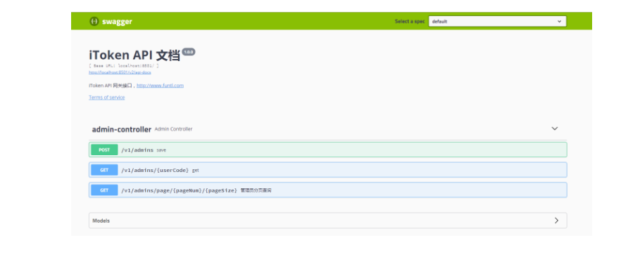

### 配置 Swagger2 接口文档引擎
手写文档存在的问题
文档需要更新的时候，需要再次发送一份给前端，也就是文档更新交流不及时。
接口返回结果不明确
不能直接在线测试接口，通常需要使用工具，比如：Postman
接口文档太多，不好管理
### 使用 Swagger 解决问题
Swagger 也就是为了解决这个问题，当然也不能说 Swagger 就一定是完美的，当然也有缺点，最明显的就是代码植入性比较强。

### Maven
增加 Swagger2 所需依赖，pom.xml 配置如下：
```
<!-- Swagger2 Begin -->
<dependency>
    <groupId>io.springfox</groupId>
    <artifactId>springfox-swagger2</artifactId>
    <version>2.8.0</version>
</dependency>
<dependency>
    <groupId>io.springfox</groupId>
    <artifactId>springfox-swagger-ui</artifactId>
    <version>2.8.0</version>
</dependency>
<!-- Swagger2 End -->
```
### 配置 Swagger2
注意：RequestHandlerSelectors.basePackage("com.funtl.itoken.service.admin.controller") 为 Controller 包路径，不然生成的文档扫描不到接口

创建一个名为 Swagger2Config 的 Java 配置类，代码如下：
```
package com.funtl.itoken.service.admin.config;

import org.springframework.context.annotation.Bean;
import org.springframework.context.annotation.Configuration;
import springfox.documentation.builders.ApiInfoBuilder;
import springfox.documentation.builders.PathSelectors;
import springfox.documentation.builders.RequestHandlerSelectors;
import springfox.documentation.service.ApiInfo;
import springfox.documentation.spi.DocumentationType;
import springfox.documentation.spring.web.plugins.Docket;

@Configuration
public class Swagger2Config {
    @Bean
    public Docket createRestApi() {
        return new Docket(DocumentationType.SWAGGER_2)
                .apiInfo(apiInfo())
                .select()
                .apis(RequestHandlerSelectors.basePackage("com.funtl.itoken.service.admin.controller"))
                .paths(PathSelectors.any())
                .build();
    }

    private ApiInfo apiInfo() {
        return new ApiInfoBuilder()
                .title("iToken API 文档")
                .description("iToken API 网关接口，http://www.funtl.com")
                .termsOfServiceUrl("http://www.funtl.com")
                .version("1.0.0")
                .build();
    }
}
```
### 启用 Swagger2
Application 中加上注解 @EnableSwagger2 表示开启 Swagger
```
package com.funtl.itoken.service.admin;

import org.springframework.boot.SpringApplication;
import org.springframework.boot.autoconfigure.SpringBootApplication;
import org.springframework.cloud.netflix.eureka.EnableEurekaClient;
import springfox.documentation.swagger2.annotations.EnableSwagger2;
import tk.mybatis.spring.annotation.MapperScan;

@SpringBootApplication(scanBasePackages = "com.funtl.itoken")
@EnableEurekaClient
@EnableSwagger2
@MapperScan(basePackages = {"com.funtl.itoken.common.mapper", "com.funtl.itoken.service.admin.mapper"})
public class ServiceAdminApplication {
    public static void main(String[] args) {
        SpringApplication.run(ServiceAdminApplication.class, args);
    }
}
```
### 使用 Swagger2
在 Controller 中增加 Swagger2 相关注解，代码如下：
```
/**
 * 分页查询
 *
 * @param pageNum
 * @param pageSize
 * @param tbSysUserJson
 * @return
 */
@ApiOperation(value = "管理员分页查询")
@ApiImplicitParams({
        @ApiImplicitParam(name = "pageNum", value = "页码", required = true, dataType = "int", paramType = "path"),
        @ApiImplicitParam(name = "pageSize", value = "笔数", required = true, dataType = "int", paramType = "path"),
        @ApiImplicitParam(name = "tbSysUserJson", value = "管理员对象 JSON 字符串", required = false, dataTypeClass = String.class, paramType = "json")
})
@RequestMapping(value = "page/{pageNum}/{pageSize}", method = RequestMethod.GET)
public BaseResult page(
        @PathVariable(required = true) int pageNum,
        @PathVariable(required = true) int pageSize,
        @RequestParam(required = false) String tbSysUserJson
) throws Exception {

    TbSysUser tbSysUser = null;
    if (tbSysUserJson != null) {
        tbSysUser = MapperUtils.json2pojo(tbSysUserJson, TbSysUser.class);
    }
    PageInfo pageInfo = adminService.page(pageNum, pageSize, tbSysUser);

    // 分页后的结果集
    List<TbSysUser> list = pageInfo.getList();

    // 封装 Cursor 对象
    BaseResult.Cursor cursor = new BaseResult.Cursor();
    cursor.setTotal(new Long(pageInfo.getTotal()).intValue());
    cursor.setOffset(pageInfo.getPageNum());
    cursor.setLimit(pageInfo.getPageSize());

    return BaseResult.ok(list, cursor);
}
```
### Swagger 注解说明
Swagger 通过注解表明该接口会生成文档，包括接口名、请求方法、参数、返回信息的等等。

@Api：修饰整个类，描述 Controller 的作用
@ApiOperation：描述一个类的一个方法，或者说一个接口
@ApiParam：单个参数描述
@ApiModel：用对象来接收参数
@ApiProperty：用对象接收参数时，描述对象的一个字段
@ApiResponse：HTTP 响应其中 1 个描述
@ApiResponses：HTTP 响应整体描述
@ApiIgnore：使用该注解忽略这个API
@ApiError：发生错误返回的信息
@ApiImplicitParam：一个请求参数
@ApiImplicitParams：多个请求参数
# 访问 Swagger2
访问地址：http://ip:port/swagger-ui.html



