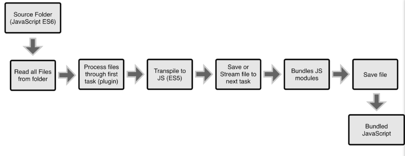
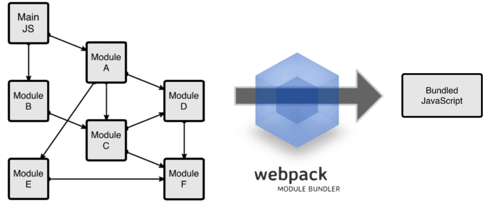
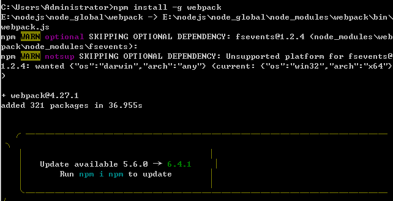
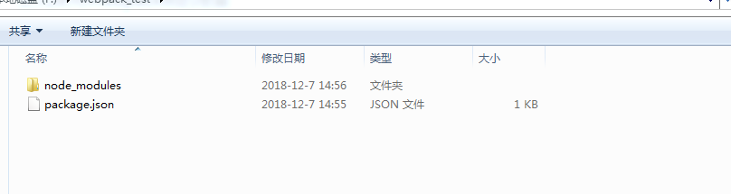
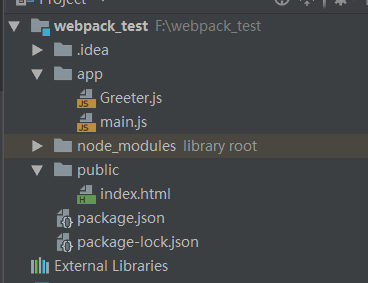
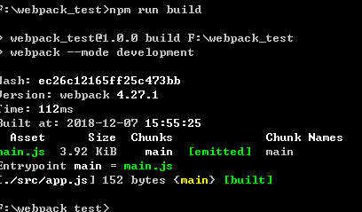

### 什么是WebPack
WebPack可以看做是模块打包机：它做的事情是，分析你的项目结构，找到JavaScript模块以及其它的一些浏览器不能直接运行的拓展语言（Scss，TypeScript等），并将其转换和打包为合适的格式供浏览器使用。
其实Webpack和另外两个并没有太多的可比性，Gulp/Grunt是一种能够优化前端的开发流程的工具，而WebPack是一种模块化的解决方案，不过Webpack的优点使得Webpack在很多场景下可以替代Gulp/Grunt类的工具。

Grunt和Gulp的工作方式是：在一个配置文件中，指明对某些文件进行类似编译，组合，压缩等任务的具体步骤，工具之后可以自动替你完成这些任务。

Webpack的工作方式是：把你的项目当做一个整体，通过一个给定的主文件（如：index.js），Webpack将从这个文件开始找到你的项目的所有依赖文件，使用loaders处理它们，最后打包为一个（或多个）浏览器可识别的JavaScript文件。

如果实在要把二者进行比较，Webpack的处理速度更快更直接，能打包更多不同类型的文件。
### 如何使用
#### 安装(node.js安装配置要了解)
Webpack可以使用npm安装，新建一个空的练习文件夹（此处命名为webpack），在终端中转到该文件夹后执行下述指令就可以完成安装。
``` javascript?fancy=2,3&linenums=true
## 全局安装
npm install -g webpack
## /安装到你的项目目录
npm install --save-dev webpack
```

1.在终端中使用npm init命令可以自动创建这个package.json文件
``` javascript?fancy=2,3&linenums=true
npm init
```
输入这个命令后，终端会问你一系列诸如项目名称，项目描述，作者等信息，不过不用担心，如果你不准备在npm中发布你的模块，这些问题的答案都不重要，回车默认即可。
2.package.json文件已经就绪，我们在本项目中安装Webpack作为依赖包（文件夹不要叫webpack,不然安装失败）

``` javascript?fancy=2,3&linenums=true
## 安装Webpack
npm install --save-dev webpack
```
#### 低版本方法
3.回到之前的空文件夹，并在里面创建两个文件夹,app文件夹和public文件夹，app文件夹用来存放原始数据和我们将写的JavaScript模块，public文件夹用来存放之后供浏览器读取的文件（包括使用webpack打包生成的js文件以及一个index.html文件）。接下来我们再创建三个文件:
 - index.html --放在public文件夹中;
 - Greeter.js-- 放在app文件夹中;
 - main.js-- 放在app文件夹中;
 
 4.我们在index.html文件中写入最基础的html代码，它在这里目的在于引入打包后的js文件（这里我们先把之后打包后的js文件命名为bundle.js，之后我们还会详细讲述）。
 
 ``` javascript?fancy=2,3&linenums=true
<!DOCTYPE html>
<html lang="en">
    <head>
        <meta charset="utf-8">
        <title>测试webpack</title>
    </head>
    <body>
        <div id='root'></div>
        <script src="bundle.js"></script>
    </body>
</html>
```
 5.我们在Greeter.js中定义一个返回包含问候信息的html元素的函数,并依据CommonJS规范导出这个函数为一个模块：
 

``` javascript
##Greeter.js
module.exports = function() {
  var greet = document.createElement('div');
  greet.textContent = "Hi there and greetings!";
  return greet;
};
```
6.main.js文件中我们写入下述代码，用以把Greeter模块返回的节点插入页面。

``` javascript
##main.js 
const greeter = require('./Greeter.js');
document.querySelector("#root").appendChild(greeter());
```
7.webpack可以在终端中使用，在基本的使用方法如下：
``` javascript
# {entry file}出填写入口文件的路径，本文中就是上述main.js的路径，
# {destination for bundled file}处填写打包文件的存放路径
# 填写路径的时候不用添加{}
webpack {entry file} {destination for bundled file}
```
8.指定入口文件后，webpack将自动识别项目所依赖的其它文件，不过需要注意的是如果你的webpack不是全局安装的，那么当你在终端中使用此命令时，需要额外指定其在node_modules中的地址，继续上面的例子，在终端中输入如下命令
``` javascript
# webpack非全局安装的情况
node_modules/.bin/webpack app/main.js public/bundle.js
```
#### 4.+以上方法
1.我们需要新建一个js文件，命名为webpack.config.js（后续会说为什么叫这个名字），这个文件需要导出一个对象，我们使用module.exports={}（这个对象就是webpack的配置），这个对象描述了webpack会以怎样的形式去打包，以及打包过程中它会干什么事情，全部依赖这个对象去描述
这个对象至少要有两个属性，程序的入口和出口，代码
注意：entry可以是字符串、数组和json对象，三种格式都可以
``` javascript
# webpack非全局安装的情况
const path = require('path');
module.exports = {
    entry:'./src/app.js',
    output:{
        path:path.resolve(__dirname,'dist'),
        filename:'main.js'
    }
}
```
==注意：entry可以是字符串、数组和json对象，三种格式都可以 #f44336==
解释一下：entry，就是我们说的程序的入口，告诉webpack，我们的项目的入口是谁，（本例中app.js即是项目的入口，是相对路径，相对于我们前面提到的配置文件的位置，即相对于webpack.config.js）只有当我们告诉了项目的入口是谁，它才能从这个入口中去分析出你整个应用需要用到什么样的依赖，分析出你整个依赖树，然后去帮你打包，打包之后，它会输出一个新的文件，所以我们需要告诉webpack以怎样的方式输出，所以我们给它一个输出的属性output，output接收一个对象

``` javascript
output:{
        path:path.resolve(__dirname,'dist'),
        filename:'main.js'
    }
```
``` javascript
const path = require('path');
```
上面代码是引入path模块，它是node.js的一个内置模块，使用path帮助我们处理路径问题
path :必须是绝对路径，这和entry中的路径不同（可以是相对路径），__dirname:代表文件所在的根目录，（注意是两个英文状态的下划线），dist,打包后的文件要存放的文件夹（这个是自己建的），所以就是告诉path就是告诉webpack，打包后的文件放在根目录的dist文件夹中
然后我们要告诉打包后的文件叫什么名字，所以就需要用到filename这个属性了，我们上面的代码：指打包后的文件叫main.js
总结一下就是，告诉webpack，打包后的文件放在根目录的dist文件夹中，名字叫main.js
2、回到package.json中，声明处理要运行的命令，看我下面的代码

``` javascript
"scripts": {
    "test": "echo \"Error: no test specified\" && exit 1",
    "build": "webpack --mode development"
	}
```
因为想要进行打包，就要运行webpack命令，而运行webpack命令要在scripts中声明要运行谁，以及要运行的命令，所以，看上面的代码，我们加入了"build":"webpack --mode development",build：是我们起的名字（随意起，运行时使用），webpack:是运行的命令，即处理哪个文件夹，使用哪一个webpack配置，默认运行webpack.config.js，所以如果我们的配置文件是webpack.config.js，则只需要使用"build":"webpack"，如果，我们的配置文件不是webpack.config.js,那么此处应该为："build":"webpack --config  配置文件名"，,假如我们的配置文件为webpack.dev.js,那么我么这里就应该是："build":"webpack --config  webpack.dev.js"。--mode development也是这个版本必须要加的(用于消除警告)，反正我不加这句代码的时候，它就总是有警告，加上之后就好了。
3.npm i -D  webpack-cli（这个在3版本的时候是不需要的，到了4版本必须加，否则会报错），执行完之后，会在package.json的devDependencies中加入"webpack-cli":"^2.1.2"，如下所示（当然，其实我们不需要管这些，只需执行命令即可）
``` javascript
"devDependencies": {
    "webpack": "^4.27.1",
    "webpack-cli": "^3.1.2"
  }
```
在配置文件（webpack.config.js）中加入
``` javascript
mode:'development'
```
（如果不加，当我们进行webpack打包的时候，会有警告，让加入mode为development或production，因为webpack是在开发中使用的，所以就使用development即可）
4、npm  run   build（进行一次打包，打包后，会在dist中生成一个main.js文件），注意这里的build就是我们上面起的名字，起什么名字，run什么


